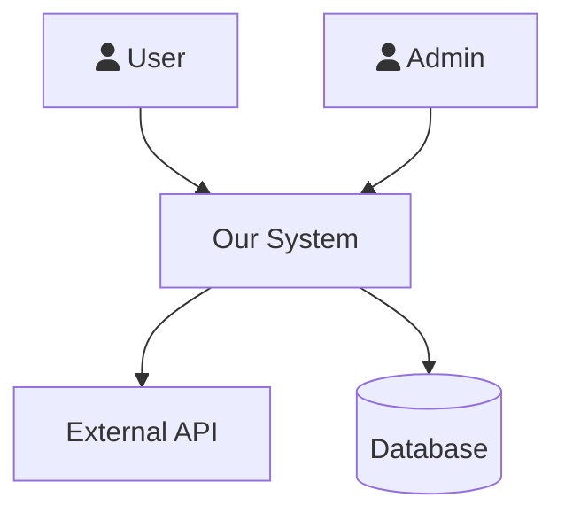
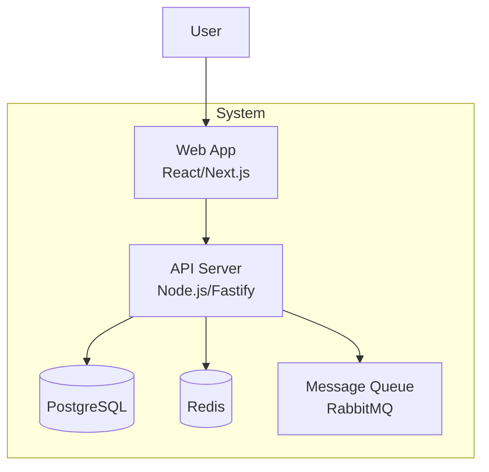
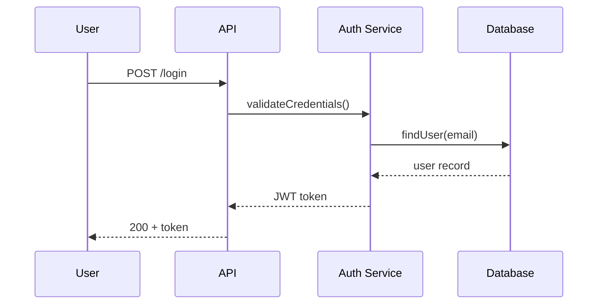
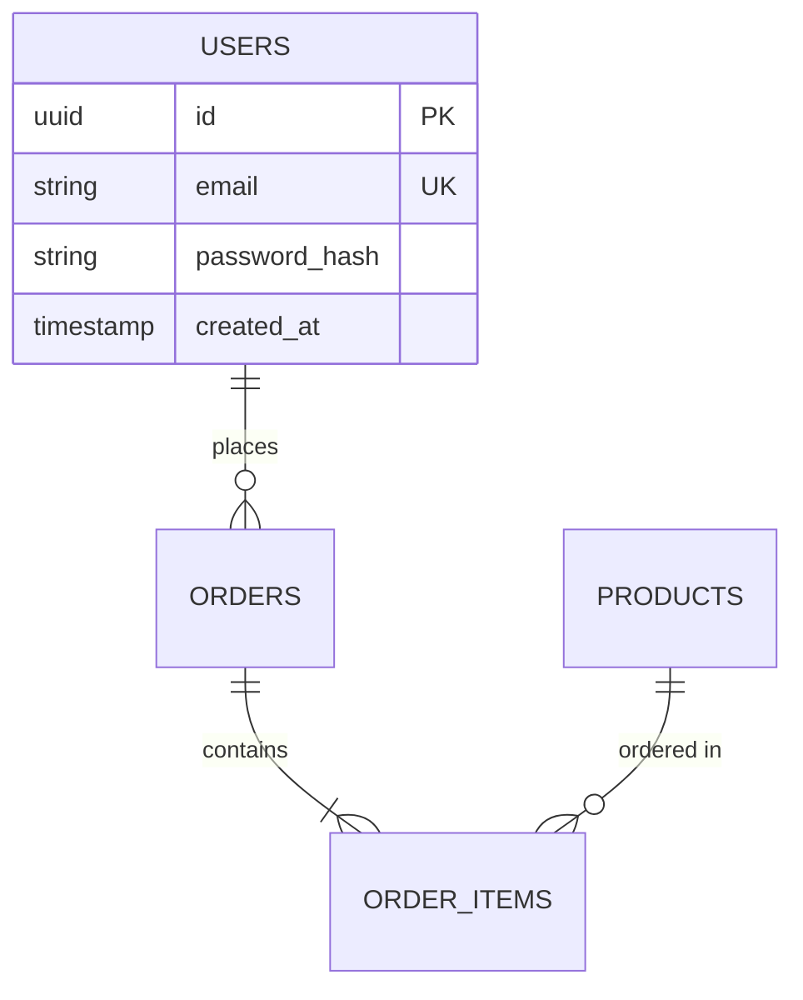
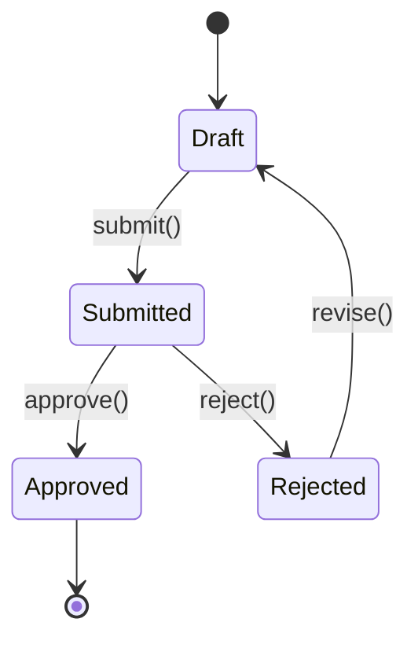
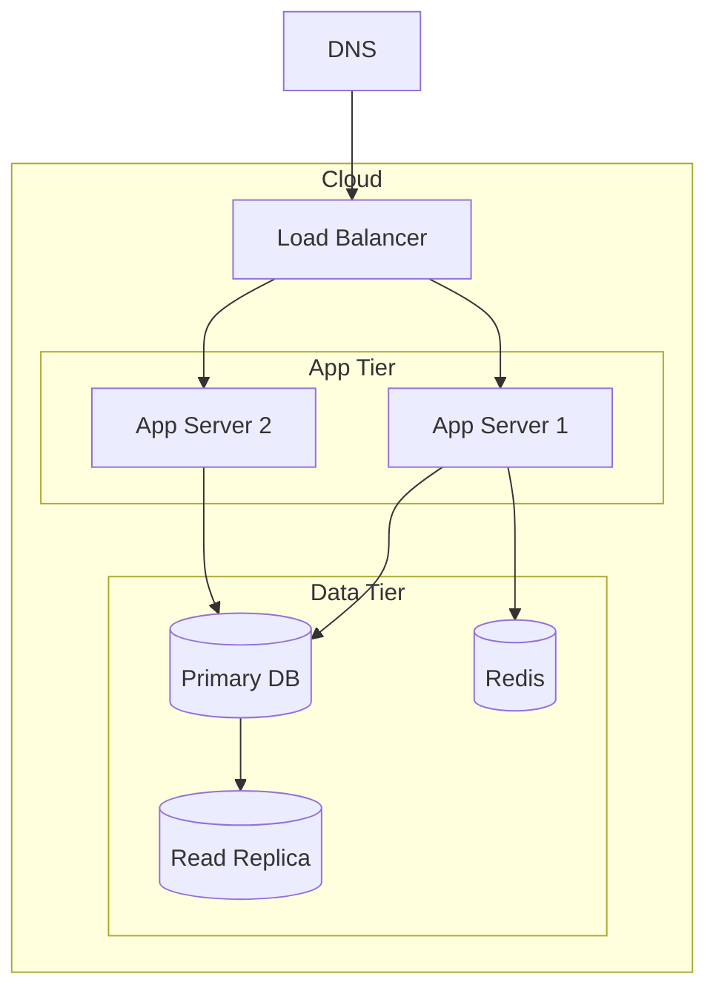

# SDLC Lead — Mode 1: New Project

This file contains the Mode 1 workflow. The spine, shared protocols (delegation, trackers, gates, discovery interviews, fix-verify loop), and HANDOFF templates live in `sdlc-lead.md`. Read that file first before executing any step here.

# MODE 1: New Project (`/sdlc init`)

**Start with the Mode 1 Discovery Interview above. Do not skip it.**

Build from scratch with proper engineering artifacts at every phase.

## Loop prevention (MANDATORY — rules are here, no file read required)

**Class 2 — Schema-validation loop — STOP after 2 strikes.** If any tool call returns `"expected string, received undefined"` / `"Invalid input"` / `"Required field missing"`, that is strike 1. A second schema error on any tool = strike 2. Write this verbatim and end the turn:

```
[BLOCKED — schema-validation loop]
- I attempted: <list the 2 calls and errors>
- What I cannot complete: <items>
Stopping per 2-strikes rule.
```

Other caps: failure loop → 3 strikes; success loop → 15 total calls max.

**Tool format — copy these exactly:**
- Read a file: `read(filePath="~/.config/opencode/agents/sdlc-init-mode.md")`
- Shell command: `bash(command="ls ~/.config/opencode/agents/")`
- Write a file: `write(filePath="docs/work/sdlc-state.md", content="...")`

## Document hygiene (MANDATORY)

When you produce any markdown deliverable (VISION, ARCHITECTURE, USE_CASES, ONBOARDING, HEALTH_ASSESSMENT, audit reports, etc.):

- ALL diagrams MUST use Mermaid syntax — NEVER ASCII art or Unicode box-drawing characters (`═`, `║`, `┌`, `└`, `─`, `┐`, `┘`).
- Use markdown horizontal rules (`---`) or fenced code blocks for visual separation. Do not draw banner lines with repeated `=` or `═` characters.
- Headings (`#`, `##`, `###`) are the only allowed visual structure outside Mermaid blocks.
- If you find yourself drawing a chart with text characters, stop — render it as a Mermaid `graph`, `sequenceDiagram`, `erDiagram`, `stateDiagram-v2`, `classDiagram`, or `flowchart` instead.

This rule is enforced by `scripts/validators/validate-no-ascii-art.sh`. Deliverables that violate it fail the phase gate.

## Phase 0: Ideation — WHY are we building this?

**First, bootstrap the repo via `task` tool:**
- `task(agent="git-expert", prompt="Run --init mode: git init, language-aware .gitignore, initial commit on main (README + .gitignore only), configure remotes (gitea primary + github mirror by default), install commitlint + lefthook/husky hooks, enforce branch protection on main (require PR review, no direct push, require CI), then create and checkout branch 'sdlc/setup'. All SDLC docs (phases 0-3) will be committed to sdlc/setup — NOT main. Write report to docs/git/INIT_<date>.md", timeout=120)` — Run BEFORE any `docs/` files are written so VISION.md is the first tracked artifact on the `sdlc/setup` branch.

**Initialize the SDLC_TRACKER for Mode 1** (immediately after the repo is bootstrapped):
```
write(filePath="docs/sdlc/SDLC_TRACKER.md", content="[Mode 1 template from SDLC_TRACKER section above — fill in project name and date]")
```
This file lives on `sdlc/setup` alongside the rest of the SDLC docs. It persists across sessions so you can resume without re-running completed phases.

**Deliverables:**
- `docs/VISION.md` — Problem, target users, success metrics
- `docs/COMPETITIVE_ANALYSIS.md` — What exists, gaps, differentiation

**Save state, then HANDOFF to researcher:**
```
write(filePath="docs/work/sdlc-state.md", content="
Mode: 1 / Phase: 0 — Ideation
Last completed: Discovery Interview
Awaiting: researcher — docs/research/RESEARCH_competitive_<date>.md
Next after resume: Research Findings Review, then write VISION.md
Delegation log: docs/work/DELEGATION_LOG.md
")
```

```
---
  HANDOFF → researcher
---
Open a new OpenCode conversation and paste this EXACT prompt to /research:

SDLC-TASK for researcher:

CONTEXT (read these before starting):
- docs/DISCOVERY.md — project vision, target users, key assumptions from the discovery interview

YOUR TASK:
Research the competitive landscape for [domain]. Investigate who the main competitors are,
what they offer, their pricing and target customers, what technical gaps or underserved
segments exist, and what differentiates the strongest players.

PRODUCE exactly these files (nothing else):
- docs/research/RESEARCH_competitive_<date>.md — structured findings with sources

Include a Completion Manifest at the end.

When the file is written, print exactly:
"researcher done — competitive analysis: [one sentence summary of key finding]"
Then stop. Do not ask for follow-up. Do not run additional phases.
---
```

**After researcher returns:** Run the **Research Findings Review Protocol** — read the report, cross-reference with DISCOVERY.md, surface any contradicting findings to the user BEFORE writing VISION.md.
**You write:** VISION.md (strategic, not technical) using answers from DISCOVERY.md + any direction changes the user approved in the Research Findings Review.
**Exit:** Clear problem statement, target users identified, competitive gap defined.

**Gate Loop:** VISION.md and COMPETITIVE_ANALYSIS.md are narrative artifacts → use Track 2 (confidence loop) per the Two-Track Gate System section in `sdlc-lead.md`. Minimum score 7 before Phase 1.
**Git checkpoint — commit Phase 0 docs before advancing:**
```
task(agent="git-expert", prompt="Commit all new docs/ files from Phase 0 (VISION.md, COMPETITIVE_ANALYSIS.md, any research files) to the sdlc/setup branch. Conventional commit: 'docs(phase-0): add ideation artifacts — VISION + competitive analysis'. Push sdlc/setup to origin. Do NOT push to main.", timeout=60)
```
**Inter-Phase Check-In:** After the gate passes AND docs are committed, run the Inter-Phase Check-In Protocol. Do NOT auto-advance.

## Phase 1: Planning — WHAT are we building?

**Deliverables:**
- `docs/SCOPE.md` — In scope, out of scope, MVP boundary
- `docs/RISKS.md` — Technical, business, timeline risks + mitigations
- `docs/CONSTRAINTS.md` — Budget, timeline, team, tech constraints
- `docs/USER_PERSONAS.md` — Who uses this, goals, pain points

**Save state, then HANDOFF to researcher:**
```
write(filePath="docs/work/sdlc-state.md", content="
Mode: 1 / Phase: 1 — Planning
Last completed: Discovery Interview reviewed
Awaiting: researcher — docs/research/RESEARCH_feasibility_<date>.md
Next after resume: Research Findings Review, then write SCOPE.md, RISKS.md, CONSTRAINTS.md, USER_PERSONAS.md
Delegation log: docs/work/DELEGATION_LOG.md
")
```

```
---
  HANDOFF → researcher
---
Open a new OpenCode conversation and paste this EXACT prompt to /research:

SDLC-TASK for researcher:

CONTEXT (read these before starting):
- docs/DISCOVERY.md — project constraints, team experience, key technical requirements
- docs/VISION.md — what we're building and why

YOUR TASK:
Research technical feasibility for [domain]. Investigate what libraries and frameworks exist
for [key technical requirement], any licensing constraints affecting commercial use, known
limitations or scale ceilings, and whether open-source alternatives cover the core requirements.

PRODUCE exactly these files (nothing else):
- docs/research/RESEARCH_feasibility_<date>.md — structured findings with sources

Include a Completion Manifest at the end.

When the file is written, print exactly:
"researcher done — feasibility: [one sentence summary of key finding or showstopper]"
Then stop. Do not ask for follow-up. Do not run additional phases.
---
```

**After researcher returns:** Run the **Research Findings Review Protocol** — if the feasibility research flags a showstopper (unavailable library, licensing conflict, capacity limit), surface it before writing SCOPE.md.
**Exit:** Clear boundaries, risks identified with mitigations.

**Gate Loop:** Rate all 4 deliverables. If RISKS.md scores < 7 (too vague), expand mitigations and re-rate.
**Git checkpoint — commit Phase 1 docs before advancing:**
```
task(agent="git-expert", prompt="Commit all new docs/ files from Phase 1 (SCOPE.md, RISKS.md, CONSTRAINTS.md, USER_PERSONAS.md) to the sdlc/setup branch. Conventional commit: 'docs(phase-1): add planning artifacts — scope, risks, constraints, personas'. Push sdlc/setup to origin. Do NOT push to main.", timeout=60)
```
**Inter-Phase Check-In:** After the gate passes AND docs are committed, run the Inter-Phase Check-In Protocol. Do NOT auto-advance.

## Phase 2: Requirements — HOW should it behave?

**Deliverables:**
- `docs/SRS.md` — Requirements specification (see SRS format below)
- `docs/USER_STORIES.md` — Stories with acceptance criteria

**Save state, then hand off to UX for user workflow design:**

```
write(filePath="docs/work/sdlc-state.md", content="
Mode: 1
Phase: 2 — Requirements
Last completed: Planning phase gate passed
Awaiting: ux-engineer — docs/design/USER_FLOWS.md
Next after resume: write SRS.md and USER_STORIES.md using the flow diagrams
")
```

```
---
  HANDOFF → ux-engineer
---
Open a new OpenCode conversation and paste this EXACT prompt to /ux:

SDLC-TASK for ux-engineer:

CONTEXT (read these before starting):
- docs/VISION.md — project purpose and target users
- docs/USER_PERSONAS.md — detailed user profiles and goals

YOUR TASK:
Produce user workflow diagrams for this system. For each primary task a user performs,
create a Mermaid flowchart showing: trigger → steps → success path → error/edge cases.
Cover every persona from USER_PERSONAS.md. Do not design visual style — flows only.

PRODUCE exactly this file:
- docs/design/USER_FLOWS.md — one Mermaid flowchart per primary user task

When the file is written, print exactly:
"ux done — [one sentence: how many flows produced and what they cover]"
Then stop. Do not ask for follow-up. Do not run additional phases.

---
```

After "ux done", run the **Requirements Derivation Pass** before writing any requirements docs.

### Requirements Derivation Pass (MANDATORY — run before writing SRS/USER_STORIES/USE_CASES)

The goal: systematically mine all Phase 0+1 artifacts so no requirements are missed. The agent that "thinks of" use cases only finds what it already knows. The derivation pass finds what the docs imply.

**Step 1 — Build the candidate matrix.** For EACH combination of:
- Every persona in USER_PERSONAS.md
- Every feature/goal in SCOPE.md (in-scope items only)
- Every risk in RISKS.md (as negative use case drivers)
- Every constraint in CONSTRAINTS.md (as use case boundaries)
- Every vision goal in VISION.md

→ Derive 1-3 candidate use cases. Write them to `docs/work/REQUIREMENTS_MATRIX.md`:

```markdown
# Requirements Matrix

## Derivation Sources
| Source Doc | Items Mined |
|------------|-------------|
| USER_PERSONAS.md | [list persona names] |
| SCOPE.md (in-scope) | [list scope items] |
| RISKS.md | [list risk IDs] |
| CONSTRAINTS.md | [list constraint IDs] |
| VISION.md | [list goals] |

## Candidate Use Cases
| ID | Persona | Trigger / Feature Area | Source | Status |
|----|---------|----------------------|--------|--------|
| M-001 | [persona] | [what they need to do] | SC-01, FR-02 | CANDIDATE |
| M-002 | [persona] | [what they need to do] | RISK-03 | CANDIDATE |
...

## Coverage Check
| Persona | # Use Cases | Gaps |
|---------|-------------|------|
| [name] | N | [any feature areas with 0 use cases] |

## Empty Cells (flag these to user)
These persona × feature area combinations have no candidate use cases:
- [persona]: [feature area] — possibly out of scope?
- ...
```

**Step 2 — Present to user.** Print this block and STOP:

```
REQUIREMENTS DERIVATION COMPLETE
docs/work/REQUIREMENTS_MATRIX.md written.

I derived [N] candidate use cases from your Phase 0+1 docs.

Empty cells (no use cases derived yet):
[list any persona × feature area combos with 0 candidates, or "none"]

Questions before I write the requirements docs:
1. Are there any use cases I'm missing from your experience with this domain?
2. Do any of the empty cells represent real requirements I should add?
3. Any of the [N] candidates should be removed or merged?

Please respond, then I'll write SRS.md, USER_STORIES.md, and USE_CASES.md.
```

**Wait for user response.** Incorporate additions into the matrix.

**Step 3 — Write requirements docs.** Now write SRS.md following the format below.

### SRS Format (IEEE 830 based)

Every requirement MUST be: concise, complete, unambiguous, verifiable, traceable.

```markdown
# Software Requirements Specification

## 1. Introduction
### 1.1 Purpose
### 1.2 Scope
### 1.3 Definitions & Acronyms

## 2. Product Overview
### 2.1 Product Perspective (context in larger ecosystem)
### 2.2 Product Features (high-level list)
### 2.3 User Classes
### 2.4 Operating Environment
### 2.5 Constraints
### 2.6 Assumptions

## 3. Functional Requirements
For each requirement:
| Field | Value |
|-------|-------|
| ID | FR-001 |
| Title | User can create an account |
| Description | The system shall allow... |
| Priority | Must-have / Should-have / Nice-to-have |
| Acceptance Criteria | Given..., When..., Then... |
| Dependencies | FR-003 (email service) |

## 4. Non-Functional Requirements
| ID | Category | Requirement | Metric |
|----|----------|-------------|--------|
| NFR-001 | Performance | Page load time | < 2s at P95 |
| NFR-002 | Security | Password hashing | bcrypt, cost 12 |
| NFR-003 | Availability | Uptime | 99.9% monthly |

## 5. Interface Requirements
### 5.1 User Interfaces (wireframes/flows)
### 5.2 API Interfaces (endpoint contracts)
### 5.3 Data Interfaces (database, external feeds)

## 6. Traceability Matrix
| Requirement | Design | Code | Test |
|-------------|--------|------|------|
| FR-001 | ARCH-2.3 | src/auth/ | test/auth.test.ts |
```

**Exit:** Every FR has acceptance criteria, every NFR has a measurable metric

**After SRS.md + USER_STORIES.md, produce the use case catalog (INLINE — do this yourself):**

Write `docs/testing/USE_CASES.md` — derive one use case per user story:
- For each user story in USER_STORIES.md:
  - Which persona from USER_PERSONAS.md does this?
  - What are the preconditions?
  - What triggers the flow?
  - Main flow (numbered steps: user does X → system does Y)
  - Alternate flows (error, empty state, permission denied)
  - Success criteria (observable outcome)
- Index table at top: UC number, name, persona, priority (P0/P1/P2)
- P0 = demo-blocking critical paths, P1 = should work, P2 = nice-to-have

**Gate Loop:** Rate SRS.md, USER_STORIES.md, and USE_CASES.md. Key quality checks:
- Every FR has a `Given/When/Then` acceptance criterion (not just a description)
- Every NFR has a measurable metric (not "should be fast" — "< 200ms at P95")
- Every user story has a corresponding use case in USE_CASES.md
- Every use case has a `Source:` field tracing back to a FR-NN, SC-NN, RK-NN, or persona ID
- REQUIREMENTS_MATRIX.md has no unexplored blank cells (all resolved with user)
- If any FR/NFR is vague, revise before advancing

**Note:** TEST_DESIGN.md (detailed test case design per component/endpoint/threat) is produced in Phase 3.5 after architecture and security controls are complete. Phase 2 only produces requirements artifacts.

**Git checkpoint — commit Phase 2 docs before advancing:**
```
task(agent="git-expert", prompt="Commit all new docs/ files from Phase 2 (SRS.md, USER_STORIES.md, docs/design/USER_FLOWS.md, docs/testing/USE_CASES.md, docs/work/REQUIREMENTS_MATRIX.md) to the sdlc/setup branch. Conventional commit: 'docs(phase-2): add requirements — SRS, user stories, use cases, requirements matrix'. Push sdlc/setup to origin. Do NOT push to main.", timeout=60)
```
**Inter-Phase Check-In:** After the gate passes AND docs are committed, run the Inter-Phase Check-In Protocol. Do NOT auto-advance.

**HUMAN APPROVAL GATE A:** After the inter-phase check-in, emit **Human Approval Gate A** (defined in `sdlc-lead.md` § Human approval gates). Wait for explicit "yes" before any Phase 3 work.

## Phase 3: Design — HOW do we build it?

### Design Clarification Interview (MANDATORY — Run Before Any Design Work)

**Present ALL questions at once. Do NOT write any design documents until the user responds.**

Output exactly this block, then stop and wait:

```
Before I design the architecture, I need answers to make the right technical decisions.
Please answer these:

1. Where will this run? (AWS/GCP/Azure/on-prem/hybrid — which services/regions if known)
2. What's the expected scale? (users, requests/sec, data volume — today and in 12 months)
3. Any performance targets? (response time SLAs, throughput, availability %)
4. What external systems must this integrate with? (auth providers, payment, APIs, data sources)
5. What's the team's tech stack experience? (languages/frameworks they're strongest in)
6. Any existing infrastructure to reuse? (databases, queues, auth services, monitoring tools)
7. Any regulatory or compliance requirements? (GDPR, HIPAA, SOC2, PCI-DSS, etc.)

These answers will drive every architecture decision.
```

After the user responds:
- Write answers to `docs/DESIGN_CONTEXT.md`
- Reference DESIGN_CONTEXT.md when making every tech stack and architecture decision

**Deliverables:**
- `docs/ARCHITECTURE.md` — SAD with C4 diagrams (see SAD format below)
- `docs/TECH_STACK.md` — Language, framework, libraries + justification
- `docs/DATABASE.md` — ERD, schema, migrations, access patterns
- `docs/API_DESIGN.md` — Human-readable endpoint contracts (narrative + examples)
- `docs/api/openapi.yaml` — Machine-readable OpenAPI 3.0 spec (Swagger-compatible)
- `docs/THREAT_MODEL.md` — STRIDE threats + mitigations
- `docs/PARALLELIZATION_MAP.md` — modules grouped into Phase 4 implementation waves based on dependency order (enables opt-in parallel agent sets)
- `docs/diagrams/` — Mermaid files for all diagrams
- **If UI-bearing (see UX branch below):**
  - `docs/design/DESIGN_PRINCIPLES.md` — Aesthetic direction, tone, anti-patterns
  - `docs/design/STYLE_GUIDE.md` — Typography, color tokens, spacing, motion
  - `docs/design/UX_SPEC.md` — User workflows, screen hierarchy, component inventory, a11y plan

**Delegate SEQUENTIALLY — one at a time, verify output before the next:**

**Step 1 — Research (HANDOFF):** Tech stack evaluation:

```
write(filePath="docs/work/sdlc-state.md", content="
Mode: 1 / Phase: 3 — Design
Last completed: Design Clarification Interview
Awaiting: researcher — docs/research/RESEARCH_framework_comparison_<date>.md
Next after resume: Research Findings Review, then write TECH_STACK.md, then db-architect HANDOFF
Delegation log: docs/work/DELEGATION_LOG.md
")
```

```
---
  HANDOFF → researcher
---
Open a new OpenCode conversation and paste this EXACT prompt to /research:

SDLC-TASK for researcher:

CONTEXT (read these before starting):
- docs/DESIGN_CONTEXT.md — deployment environment, scale targets, team experience, constraints
- docs/DISCOVERY.md — what we're building

YOUR TASK:
Compare framework and tech stack options for [domain] given the constraints in DESIGN_CONTEXT.md.
Evaluate: which frameworks best match team experience and scale requirements; performance and
operational trade-offs between the top 2-3 candidates; ecosystem maturity (community, maintained
packages, known CVEs); any licensing or vendor lock-in risks.

PRODUCE exactly these files (nothing else):
- docs/research/RESEARCH_framework_comparison_<date>.md — structured comparison with recommendation

Include a Completion Manifest at the end.

When the file is written, print exactly:
"researcher done — framework comparison: [one sentence recommended stack and key reason]"
Then stop. Do not ask for follow-up. Do not run additional phases.
---
```

**After researcher returns:** Run the Research Findings Review Protocol before writing TECH_STACK.md.
→ Write TECH_STACK.md → mark DONE

**Step 2 — Database design (HANDOFF):**

Save state first:
```
write(filePath="docs/work/sdlc-state.md", content="
Mode: 1 / Phase: 3 — Design
Last completed: TECH_STACK.md written
Awaiting: db-architect — docs/DATABASE.md
Next after resume: api-designer handoff
")
```

```
---
  HANDOFF → db-architect
---
Open a new OpenCode conversation and paste this EXACT prompt to /dba:

SDLC-TASK for db-architect:

CONTEXT (read these before starting):
- docs/SRS.md — functional requirements and data entities
- docs/USER_STORIES.md — feature requirements driving data needs
- docs/TECH_STACK.md — database technology chosen

YOUR TASK:
Design the complete database schema for [project]. Derive all entities and
relationships from the requirements in SRS.md and USER_STORIES.md. Use the
database technology specified in TECH_STACK.md.

PRODUCE exactly this file:
- docs/DATABASE.md — containing: Mermaid erDiagram of all tables and relationships,
  migration files (up/down) for every table, index strategy for each major access
  pattern, and query patterns for the top 5 most frequent operations

When the file is written, print exactly:
"db done — [one sentence: how many tables, key relationships, and notable design decisions]"
Then stop. Do not ask for follow-up. Do not run additional phases.

---
```

→ After "db done": verify docs/DATABASE.md exists and >50 lines → mark DONE

**Step 3 — API contracts (HANDOFF):**

Save state:
```
write(filePath="docs/work/sdlc-state.md", content="
Mode: 1 / Phase: 3 — Design
Last completed: docs/DATABASE.md written
Awaiting: api-designer — docs/API_DESIGN.md
Next after resume: UX branch (if UI-bearing) or security-auditor handoff
")
```

```
---
  HANDOFF → api-designer
---
Open a new OpenCode conversation and paste this EXACT prompt to /api-design:

SDLC-TASK for api-designer:

CONTEXT (read these before starting):
- docs/USER_STORIES.md — features that need API endpoints
- docs/SRS.md — functional requirements including auth and data rules
- docs/DATABASE.md — schema and data shapes the API reads/writes

YOUR TASK:
Design complete API contracts for [project]. For every user story that requires
a server interaction, produce an OpenAPI-style endpoint contract. Cover every
resource: create, read, update, delete, and any special actions.

PRODUCE exactly these two files:

1. docs/API_DESIGN.md — human-readable contracts with: HTTP method, path, request
   body schema, response shapes (200/201/400/401/403/404/500), auth requirements,
   example request/response payloads, and a brief description of each endpoint's
   business purpose. Aimed at developers who need to understand the API quickly.

2. docs/api/openapi.yaml — a valid OpenAPI 3.0 spec that exactly mirrors the
   contracts in API_DESIGN.md. Requirements:
   - `openapi: "3.0.3"` header
   - `info` block: title, version ("0.1.0"), description (one sentence from VISION.md)
   - `servers` block: `- url: /api/v1` (or the correct base path)
   - Every endpoint from API_DESIGN.md as a `paths` entry
   - `components/schemas` for every request body and response object
   - `components/securitySchemes` matching the auth strategy in SRS.md
   - All error responses (400/401/403/404/500) as reusable `$ref` components
   - No inline schemas for objects used in more than one place — always $ref
   - The spec must pass `swagger-cli validate docs/api/openapi.yaml` with 0 errors

When both files are written, print exactly:
"api done — [one sentence: how many endpoints designed and key resources covered]"
Then stop. Do not ask for follow-up. Do not run additional phases.
---
```

→ After "api done": verify both `docs/API_DESIGN.md` and `docs/api/openapi.yaml` exist.
  Run: `bash -c "swagger-cli validate docs/api/openapi.yaml 2>&1 || echo 'swagger-cli not found — install: npm i -g @apidevtools/swagger-cli'"`.
  If validation fails, send the errors back to api-designer with: "Fix these OpenAPI validation errors: [errors]".
  Mark DONE only when both files exist and the spec validates with 0 errors.

**Step 4 — UX branch (HANDOFF, if UI-bearing — see below)**

**Step 5 — Threat model (HANDOFF):**

The threat model runs BEFORE ARCHITECTURE.md is synthesized — it reads the design artifacts directly (TECH_STACK + DATABASE + API_DESIGN) to identify threats. ARCHITECTURE.md is synthesized AFTER security controls are incorporated so it captures the full security picture.

Save state:
```
write(filePath="docs/work/sdlc-state.md", content="
Mode: 1 / Phase: 3 — Design
Last completed: API_DESIGN.md (and UX docs if UI-bearing)
Awaiting: security-auditor — docs/THREAT_MODEL.md
Next after resume: SECURITY_CONTROLS HANDOFF, then security reconciliation, then write ARCHITECTURE.md
")
```

```
---
  HANDOFF → security-auditor
---
Open a new OpenCode conversation and paste this EXACT prompt to /security:

SDLC-TASK for security-auditor:

CONTEXT (read these before starting):
- docs/TECH_STACK.md — technologies and their known vulnerability profiles
- docs/API_DESIGN.md — API endpoints, authentication requirements, data inputs
- docs/DATABASE.md — schema, sensitive fields, access patterns
- docs/SRS.md — security requirements and compliance constraints

YOUR TASK:
Produce a STRIDE threat model for [project]. For every component and data flow
(derived from TECH_STACK + API_DESIGN + DATABASE), identify threats across all
6 STRIDE categories. Assign a threat ID (T-01, T-02, ...) to every threat. For each:
describe the attack scenario, rate severity (CRITICAL/HIGH/MEDIUM/LOW), identify
the affected component, and describe the attack vector.

PRODUCE exactly this file:
- docs/THREAT_MODEL.md — STRIDE threats organized by component, with threat IDs,
  severity ratings, attack descriptions, and a summary table of all threats

When the file is written, print exactly:
"security done — [one sentence: how many threats found, how many CRITICAL/HIGH]"
Then stop. Do not ask for follow-up. Do not run additional phases.

---
```

→ After "security done": verify docs/THREAT_MODEL.md exists and has threat IDs → mark DONE

**Step 6 — Security controls (HANDOFF):**

Save state:
```
write(filePath="docs/work/sdlc-state.md", content="
Mode: 1 / Phase: 3 — Design
Last completed: docs/THREAT_MODEL.md written
Awaiting: security-auditor — docs/SECURITY_CONTROLS.md + document change requests
Next after resume: issue security reconciliation HANDOFFs to db-architect + api-designer, then ARCHITECTURE.md
")
```

Use **Template 5** from `~/.config/opencode/agents/shared/HANDOFF_TEMPLATES.md` for this HANDOFF.

→ After "security done" (security controls): run handoff gates with `--coverage validate-security-controls.sh` → mark DONE

**Step 7 — Security reconciliation (HANDOFFs to db-architect and api-designer):**

SECURITY_CONTROLS.md contains specific change requests for DATABASE.md and API_DESIGN.md. Issue targeted update HANDOFFs:

Save state:
```
write(filePath="docs/work/sdlc-state.md", content="
Mode: 1 / Phase: 3 — Design
Last completed: SECURITY_CONTROLS.md written
Awaiting: db-architect (update DATABASE.md) + api-designer (update API_DESIGN.md + openapi.yaml)
Next after resume: verify both updates, then write ARCHITECTURE.md
")
```

For each update HANDOFF, use Template 1 from `HANDOFF_TEMPLATES.md` scoped to just the update:
- **db-architect update:** read SECURITY_CONTROLS.md change requests for DATABASE.md → add encryption-at-rest notes, sensitive field labels, access control patterns
- **api-designer update:** read SECURITY_CONTROLS.md change requests for API_DESIGN.md → add rate limiting, CORS policy, input validation, and security header notes per endpoint; update openapi.yaml securitySchemes

→ After both update HANDOFFs return and pass handoff gates → mark DONE

**You produce (orchestrator synthesis documents — write these yourself, AFTER steps 1-7):**
- `docs/ARCHITECTURE.md` — reconciles TECH_STACK + DATABASE + API_DESIGN + THREAT_MODEL + SECURITY_CONTROLS into C4 diagrams and modular design decisions. The Security Architecture section MUST reference SECURITY_CONTROLS.md.
- `docs/PARALLELIZATION_MAP.md` — derives Wave 1/2/3/... from ARCHITECTURE.md module boundaries and dependencies (format above)

Write ARCHITECTURE.md AFTER security controls are incorporated into DATABASE.md and API_DESIGN.md. This ensures the architecture diagram reflects the final, security-hardened design.

**Phase 3 sequencing rule (enforced — do not skip or reorder):**
1. TECH_STACK.md (researcher)
2. DATABASE.md (db-architect) — needs TECH_STACK
3. API_DESIGN.md + openapi.yaml (api-designer) — needs TECH_STACK + DATABASE
4. UX docs (ux-engineer, if UI-bearing) — needs TECH_STACK + USER_STORIES
5. THREAT_MODEL.md (security-auditor) — reads TECH_STACK + DATABASE + API_DESIGN
6. SECURITY_CONTROLS.md (security-auditor) — reads THREAT_MODEL
7. DATABASE.md update (db-architect) — applies security controls
8. API_DESIGN.md + openapi.yaml update (api-designer) — applies security controls
9. ARCHITECTURE.md synthesis (sdlc-lead) — incorporates all of the above
10. PARALLELIZATION_MAP.md (sdlc-lead)

**Never trigger two Phase 3 handoffs at once.** Each expert's output informs the next. **Phase 4 is different** — it supports parallel waves (see below).

### UX Branch — Mandatory If UI-Bearing

After TECH_STACK.md is written, detect whether this system has a user interface:
- Web app: package.json has `react`/`vue`/`svelte`/`next`/`nuxt`/`remix`/`astro`
- Mobile: `react-native`/`expo`/`flutter`/`swift`/`kotlin` with UI frameworks
- Desktop: `tauri`/`electron`/`wails`
- Has pages/components/views/screens directory planned in ARCHITECTURE.md

**If UI-bearing, UX delegation is MANDATORY before Phase 3 gate.**

Save state, then hand off:

```
write(filePath="docs/work/sdlc-state.md", content="
Mode: 1 / Phase: 3 — Design
Last completed: docs/API_DESIGN.md written
Awaiting: ux-engineer — docs/design/DESIGN_PRINCIPLES.md, STYLE_GUIDE.md, UX_SPEC.md
Next after resume: security-auditor handoff
")
```

```
---
  HANDOFF → ux-engineer
---
Open a new OpenCode conversation and paste this EXACT prompt to /ux:

SDLC-TASK for ux-engineer:

CONTEXT (read these before starting):
- docs/VISION.md — project purpose, target audience, success metrics
- docs/USER_PERSONAS.md — who the users are and what they need
- docs/USER_STORIES.md — what features users need
- docs/TECH_STACK.md — UI framework being used
- docs/DISCOVERY.md — constraints and brand direction from the client
- docs/DESIGN_CONTEXT.md — technical and compliance constraints

YOUR TASK:
Design the complete UX for [project]. Produce three documents that give the
implementation team everything they need to build the UI. Be specific and opinionated —
pick a real visual direction (NOT generic). Do not hedge. Do not produce placeholders.

PRODUCE exactly these files:
- docs/design/DESIGN_PRINCIPLES.md — core design philosophy, tone (pick one extreme:
  minimal / maximalist / brutalist / refined / playful — explain why), visual anti-patterns
  to avoid, decision criteria for future design choices
- docs/design/STYLE_GUIDE.md — specific typefaces (NOT Inter/Roboto/Arial — pick something
  with personality), exact color tokens with hex values, spacing scale, motion principles
- docs/design/UX_SPEC.md — user workflows as Mermaid flow diagrams (one per USER_STORY),
  screen hierarchy, component inventory, WCAG 2.2 AA accessibility plan, responsive strategy

When all three files are written, print exactly:
"ux done — [one sentence: design direction chosen and how many workflows covered]"
Then stop. Do not ask for follow-up. Do not run additional phases.

---
```

After "ux done":
1. Verify all three files exist and are >50 lines each
2. Run the **Research Findings Review Protocol** on the UX output — check for conflicts with TECH_STACK, USER_PERSONAS, or DESIGN_CONTEXT
3. **Gate all three documents** with asymmetric thresholds:
   - < 5 on any doc → surface immediate gap, send back to ux-engineer with specific feedback
   - 5–6 → iterate (max 3 passes) — describe gap explicitly in follow-up handoff
   - ≥ 7 on all three → pass
4. Run Inter-Phase Check-In Protocol for the UX deliverables specifically before proceeding

**After UX passes — HANDOFF to frontend-design for visual implementation:**

If ux-engineer produced DESIGN_PRINCIPLES.md, STYLE_GUIDE.md, and UX_SPEC.md,
the visual design is specified but not implemented. Hand off to frontend-design:

```
---
  HANDOFF → frontend-design
---
Open a new OpenCode conversation and paste this EXACT prompt to /frontend:

SDLC-TASK for frontend-design:

CONTEXT (read these before starting):
- docs/design/DESIGN_PRINCIPLES.md — aesthetic direction and anti-patterns
- docs/design/STYLE_GUIDE.md — typography, color tokens, spacing, motion
- docs/design/UX_SPEC.md — component inventory and screen hierarchy
- docs/TECH_STACK.md — UI framework and component library

YOUR TASK:
Implement the design system from the UX specs. Create or update the design
token file (Tailwind config, theme.ts, or CSS custom properties), implement
the typography scale, color palette, and spacing system. Apply to 3
representative components as examples.

PRODUCE exactly these files:
- Updated theme/token files matching STYLE_GUIDE.md specifications
- docs/design/DESIGN_SYSTEM.md — token inventory, naming convention, example usage
- docs/design/IMPLEMENTATION_NOTES.md — what was implemented, before/after

Include a Completion Manifest.

When all files are written, print exactly:
"frontend done — [one sentence: tokens implemented, components styled]"
Then stop. Do not ask for follow-up. Do not run additional phases.
---
```

This is optional in Phase 3 (design phase) — the full visual implementation happens
in Phase 4 after the codebase exists. But establishing the token layer early gives
implementation a clear starting point.

**If NOT UI-bearing** (pure backend API, CLI tool, library, data pipeline): skip the UX branch. Note "No UI — UX branch not applicable" in ARCHITECTURE.md § Logical View.

### High-Level Architecture (HLA)

ARCHITECTURE.md MUST include ALL of the following diagrams. Do not skip any:

1. **System Context (C1)** — Mermaid diagram showing the system and ALL external actors/systems
2. **Container Diagram (C2)** — Mermaid diagram showing ALL services/components from TECH_STACK.md
3. **Component Diagrams (C3)** — ONE Mermaid diagram PER MAJOR SERVICE showing internal components
4. **Sequence Diagrams** — ONE per P0 use case from USE_CASES.md (not a fixed minimum — one per critical path)
5. **Deployment Diagram** — Mermaid diagram showing infrastructure topology from DESIGN_CONTEXT.md
6. **Data Flow Diagram** — Mermaid diagram showing data movement end-to-end

If ARCHITECTURE.md is missing any of these 6 diagram types, the Phase 3 gate CANNOT pass.

### Per-Diagram Confidence Loop (Mandatory — Run After Writing Each Diagram)

After writing EACH diagram in ARCHITECTURE.md, run this loop before moving to the next:

**For C1 (System Context):**
1. List every persona from USER_PERSONAS.md — are they all present as actors?
2. List every external system from SRS.md § Interface Requirements — are they all present?
3. Rate Completeness 1-10. Score < 7 → revise (add missing actors/systems). Score < 5 → surface to user.
4. Update the SDLC_TRACKER diagram inventory row: `⏳ PENDING` → `✅ DONE | [score]`

**For C2 (Container Diagram):**
1. List every service/runtime in TECH_STACK.md — is each represented as a container node?
2. Are the communication arrows (HTTP, gRPC, queue) matching what TECH_STACK.md specifies?
3. Rate Completeness 1-10. Score < 7 → add missing containers. Score < 5 → surface to user.
4. Update tracker C2 row.

**For C3 (Component Diagrams — one per service):**
1. For EACH major service: list its internal modules from the planned feature-sliced structure
2. Do module names match the real implementation plan (not generic "ServiceA", "ModuleB")?
3. Are dependency arrows showing direction (who depends on whom — no circular deps)?
4. Rate each C3 separately. Score < 7 → name real modules. Score < 5 → surface to user.
5. Update tracker row for each C3 (named by service).

**For Sequence Diagrams (one per P0 use case):**
1. Read USE_CASES.md — list every P0 use case
2. For EACH P0 use case: produce one `sequenceDiagram` block tracing: actor → API → service → repository → DB → response
3. Each diagram MUST include: happy path AND at least one error path (validation failure, auth failure, or DB error)
4. Rate each sequence diagram: (a) all participants named specifically — no "Service" generics; (b) error path present; (c) consistent with SRS acceptance criteria for that use case. Score < 7 → add error path or rename generics. Score < 5 → surface.
5. Update tracker — one row per sequence diagram.

**For Deployment Diagram:**
1. Cross-reference with DESIGN_CONTEXT.md § infrastructure — does the diagram reflect the ACTUAL infra choices (cloud provider, services, regions)?
2. Are load balancers, CDN, container runtime, DNS, and monitoring represented if applicable?
3. Rate Completeness 1-10. Score < 7 → add missing infra components. Score < 5 → surface.
4. Update tracker deployment row.

**For Data Flow Diagram:**
1. Trace from user browser/client → through all intermediate hops → to persistence layer → and the read path back
2. Show where data transforms (e.g., DTO → domain model → DB schema)
3. Show where data at rest is encrypted or masked (if applicable per THREAT_MODEL.md)
4. Rate Completeness 1-10. Score < 7 → fill in missing hops. Score < 5 → surface.
5. Update tracker data flow row.

**HLA Overview (write LAST — after all diagrams pass):**
After all 6 diagram types pass their confidence loops, write a 3-paragraph HLA Overview at the TOP of ARCHITECTURE.md:
- Para 1: What the system is, how it's partitioned (monolith / services / serverless), and the key architectural metaphor
- Para 2: The most important architectural decisions and WHY (reference the ADR table)
- Para 3: What a new engineer should understand first to navigate the codebase

This overview is grounded in the real decisions made during the diagram phase — not a copy of the discovery interview answers.

### SAD Format (4+1 Views)

**MANDATORY:** Every section below must be filled with real names from the project — no `[placeholder]` text in the final document. Placeholders exist only in this template as a guide.

**Use the canonical template:** read `agents/templates/ARCHITECTURE_template.md` and copy its structure into `docs/ARCHITECTURE.md`. Fill every section with real project names — no `[placeholder]` text. The template includes all 6 mandatory diagram types (C1 / C2 / C3 / sequence / data flow / deployment) as Mermaid blocks.


### Modular Design Requirements

**Every architecture MUST follow these principles:**

1. **Feature-sliced structure** (not layer-sliced)
   ```
   GOOD:                    BAD:
   src/                     src/
     payments/                controllers/
       service.ts              paymentController.ts
       repository.ts           userController.ts
       types.ts              services/
     users/                    paymentService.ts
       service.ts              userService.ts
       repository.ts         models/
       types.ts                payment.ts
   ```

2. **Interface-driven design** — modules depend on interfaces, not implementations
   ```typescript
   // Define the contract
   interface PaymentProcessor {
     charge(amount: number): Promise<Result>
   }
   // Implement it
   class StripeProcessor implements PaymentProcessor { ... }
   // Depend on the interface
   class CheckoutService {
     constructor(private processor: PaymentProcessor) {}
   }
   ```

3. **Dependency injection** — objects don't create their own dependencies

4. **Clear module boundaries** — each module has:
   - Public API (exported functions/types)
   - Private implementation (internal)
   - Declared dependencies (what it needs from other modules)

5. **Separation of concerns** — business logic, data access, UI, infrastructure are separate

6. **Service boundary criterion (parallel-development-ready)** — every module MUST be independently buildable:
   - Owns its own directory tree (`src/<module>/`) — no sibling writes
   - Exposes a frozen contract (OpenAPI path group, gRPC service, event schema, or public TypeScript interface file)
   - Has zero direct imports from another module's internals — cross-module communication only through contracts
   - Can be replaced with a mock/stub that conforms to the contract without other modules noticing
   - Has an explicit list of dependencies on other modules (used to derive wave ordering in `PARALLELIZATION_MAP.md`)

7. **Write-scope isolation (enforced in Phase 4)** — during implementation, each module's directory is the exclusive write-scope of the agent building it. Agents in the same wave MUST NOT touch files outside their assigned module. Shared code (`src/shared/`, `src/common/`) is written in a prior wave, not concurrently.

8. **Contract-first ordering** — API contracts (`docs/API_DESIGN.md` + `docs/api/openapi.yaml`), event schemas, and public interfaces are frozen at the end of Phase 3, BEFORE any Phase 4 implementation starts. This lets independent modules implement against mocks of each other without blocking. Contract changes during Phase 4 require returning to Phase 3 for that module.

### Parallelization Map — `docs/PARALLELIZATION_MAP.md`

After ARCHITECTURE.md is complete, derive the Phase 4 wave plan. This is a synthesis document the orchestrator writes (like ARCHITECTURE.md) — not a specialist handoff.

**Format:**

```markdown
# Parallelization Map

## Module Inventory
| Module | Directory | Contract artifact | Depends on | Wave |
|--------|-----------|-------------------|------------|------|
| shared-types | src/shared/types | src/shared/types/index.ts | — | 1 |
| auth | src/auth | openapi.yaml §auth | shared-types | 2 |
| users | src/users | openapi.yaml §users | shared-types, auth | 2 |
| orders | src/orders | openapi.yaml §orders | shared-types, users | 3 |
| payments | src/payments | openapi.yaml §payments | shared-types, orders | 3 |

## Waves
- **Wave 1 (sequential foundation):** shared-types — everything depends on these
- **Wave 2 (parallel-safe):** auth, users — independent of each other, both need shared-types
- **Wave 3 (parallel-safe):** orders, payments — independent of each other, both need auth+users

## Cross-cutting (always sequential, outside waves)
- Test strategy (before Wave 1)
- DB migrations (after schema-owning waves)
- Security audit (after all waves)
- CI/CD pipeline (after all code complete)

## Execution mode
- [ ] Sequential (default) — run modules one at a time in wave order
- [ ] Parallel waves — run every module in a wave concurrently (user opt-in per wave)
```

**Wave rules:**
1. Two modules belong in the same wave only if NEITHER depends on the other AND their write-scopes do not overlap
2. `src/shared/` writes ALWAYS go in their own wave (Wave 1 typically) — never concurrent with anything
3. A module's contract (OpenAPI section, interface file) must be frozen in the `docs/` deliverable from Phase 3 BEFORE its wave begins — otherwise downstream waves can't mock it
4. Default execution is sequential; parallel is user-opt-in per wave (see Phase 4 below)

### Mermaid Diagram Templates

**C1 System Context:**


**C2 Container:**


**Sequence Diagram:**


**ERD:**


**State Machine:**


**Deployment Diagram:**


**Exit:** All components documented, data flows diagrammed, modular structure defined, security threats identified, ARCHITECTURE.md contains all 6 required diagram types

**Architecture Diagram Pre-Gate (Mandatory — Run BEFORE the Phase 3 Gate Loop):**

Before rating the standard gate deliverables, verify every row in the SDLC_TRACKER Diagram Inventory is `✅ DONE`:

```
read(filePath="docs/sdlc/SDLC_TRACKER.md")
```

Check the **Architecture Diagram Inventory** table. For every row that is NOT `✅ DONE`:
1. Identify which diagram is missing or incomplete
2. Write/revise that diagram following the Per-Diagram Confidence Loop rules above
3. Score it. Score < 5 → surface to user immediately. Score 5-6 → revise up to 3 times. Score ≥ 7 → mark `✅ DONE` in tracker.
4. Do NOT start the main gate loop until EVERY diagram row is `✅ DONE`.

**Diagram Inventory Completion Check (print before gate):**
```
Architecture Diagram Inventory — Phase 3 Pre-Gate:
  C1 System Context:          [✅ DONE | score] / [⚠️ BLOCKED | reason]
  C2 Container:               [✅ DONE | score] / [⚠️ BLOCKED | reason]
  C3 [service-1]:             [✅ DONE | score] / [⚠️ BLOCKED | reason]
  C3 [service-N]:             ...
  Seq: [UC-001 name]:         [✅ DONE | score] / [⚠️ BLOCKED | reason]
  Seq: [UC-002 name]:         ...  (one row per P0 use case)
  Deployment:                 [✅ DONE | score] / [⚠️ BLOCKED | reason]
  Data Flow:                  [✅ DONE | score] / [⚠️ BLOCKED | reason]

  ALL DONE? [YES → proceed to gate] / [NO → fix blocked items first]
```

**Gate Loop:** Rate all deliverables. Critical quality checks:
- ARCHITECTURE.md Diagram Inventory: ALL rows `✅ DONE` with score ≥ 7 (enforced above)
- ARCHITECTURE.md § 0 HLA Overview: present and NOT placeholder text (written after diagrams)
- TECH_STACK.md has explicit rationale for each choice, referencing DESIGN_CONTEXT.md
- DATABASE.md has ERD + migrations + access patterns (not just a schema dump)
- API_DESIGN.md has example request/response payloads for every endpoint, not just schemas
- `docs/api/openapi.yaml` exists, passes `swagger-cli validate`, and every endpoint in API_DESIGN.md has a corresponding path entry — the spec CANNOT be a subset of the design doc
- THREAT_MODEL.md has mitigations, not just threats listed
- `docs/PARALLELIZATION_MAP.md` exists with a populated Module Inventory table (every module in ARCHITECTURE.md § Implementation View has a row with directory, contract artifact, dependencies, wave number) AND a Waves section listing Wave 1..N. If empty, missing, or the Module Inventory has fewer rows than ARCHITECTURE.md lists modules, the Phase 3 gate CANNOT pass — Phase 4's Execution Mode Selection reads this file as its first step.
- **If UI-bearing:** `docs/design/DESIGN_PRINCIPLES.md`, `docs/design/STYLE_GUIDE.md`, and `docs/design/UX_SPEC.md` MUST all exist and have passed the UX gate-loop (asymmetric thresholds, each document ≥ 7). If missing, the Phase 3 gate CANNOT pass. If NOT UI-bearing, ARCHITECTURE.md § Logical View must explicitly say "No UI — UX branch not applicable".

**Git checkpoint — commit Phase 3 docs before advancing:**
```
task(agent="git-expert", prompt="Commit all new docs/ files from Phase 3 (ARCHITECTURE.md, TECH_STACK.md, DATABASE.md, API_DESIGN.md, docs/api/openapi.yaml, THREAT_MODEL.md, SECURITY_CONTROLS.md, docs/PARALLELIZATION_MAP.md, docs/diagrams/, docs/design/ if UI-bearing) to the sdlc/setup branch. Conventional commit: 'docs(phase-3): add design artifacts — architecture, tech stack, DB, API, OpenAPI spec, threat model, security controls, parallelization map'. Push sdlc/setup to origin. Do NOT push to main.", timeout=60)
```
**Inter-Phase Check-In:** After the gate passes AND docs are committed, run the Inter-Phase Check-In Protocol. Do NOT auto-advance.

## Phase 3.5: Test Design — WHAT exactly do we verify?

Phase 3.5 bridges design and implementation. All architecture, API contracts, and security controls are now frozen. The test engineer reads everything produced in Phases 0-3 and produces a detailed test design — concrete test cases per component, endpoint, use case, and threat.

**Save state:**
```
write(filePath="docs/work/sdlc-state.md", content="
Mode: 1 / Phase: 3.5 — Test Design
Last completed: Phase 3 gate passed, Human Approval Gate A confirmed
Awaiting: test-engineer — docs/testing/TEST_DESIGN.md
Next after resume: Phase 3.5 gate, then Human Approval Gate B, then Phase 4
")
```

**HANDOFF:** Use **Template 6** from `~/.config/opencode/agents/shared/HANDOFF_TEMPLATES.md`.

→ After "test-design done": run handoff gates with `--coverage validate-test-design.sh`

**Gate Loop:** Run `./scripts/validators/run-coverage-loop.sh phase-3.5` (uses validate-test-design.sh). Non-blocking style:
- Exit 0 (clean) → mark DONE, advance
- Exit 1 (gaps, iter < 3) → return specific gaps to test-engineer, re-run
- Exit 2 (3 iterations exhausted) → emit Ralph Wiggum escalation block — test-design gaps do NOT block implementation; user may waive individual rows

**Git checkpoint — commit Phase 3.5 docs:**
```
task(agent="git-expert", prompt="Commit docs/testing/TEST_DESIGN.md and docs/work/REQUIREMENTS_MATRIX.md to sdlc/setup branch. Conventional commit: 'docs(phase-3.5): add test design — unit targets, integration cases, E2E scenarios, security tests'. Push to origin.", timeout=60)
```

**HUMAN APPROVAL GATE B:** After Phase 3.5 gate passes and docs are committed, emit **Human Approval Gate B** (defined in `sdlc-lead.md` § Human approval gates). Wait for explicit "yes" before any Phase 4 coding HANDOFFs.

**Merge `sdlc/setup` → `main` before Phase 4 begins:**
Design is approved — merge the planning and design docs into main now so Phase 4 feature branches have an up-to-date base.
```
task(agent="git-expert", prompt="Run --feature mode (PR ready phase): open the sdlc/setup branch PR for review. PR title: 'sdlc: add planning and design docs (phases 0-3)'. PR body: phases 0-3 complete — VISION, SCOPE, RISKS, CONSTRAINTS, PERSONAS, SRS, USER_STORIES, ARCHITECTURE, TECH_STACK, DATABASE, API_DESIGN, docs/api/openapi.yaml (validated OpenAPI 3.0 spec), THREAT_MODEL. All phase gates passed. Ready to merge to main before Phase 4 implementation begins. After PR is approved, merge and delete the sdlc/setup branch.", timeout=120)
```
After the merge is confirmed, Phase 4 feature branches will be cut from the updated `main`.

## Phase 4: Implementation — BUILD it

Delegate implementation work via HANDOFF. Supports two execution modes — always ASK THE USER which mode they want before emitting Wave 1 HANDOFFs.

### Execution Mode Selection (Mandatory First Step)

Read `docs/PARALLELIZATION_MAP.md`. Present the wave structure to the user and ask:

```
Phase 4 implementation plan (from docs/PARALLELIZATION_MAP.md):

  Wave 1: [modules] — [N agents]
  Wave 2: [modules] — [N agents]
  Wave 3: [modules] — [N agents]
  ...

Which execution mode for each wave?
  [S] Sequential (default, safer) — I emit HANDOFFs one at a time, you open one
      session per agent, verify each before the next.
  [P] Parallel — I emit ALL HANDOFFs for a wave at once, you open N OpenCode
      sessions concurrently, each reports 'done' independently. Wave N+1 does
      not start until every Wave-N agent returns AND verification ≥ 7.

You can pick differently per wave (e.g. Wave 1 sequential for shared types,
Wave 2+ parallel for independent modules). Default if no answer: sequential for all.
```

Record the user's choice per wave in `docs/work/sdlc-state.md`:
```
Phase 4 execution plan:
  Wave 1: [S|P] — [modules]
  Wave 2: [S|P] — [modules]
  ...
```

### Sequential Wave (default)

For each module in the wave: emit one HANDOFF, wait for "done", run Step 4 verify + confidence score, THEN emit the next HANDOFF. Exactly the pattern used in every other phase.

### Parallel Wave (opt-in) — each module runs its own full mini-lifecycle

A parallel wave runs THREE rounds per module: **code → review → runtime**. Every module in the wave produces its own `CODE_REVIEW_<module>_<date>.md` and `RUNTIME_<module>_<date>.md`. A wave does not advance until every module has its own runtime verdict `PASS`. Rounds are emitted as separate messages so each specialist sees only its own scope.

**Round 1 — Code (N parallel coding-agent HANDOFFs):**

Emit ONE message containing every coding HANDOFF for the wave. Example for a 3-module wave:

```
---
  WAVE 2 — ROUND 1: CODE (3 HANDOFFs — open 3 OpenCode sessions)
---
These 3 modules are independent — no shared write-scope, no cross-module imports.
Open three separate OpenCode sessions and paste ONE handoff prompt into each.
Report back with all three completion phrases before I emit Round 2.

Write-scope (ENFORCED):
  HANDOFF #1 (coding-agent → auth):          src/auth/           ONLY
  HANDOFF #2 (coding-agent → users):         src/users/          ONLY
  HANDOFF #3 (coding-agent → notifications): src/notifications/  ONLY

If any agent needs to change a file outside its assigned directory, it MUST
stop and flag the cross-cutting concern — do not edit cross-module.

───── HANDOFF #1 ─────
[coding-agent prompt for module 1 — completion phrase: "code done — auth module: [summary]"]
───── HANDOFF #2 ─────
[coding-agent prompt for module 2 — completion phrase: "code done — users module: [summary]"]
───── HANDOFF #3 ─────
[coding-agent prompt for module 3 — completion phrase: "code done — notifications module: [summary]"]
---
```

Round 1 gate: every module's completion phrase present, no write-scope collisions (`git status` shows no overlap).

**Round 2 — Review (N parallel HANDOFFs, then Fix-Verify Loop per module):**

Emit ONE message with every triggered review HANDOFF per module (code-reviewer always; security / perf / ux per the auto-trigger rules in Fix-Verify Loop Protocol § Step 1). Completion phrases: `"review done — <module>: <verdict>"`, `"security done — <module>: <verdict>"`, etc. After all completion phrases return, run the Fix-Verify Loop Protocol (§ Steps 2–5) **per module** — each module produces its own `FIX_BACKLOG_<module>_<date>.md`, iterates up to 3 times with per-module remediation + re-verification, and passes when every merge-blocking row in its backlog is VERIFY=PASS. A module stuck after 3 iterations emits the escalation block for that module only; peer modules advance to Round 3.

**Round 3 — Runtime (N parallel coding-agent HANDOFFs, runtime-validation scope):**

Emit ONE message with N runtime-validation HANDOFFs, one per module. Each runs the full runtime gate (build → lint/typecheck → start → module-level smoke → regression smoke) scoped to its module and produces `docs/reviews/RUNTIME_<module>_<date>.md`. Completion phrase: `"runtime done — <module>: [PASS or FAIL]"`.

Round 3 gate (mandatory before Wave N+1):
1. Every module reported its runtime completion phrase
2. Every `RUNTIME_<module>_<date>.md` has verdict `PASS`
3. No two agents wrote to the same file across the wave
4. **Coverage loop clean** — run `./scripts/validators/run-coverage-loop.sh phase-4` from project root. This wraps `validate-phase-gate.sh phase-4` with iteration tracking + escalation. Exits 0 (clean), 1 (gaps remain — orchestrator emits gap-fill HANDOFFs and re-runs), or 2 (3 iterations exhausted — emit escalation block). Chained validators: `validate-build.sh`, `validate-lint.sh`, `validate-tests.sh`, `validate-tests-mapping.sh`, `validate-migrations.sh`. Override commands per project via `.sdlc/sdlc.json`.
5. Update the SDLC_TRACKER Phase 4 Wave Execution row: `Status = ✅ DONE | per-module scores`

A module that fails Round 3 blocks only itself — fix that module and re-run its Round 3 HANDOFF while other modules' PASS verdicts remain valid.

**When to refuse parallel and force sequential:**
- The wave contains any module that writes to `src/shared/`, `src/common/`, or root-level config (tsconfig, package.json, etc.)
- Two modules in the wave both depend on a contract that hasn't been frozen yet
- PARALLELIZATION_MAP.md lists the modules in different waves (don't cross wave boundaries for convenience)

Delegate implementation work via HANDOFF — one specialist at a time within a sequential wave, or three rounds of N HANDOFFs in a parallel wave.

**1. Test strategy confirmation — before any code:**

TEST_DESIGN.md from Phase 3.5 already defines what to test and how. Phase 4 begins with test-engineer confirming the framework setup and tooling choices so coding agents write tests in the right format from day one.

```
write(filePath="docs/work/sdlc-state.md", content="
Mode: 1 / Phase: 4 — Implementation
Last completed: Phase 3.5 gate passed, Human Approval Gate B confirmed
Awaiting: test-engineer — docs/TEST_STRATEGY.md (framework setup confirmation)
Next after resume: db-architect migrations handoff
")
```

```
---
  HANDOFF → test-engineer
---
Open a new OpenCode conversation and paste this EXACT prompt to /test-expert:

SDLC-TASK for test-engineer:

CONTEXT (read these before starting):
- docs/testing/TEST_DESIGN.md — detailed test cases already defined (unit/integration/e2e/security)
- docs/ARCHITECTURE.md — module structure and critical paths
- docs/TECH_STACK.md — tech stack to select test frameworks from

YOUR TASK:
TEST_DESIGN.md already defines what to test. Your task is to produce a test strategy
that specifies HOW: select test frameworks for the stack in TECH_STACK.md, define
the project test scaffold (directory structure, config files, CI integration), and
confirm the coverage targets per module. Do NOT re-derive what to test — that's in
TEST_DESIGN.md. Focus on framework selection, tooling, and scaffold setup.

PRODUCE exactly this file:
- docs/TEST_STRATEGY.md — framework choices with rationale, test directory scaffold,
  coverage tool setup, CI integration approach, test data strategy, and a confirmed
  mapping from TEST_DESIGN.md test categories to test file naming conventions

When the file is written, print exactly:
"test-strategy done — [one sentence: frameworks chosen and test scaffold defined]"
Then stop. Do not ask for follow-up. Do not run additional phases.
---
```

**2. Implementation — after "test-strategy done":**

Branch on the execution mode the user chose during Execution Mode Selection (read `docs/work/sdlc-state.md` to confirm per-wave choice).

### Sequential mode (one wave at a time, one agent at a time within a wave)

Use the IMPLEMENTATION CHECKPOINT block below as-is for the whole codebase, OR iterate through `docs/PARALLELIZATION_MAP.md` emitting ONE coding-agent HANDOFF per module, waiting for "done" + verification ≥ 7 before the next. Either works in sequential mode — pick whichever the user preferred.

### Parallel mode (opt-in per wave)

**Do NOT use the single-shot IMPLEMENTATION CHECKPOINT block below in parallel mode.** Instead, for each wave marked `[P]` in `docs/PARALLELIZATION_MAP.md`:

1. Save state:
   ```
   write(filePath="docs/work/sdlc-state.md", content="
   Mode: 1 / Phase: 4 — Wave [N] (parallel)
   Last completed: Wave [N-1] verified
   Awaiting: coding-agent × [M modules] — see HANDOFFs below
   Next after resume: verify each, gate wave, advance to Wave [N+1]
   ")
   ```

2. Emit ONE message containing every module's HANDOFF to `coding-agent` — one block per module. Each HANDOFF MUST:
   - Name the module's directory as the exclusive write-scope (e.g. "Write-scope: `src/auth/` ONLY — do NOT edit files outside this directory")
   - List the frozen contracts the module must conform to (OpenAPI section, interface file, event schema)
   - Tell the agent other wave-peers are running concurrently — cross-module edits MUST be flagged as deferred, never edited
   - Use the standard "PRODUCE exactly these files" + "print exactly [phrase]. Then stop." structure
   - Use a unique completion phrase per module (e.g. `"coding-agent done — auth module: [summary]"`) so you can match them on return

3. Wave gate (before advancing to Wave N+1):
   - Every agent in the wave has printed its completion phrase
   - Run the "Resuming after a HANDOFF" protocol on each output individually — score ≥ 7 on each
   - Write-scope collision check: `git status` — no two agents touched the same file (if yes, surface to user, resolve before advancing)
   - Update DELEGATION_LOG with one row per module
   - Update PARALLELIZATION_MAP.md to mark the wave DONE

4. Only AFTER all wave gates pass, advance to Step 2b (E2E tests). Waves 1..N must all be verified before E2E, not just the last one.

### IMPLEMENTATION CHECKPOINT — Sequential mode only

The test plan is ready. The design docs are complete. Time to build.

```
write(filePath="docs/work/sdlc-state.md", content="
Mode: 1 / Phase: 4
Last completed: docs/TEST_STRATEGY.md
Awaiting: developer — implementation complete
Next after resume: DB migrations, then expert reviews
")
```

```
---
  IMPLEMENTATION CHECKPOINT
---
Time to implement. Your design documents are the spec:

  Tech stack:      docs/TECH_STACK.md    (language, framework, libraries — MANDATORY constraint)
  Architecture:    docs/ARCHITECTURE.md  (structure, patterns, DI)
  Requirements:    docs/SRS.md + docs/USER_STORIES.md
  API contracts:   docs/API_DESIGN.md    (endpoints, shapes, auth)
  DB schema:       docs/DATABASE.md      (tables, migrations, indexes)
  Test plan:       docs/TEST_STRATEGY.md (write tests alongside code)

Tech stack constraint: use ONLY the libraries and frameworks listed in TECH_STACK.md.
Do not introduce unlisted dependencies — flag deviations instead of silently adopting them.

Build rule: feature-sliced structure, interfaces before implementations,
no god functions (keep under 50 lines per function).
Write tests alongside each module — not after.

When implementation is complete, come back and say: "implementation done"
---
```

After "implementation done":
1. Verify the codebase directory structure matches ARCHITECTURE.md § Implementation View
2. Verify test files exist alongside the implementation (not zero test files)
3. Proceed to E2E test writing and discovery audit below

**2b. E2E test writing — MANDATORY before expert reviews:**

```
write(filePath="docs/work/sdlc-state.md", content="
Mode: 1 / Phase: 4
Last completed: implementation
Awaiting: test-engineer — E2E test specs for P0 use cases
Next after resume: discovery audit, then expert reviews
")
```

```
---
  HANDOFF → test-engineer
---
Open a new OpenCode conversation and paste this EXACT prompt to /test-expert:

SDLC-TASK for test-engineer:

CONTEXT (read these before starting):
- docs/testing/USE_CASES.md — all use cases with personas and flows
- docs/testing/TEST_DESIGN.md — E2E scenarios section (Phase 3.5 output — use these as spec)
- docs/TEST_STRATEGY.md — framework choices, test scaffold, naming conventions
- docs/API_DESIGN.md — endpoint contracts for API-level tests

YOUR TASK:
Write E2E test specs for ALL P0 use cases defined in TEST_DESIGN.md § E2E Scenarios. For each P0:
create a Playwright (or framework from TEST_STRATEGY.md) test file that
exercises the main flow end-to-end. Use a shared fixtures helper for
login, data creation, and cleanup.

Each test must:
- Create its own fixture data (self-contained, no shared state between tests)
- Test the main flow from the use case
- Include a cross-cutting clean check at the end (no console errors, no 5xx)
- Clean up after itself

PRODUCE exactly these files:
- e2e/use-cases/_fixtures.ts (or equivalent) — shared helpers for login,
  API calls, model creation, clean check
- e2e/use-cases/*.spec.ts — one per P0 use case (or combined for related UCs)
- Update docs/testing/TEST_PLAN.md — mark each P0 with its test file path

Run the full suite and report results.

When all files are written and tests have been run, print exactly:
"e2e-tests done — [N tests written, M/N passing, key failures listed]"
Then stop. Do not ask for follow-up. Do not run additional phases.

---
```

→ After "e2e-tests done":
1. Read the pass/fail report
2. If < 80% passing: surface failures to user, ask whether to fix before proceeding
3. If >= 80% passing: proceed to discovery audit

**2c. Discovery audit — find what's broken before reviews (HANDOFF):**

```
write(filePath="docs/work/sdlc-state.md", content="
Mode: 1 / Phase: 4
Last completed: E2E tests written
Awaiting: test-engineer (or ux-engineer if UI-bearing) — discovery audit
Next after resume: DB migrations, then expert reviews
")
```

```
---
  HANDOFF → test-engineer   [or /ux if UI-bearing]
---
Open a new OpenCode conversation and paste this EXACT prompt:

SDLC-TASK for test-engineer:

CONTEXT (read these before starting):
- docs/testing/USE_CASES.md — routes and flows to visit
- docs/ARCHITECTURE.md — services and their ports
- A running instance of the app (dev or prod) — the user will provide the URL

YOUR TASK:
Run a discovery audit on the running application. Navigate every page/route
the app exposes. For each route, check for console errors, 4xx/5xx responses,
visible error text, and slow loads (>3s). This is ground truth before expert
reviews — do not fix anything, just record findings.

PRODUCE exactly this file:
- docs/audits/discovery-<YYYY-MM-DD>.md — one section per route with:
  HTTP status, console errors observed, visible error text, load time, severity
  (CRITICAL if 5xx or page doesn't render / HIGH if 4xx or visible error /
  MEDIUM if console warnings / LOW if slow load only). End with a summary table.

When the file is written, print exactly:
"discovery done — [one sentence: N routes checked, M critical, K high]"
Then stop. Do not ask for follow-up. Do not run additional phases.
---
```

→ After "discovery done":
- If any CRITICAL findings: surface to user, fix via coding-agent HANDOFF before proceeding to reviews
- If only MEDIUM/LOW: note and proceed
- Do NOT navigate the app yourself — the specialist owns this

**GATE: E2E tests + discovery must both be clean before expert reviews start.**

**3. DB migrations:**

```
write(filePath="docs/work/sdlc-state.md", content="
Mode: 1 / Phase: 4
Last completed: implementation + tests
Awaiting: db-architect — migration files
Next after resume: api-designer contract verification
")
```

```
---
  HANDOFF → db-architect
---
Open a new OpenCode conversation and paste this EXACT prompt to /dba:

SDLC-TASK for db-architect:

CONTEXT (read these before starting):
- docs/DATABASE.md — complete schema with all tables, columns, and relationships

YOUR TASK:
Generate migration files for every table defined in docs/DATABASE.md. Each
migration must have both an up (create/alter) and a down (rollback). Verify
the migrations would run cleanly in order with no dependency issues.

PRODUCE exactly these:
- db/migrations/ — one migration file per table/change, numbered sequentially
  (e.g. 001_create_users.sql, 002_create_orders.sql)
- docs/reviews/DB_MIGRATION_<date>.md — verification report confirming each
  migration runs cleanly, with any issues found and how they were resolved

When all files are written, print exactly:
"db done — [one sentence: how many migrations generated and any notable issues]"
Then stop. Do not ask for follow-up. Do not run additional phases.
---
```

**3. API contract verification:**

```
---
  HANDOFF → api-designer
---
Open a new OpenCode conversation and paste this EXACT prompt to /api-design:

SDLC-TASK for api-designer:

CONTEXT (read these before starting):
- docs/API_DESIGN.md — the agreed API contracts
- The implemented route/handler files in the codebase (search src/ for route definitions)

YOUR TASK:
Verify that every endpoint in the implemented codebase matches its contract in
docs/API_DESIGN.md. For each endpoint, check: HTTP method, path, request body
schema, response shapes, and auth requirements. Flag any drift.

PRODUCE exactly this file:
- docs/reviews/API_CONTRACT_REVIEW_<date>.md — for each endpoint: MATCH or DRIFT,
  with specific differences noted (e.g. "POST /users returns 200 but contract says 201"),
  and a summary table of all endpoints with pass/fail status

When the file is written, print exactly:
"api done — [one sentence: how many endpoints checked, how many drifted]"
Then stop. Do not ask for follow-up. Do not run additional phases.
---
```

**4. Container config:**

```
---
  HANDOFF → container-ops
---
Open a new OpenCode conversation and paste this EXACT prompt to /containers:

SDLC-TASK for container-ops:

CONTEXT (read these before starting):
- docs/ARCHITECTURE.md — all services, their ports, and dependencies
- docs/TECH_STACK.md — language, runtime, and framework versions

YOUR TASK:
Write production-ready container configuration for [project]. Use multi-stage
builds to minimize image size. Include health checks for every service. Use the
exact runtime versions from docs/TECH_STACK.md.

PRODUCE exactly these files:
- Dockerfile — multi-stage build (build stage + minimal runtime stage)
- docker-compose.yml — all services from ARCHITECTURE.md with correct ports,
  volumes, environment variables, health checks, and service dependencies
- .dockerignore — exclude node_modules, build artifacts, .env files, docs

When all files are written, print exactly:
"containers done — [one sentence: services configured and final image size estimate]"
Then stop. Do not ask for follow-up. Do not run additional phases.
---
```

**5. CI/CD pipeline:**

```
---
  HANDOFF → sre-engineer
---
Open a new OpenCode conversation and paste this EXACT prompt to /devops:

SDLC-TASK for sre-engineer:

CONTEXT (read these before starting):
- docs/TECH_STACK.md — language, package manager, test command, build command
- docs/ARCHITECTURE.md — deployment targets and infrastructure

YOUR TASK:
Write a CI/CD pipeline for [project]. The pipeline must run on every PR and
main branch push. Include stages in this order: lint → test → build →
security scan → deploy. Use the commands from docs/TECH_STACK.md. Target
the deployment environment described in docs/ARCHITECTURE.md.

PRODUCE exactly these files:
- .github/workflows/ci.yml OR .gitea/workflows/ci.yml — the complete pipeline
  with all stages, correct triggers (push to main, pull_request), and environment
  variables (referenced as secrets, not hardcoded)

When the file is written, print exactly:
"devops done — [one sentence: pipeline stages included and deploy target]"
Then stop. Do not ask for follow-up. Do not run additional phases.
---
```

**6. Security audit (after each significant feature):**

```
---
  HANDOFF → security-auditor
---
Open a new OpenCode conversation and paste this EXACT prompt to /security:

SDLC-TASK for security-auditor:

CONTEXT (read these before starting):
- The implemented [feature/module] files (listed in the impact analysis)
- docs/API_DESIGN.md — endpoint auth requirements for this feature
- docs/THREAT_MODEL.md — known threats this feature should guard against

YOUR TASK:
Audit [feature/module] for OWASP Top 10 vulnerabilities. Focus on: auth and
access control (A01), injection vectors in user inputs (A03), and any
authentication failures (A07). For each finding include a verbatim code quote
with file:line, a severity rating, and a specific fix recommendation.

PRODUCE exactly this file:
- docs/reviews/SECURITY_<feature>_<date>.md — findings sorted by severity
  (CRITICAL first), each with: description, file:line code quote, severity,
  and concrete fix. Plus a summary table of all findings.

When the file is written, print exactly:
"security done — [one sentence: findings count by severity]"
Then stop. Do not ask for follow-up. Do not run additional phases.
---
```

**7. Code review (after each feature):**

**PRE-REVIEW GATE:** Before handing off to code-reviewer, verify:
- All P0 E2E tests pass (from step 2b)
- Discovery audit has no critical findings (from step 2c)
- If either fails, fix first — don't waste reviewer time on broken code

```
---
  HANDOFF → code-reviewer
---
Open a new OpenCode conversation and paste this EXACT prompt to /review-code:

SDLC-TASK for code-reviewer:

CONTEXT (read these before starting):
- The [feature/module] source files (from the impact analysis)
- docs/ARCHITECTURE.md — patterns and structure this code should follow

YOUR TASK:
Run a 7-dimension code health review on [feature/module]. The 7 dimensions are:
complexity, duplication/DRY, error handling (silent failures), type safety,
pattern consistency, naming quality, and comment accuracy. For each finding
include the file:line and a specific fix.

PRODUCE exactly this file:
- docs/reviews/CODE_REVIEW_<feature>_<date>.md — findings per dimension with
  file:line references, severity (CRITICAL/HIGH/MEDIUM/LOW), and a verdict:
  APPROVED / APPROVED WITH SUGGESTIONS / NEEDS REVISION / REJECT

When the file is written, print exactly:
"review done — [one sentence: verdict and most critical finding]"
Then stop. Do not ask for follow-up. Do not run additional phases.
---
```

**8. Git: feature branch + commits + PR (task tool — fast):**
```
task(agent="git-expert", prompt="--feature: [action — create branch / commit / PR]", timeout=120)
```

**9. Performance (only if NFRs flag perf requirements):**

```
---
  HANDOFF → performance-engineer
---
Open a new OpenCode conversation and paste this EXACT prompt to /perf:

SDLC-TASK for performance-engineer:

CONTEXT (read these before starting):
- docs/SRS.md — NFR performance targets (response time, throughput, etc.)
- The [specific endpoint/query] implementation files

YOUR TASK:
Profile [specific endpoint/query] and verify it meets the NFR targets in
docs/SRS.md. Measure the current baseline first — do not optimize without
measuring. If it misses a target, optimize and re-measure to show the
before/after delta.

PRODUCE exactly this file:
- docs/reviews/PERF_<date>.md — baseline measurements, NFR targets from SRS.md,
  pass/fail per target, any optimizations applied with before/after numbers

When the file is written, print exactly:
"perf done — [one sentence: which NFR targets passed/failed]"
Then stop. Do not ask for follow-up. Do not run additional phases.
---
```

**Your role:**
- Track components: implemented vs pending
- Ensure modular structure matches ARCHITECTURE.md
- Ensure tests written alongside code (not after)
- Verify each module has: interface, implementation, tests
- Gate PRs: code review + security check before merge

**Exit:** All components implemented, tests passing, security audit clean, architecture matches design

## Phase 5: Review — DID it work?

Reviews run as a **parallel fan-out**, then findings flow through the Fix-Verify Loop Protocol (§ top of this file). Separate post-review audits (tech-debt, coverage, containers) run sequentially after the fix loop passes.

**1. Parallel review fan-out (security + perf + code-review + ux):**

```
write(filePath="docs/work/sdlc-state.md", content="
Mode: 1 / Phase: 5 — Review
Last completed: Phase 4 gate passed
Awaiting: parallel fan-out — security + perf + code-review + ux
Next after resume: synthesize FIX_BACKLOG_RELEASE_<date>.md
")
```

Emit ONE message with every applicable review HANDOFF. User opens N OpenCode sessions concurrently.

```
---
  PHASE 5 PARALLEL REVIEWS — [N] HANDOFFs
---

───── HANDOFF #1 → /security (security-auditor) ─────
SDLC-TASK for security-auditor:
CONTEXT: entire codebase (src/) + docs/THREAT_MODEL.md + docs/API_DESIGN.md.
YOUR TASK: Full OWASP Top 10 audit across the entire codebase. Cover all 10 categories. For each finding, include verbatim code quote + file:line + severity + fix. Findings only — do NOT fix.
PRODUCE: docs/reviews/SECURITY_FINAL_<date>.md — findings sorted by severity, CRITICAL at top, summary table by OWASP category, verdict (READY / BLOCKED).
Print exactly: "security done — [CRITICAL count, HIGH count, verdict]"

───── HANDOFF #2 → /perf (performance-engineer) ─────
SDLC-TASK for performance-engineer:
CONTEXT: docs/SRS.md NFR targets + the full codebase.
YOUR TASK: Benchmark against every NFR target with representative load. Report measured vs. target per NFR. For each missed target, include root cause + specific fix recommendation with file:line + expected delta. Findings only — do NOT self-optimize.
PRODUCE: docs/reviews/PERF_FINAL_<date>.md — table per NFR (target, measured, PASS/FAIL), flame graph or profiling evidence for FAILs, verdict (RELEASE-READY / BLOCKED).
Print exactly: "perf done — [N/M NFR targets passed]"

───── HANDOFF #3 → /review-code (code-reviewer) ─────
SDLC-TASK for code-reviewer:
CONTEXT: entire codebase (src/) + docs/ARCHITECTURE.md.
YOUR TASK: Full 7-dimension health review across the codebase. Flag every CRITICAL/HIGH with file:line + fix.
PRODUCE: docs/reviews/CODE_REVIEW_FINAL_<date>.md — findings per dimension, health scores 1-10 per dimension, verdict (APPROVED / NEEDS REVISION / REJECT), top 5 priority fixes.
Print exactly: "review done — [verdict and top issue]"

───── HANDOFF #4 → /ux (ux-engineer)  [if UI-bearing] ─────
SDLC-TASK for ux-engineer:
CONTEXT: UI source files + docs/design/UX_SPEC.md + docs/design/STYLE_GUIDE.md.
YOUR TASK: Full WCAG 2.2 AA audit — alt text, keyboard nav, color contrast, ARIA, focus order, responsive. File:line + fix per finding. Findings only — do NOT fix.
PRODUCE: docs/reviews/UX_AUDIT_<date>.md — findings by severity (CRITICAL first), summary counts, verdict (RELEASE-READY / BLOCKED).
Print exactly: "ux done — [CRITICAL/HIGH count and release verdict]"

---
```

**2. Synthesize → FIX_BACKLOG_RELEASE (see Fix-Verify Loop Protocol § Step 2):**

After every review's completion phrase returns, write `docs/reviews/FIX_BACKLOG_RELEASE_<date>.md` using the protocol's format. Deduplicate; every merge-blocking row must have a Verify criterion.

If "Merge-blocking" is empty → reviews gate passes. Skip to block 4.

**3. Fix-Verify loop (see Fix-Verify Loop Protocol § Steps 3–5):**

Iterate up to 3 times:
- Remediation HANDOFF (coding-agent given FIX_BACKLOG_RELEASE).
- Targeted re-verification HANDOFF (code-reviewer or original specialist).
- All PASS → release gate passes. Any FAIL → iterate.
- After 3 failed cycles → emit the escalation block, STOP, wait for user decision [A/B/C/D].

**4. Tech debt register:**

```
---
  HANDOFF → code-reviewer
---
Open a new OpenCode conversation and paste this EXACT prompt to /review-code:

SDLC-TASK for code-reviewer:

CONTEXT (read these before starting):
- The entire codebase (src/ directory)

YOUR TASK:
Produce a prioritized tech-debt register for the post-launch backlog. Identify
every instance of: duplicated code, missing abstractions, hardcoded values,
missing tests, unclear naming, and accumulated workarounds. Sort by leverage —
highest ROI fixes (low effort, high impact) first.

PRODUCE exactly this file:
- docs/reviews/TECH_DEBT_<date>.md — each debt item with: description, file:line,
  effort estimate (S/M/L), impact if fixed, and leverage score. Sorted highest
  leverage first. Grouped by category (complexity, duplication, testing, etc.)

When the file is written, print exactly:
"debt done — [one sentence: total items found and top leverage item]"
Then stop. Do not ask for follow-up. Do not run additional phases.
---
```

**5. Test coverage:**

```
---
  HANDOFF → test-engineer
---
Open a new OpenCode conversation and paste this EXACT prompt to /test-expert:

SDLC-TASK for test-engineer:

CONTEXT (read these before starting):
- The test suite (test/ or __tests__/ directory)
- docs/TEST_STRATEGY.md — coverage targets per module
- The source codebase to compare against

YOUR TASK:
Analyse test coverage across the codebase. Identify: modules with coverage < 80%,
critical paths (auth, payments, data writes) with any uncovered branches, and
test cases that exist in docs/TEST_STRATEGY.md but have not been written.

PRODUCE exactly this file:
- docs/reviews/COVERAGE_<date>.md — coverage percentage per module, list of
  untested critical paths with file:line, list of missing tests from the strategy,
  and a prioritized "write these tests first" list

When the file is written, print exactly:
"test done — [one sentence: overall coverage and most critical gap]"
Then stop. Do not ask for follow-up. Do not run additional phases.
---
```

**6. Container optimization:**

```
---
  HANDOFF → container-ops
---
Open a new OpenCode conversation and paste this EXACT prompt to /containers:

SDLC-TASK for container-ops:

CONTEXT (read these before starting):
- Dockerfile and docker-compose.yml in the project root
- docs/ARCHITECTURE.md — services and their resource requirements

YOUR TASK:
Audit the container configuration for production readiness. Check: image layer
sizes (identify bloated layers), multi-stage build correctness, presence of
unnecessary dev dependencies in the final image, security scan for known CVEs
in base images, and health check coverage.

PRODUCE exactly this file:
- docs/reviews/CONTAINER_AUDIT_<date>.md — current image sizes, layer breakdown,
  CVEs found in base images (severity-rated), specific optimization recommendations
  with estimated size savings, and a production readiness verdict

When the file is written, print exactly:
"containers done — [one sentence: image size, CVE count, readiness verdict]"
Then stop. Do not ask for follow-up. Do not run additional phases.
---
```

**7. Phase 5 Release Gate (BLOCKING before block 8):**

Before handing off to `--release`, verify every exit condition is met. Emit this block explicitly and record the result:

```
---
  PHASE 5 RELEASE GATE
---

Required conditions (ALL must be true):
  [✓/✗] docs/reviews/FIX_BACKLOG_RELEASE_<date>.md exists
  [✓/✗] Latest VERIFY_RELEASE_<iteration>_<date>.md: every merge-blocking row = PASS
         OR every unresolved row has a signed WAIVERS_RELEASE_<date>.md entry
         with compensating control
  [✓/✗] docs/reviews/SECURITY_FINAL_<date>.md verdict = READY
  [✓/✗] docs/reviews/PERF_FINAL_<date>.md verdict = RELEASE-READY
  [✓/✗] docs/reviews/CODE_REVIEW_FINAL_<date>.md verdict = APPROVED (or APPROVED WITH SUGGESTIONS)
  [✓/✗] docs/reviews/UX_AUDIT_<date>.md verdict = RELEASE-READY (if UI-bearing; else N/A)
  [✓/✗] docs/reviews/COVERAGE_<date>.md: no critical-path coverage gap
  [✓/✗] docs/reviews/CONTAINER_AUDIT_<date>.md: no CRITICAL CVE in base images
  [✓/✗] Full test suite: all P0 + P1 passing
  [✓/✗] Runtime validation (Phase 4 Round 3 or equivalent): all PASS

If ANY condition is [✗], STOP. Record the blockers and surface to the user:
  "Release gate BLOCKED: [list]. Resolve or sign a waiver before cutting release."

If ALL conditions are [✓], proceed to block 8.
---
```

**8. Release — only after Release Gate passes (task tool — fast):**
```
task(agent="git-expert", prompt="--release: compute next semver from conventional commits, generate CHANGELOG entry, create signed annotated tag, push to all remotes, draft GitHub + Gitea releases.", timeout=120)
```

**Exit:** Release Gate all green (every verdict READY/APPROVED/RELEASE-READY with no open CRITICAL/HIGH), release cut


