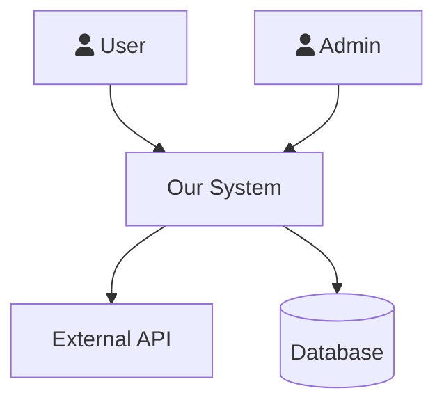
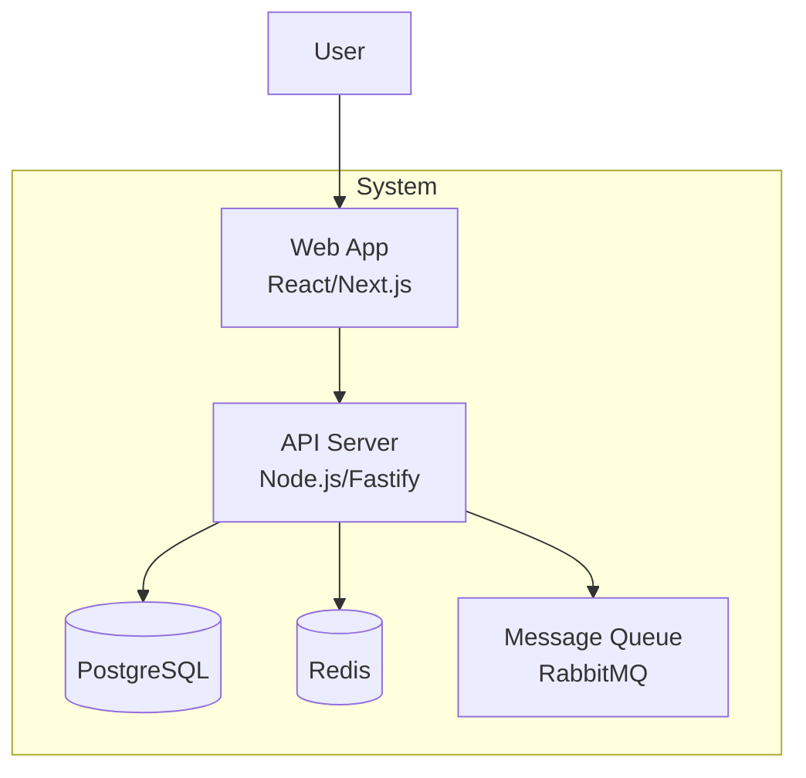
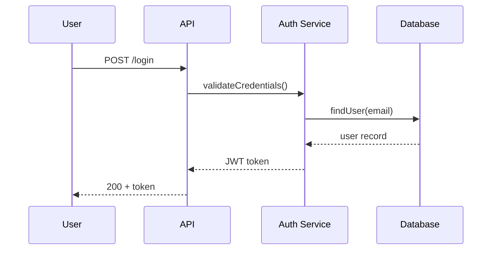
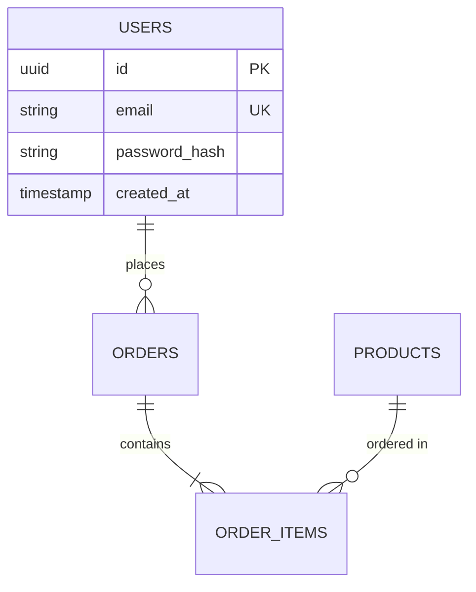
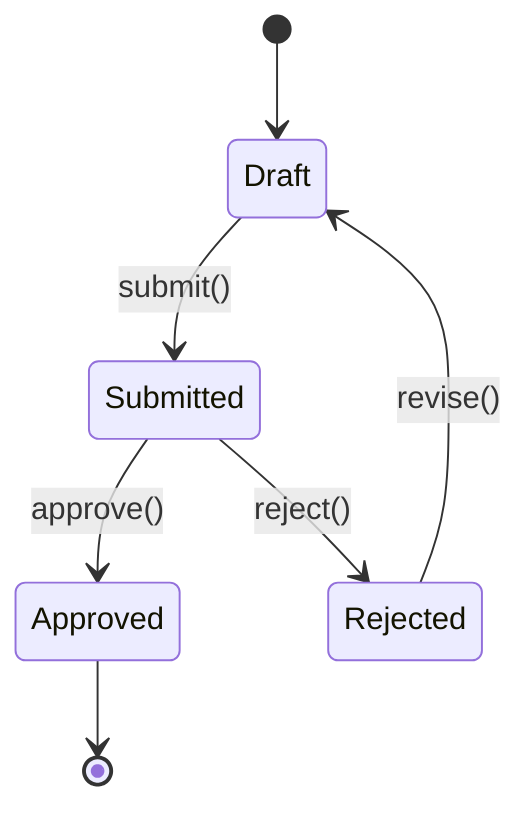
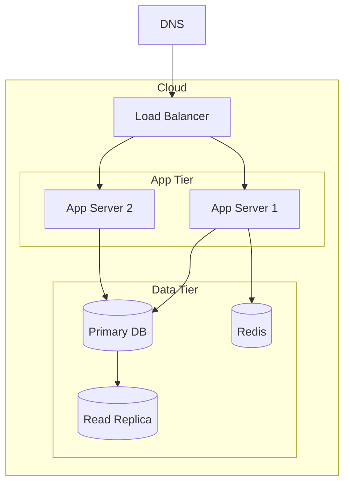

> **Persistence (do not end your turn early):** never end your turn after *announcing* an action — perform it; if you cannot call a tool, print `BLOCKED: <reason>` (never a plan as your final message). Full rule: `agents/shared/PERSISTENCE.md`.


# Mode 1 — Phase 3 & 3.5: Design + Test Design

> Load only when sdlc-init-mode.md directs you here for Phase 3 or 3.5.
> Mandatory rules (loop prevention, document hygiene, delegation) live in sdlc-init-mode.md.
> **task() → HANDOFF reminder:** Any `task(agent="X", ...)` = build a HANDOFF block, save state, execute per `agents/shared/EXECUTOR_SELECTION.md` (Task tool if `has_task_tool=true`, else emit as text and wait for user).
> **Autonomy:** In `autonomy: auto` (per `agents/shared/AUTONOMY_PROTOCOL.md`) never wait on a paste — Executor C degrades to D (inline) per `EXECUTOR_SELECTION.md`.

## Phase 3: Design — HOW do we build it?

### Design Clarification Interview (MANDATORY — Run Before Any Design Work)

**Present ALL questions at once. Do NOT write any design documents until the user responds.**

Output exactly this block, then stop and wait:

```
Before I design the architecture, I need answers to make the right technical decisions.
Please answer these:

1. Where will this run? (AWS/GCP/Azure/on-prem/hybrid — which services/regions if known)
2. What's the expected scale? (users, requests/sec, data volume — today and in 12 months)
3. Any performance targets? (response time SLAs, throughput, availability %)
4. What external systems must this integrate with? (auth providers, payment, APIs, data sources)
5. What's the team's tech stack experience? (languages/frameworks they're strongest in)
6. Any existing infrastructure to reuse? (databases, queues, auth services, monitoring tools)
7. Any regulatory or compliance requirements? (GDPR, HIPAA, SOC2, PCI-DSS, etc.)

These answers will drive every architecture decision.
```

After the user responds:
- Write answers to `docs/DESIGN_CONTEXT.md`
- Reference DESIGN_CONTEXT.md when making every tech stack and architecture decision

**Deliverables:**
- `docs/ARCHITECTURE.md` — SAD with C4 diagrams (see SAD format below)
- `docs/TECH_STACK.md` — Language, framework, libraries + justification
- `docs/DATABASE.md` — ERD, schema, migrations, access patterns
- `docs/API_DESIGN.md` — Human-readable endpoint contracts (narrative + examples)
- `docs/api/openapi.yaml` — Machine-readable OpenAPI 3.0 spec (Swagger-compatible)
- `docs/THREAT_MODEL.md` — STRIDE threats + mitigations
- `docs/PARALLELIZATION_MAP.md` — modules grouped into Phase 4 implementation waves based on dependency order (enables opt-in parallel agent sets)
- `docs/diagrams/` — Mermaid files for all diagrams
- **If UI-bearing (see UX branch below):**
  - `docs/design/DESIGN_PRINCIPLES.md` — Aesthetic direction, tone, anti-patterns
  - `docs/design/STYLE_GUIDE.md` — Typography, color tokens, spacing, motion
  - `docs/design/UX_SPEC.md` — User workflows, screen hierarchy, component inventory, a11y plan

**Delegate SEQUENTIALLY — one at a time, verify output before the next:**

**Step 1 — Research (HANDOFF):** Tech stack evaluation:

```
write(filePath="docs/work/sdlc-state.md", content="
Mode: 1 / Phase: 3 — Design
Last completed: Design Clarification Interview
Awaiting: researcher — docs/research/RESEARCH_framework_comparison_<date>.md
Next after resume: Research Findings Review, then write TECH_STACK.md, then db-architect HANDOFF
Delegation log: docs/work/DELEGATION_LOG.md
")
```

```
---
  HANDOFF → researcher
---
Delegate this EXACT prompt (Task tool preferred; fallback: paste in a new conversation) to /research:

SDLC-TASK for researcher:

CONTEXT (read these before starting):
- docs/DESIGN_CONTEXT.md — deployment environment, scale targets, team experience, constraints
- docs/DISCOVERY.md — what we're building

YOUR TASK:
Compare framework and tech stack options for [domain] given the constraints in DESIGN_CONTEXT.md.
Evaluate: which frameworks best match team experience and scale requirements; performance and
operational trade-offs between the top 2-3 candidates; ecosystem maturity (community, maintained
packages, known CVEs); any licensing or vendor lock-in risks.

PRODUCE exactly these files (nothing else):
- docs/research/RESEARCH_framework_comparison_<date>.md — structured comparison with recommendation

Include a Completion Manifest at the end.

When the file is written, print exactly:
"researcher done — framework comparison: [one sentence recommended stack and key reason]"
Then stop. Do not ask for follow-up. Do not run additional phases.
---
```

**After researcher returns:** Run the Research Findings Review Protocol before writing TECH_STACK.md.
→ Write TECH_STACK.md → mark DONE

**Step 2 — Module design (HANDOFF — new):**

MODULE_DESIGN.md defines the structural blueprint every other specialist designs inside. It must exist before db-architect and api-designer start — they design within the declared module boundaries.

Save state:
```
write(filePath="docs/work/sdlc-state.md", content="
Mode: 1 / Phase: 3 — Design
Last completed: TECH_STACK.md written
Awaiting: architecture-designer — docs/MODULE_DESIGN.md + docs/INFRASTRUCTURE.md
Next after resume: run handoff gates (validate-module-design), then db-architect
")
```

Use **Template 7** from `~/.claude/agents/shared/HANDOFF_TEMPLATES.md` for this HANDOFF.

→ After "architecture-designer done": run `./scripts/validators/run-handoff-gates.sh --scope docs --manifest <manifest> --coverage validate-module-design.sh` → mark DONE

**Git checkpoint — save MODULE_DESIGN + INFRASTRUCTURE:**
```
task(agent="git-expert", prompt="Commit docs/MODULE_DESIGN.md and docs/INFRASTRUCTURE.md to sdlc/setup branch. Conventional commit: 'docs(phase-3): add module design and infrastructure topology'. Push sdlc/setup to origin. Only stage the listed files — git add by name, not git add -A.", timeout=60)
```

**Step 3 — Database design (HANDOFF):**

Save state first:
```
write(filePath="docs/work/sdlc-state.md", content="
Mode: 1 / Phase: 3 — Design
Last completed: TECH_STACK.md written
Awaiting: db-architect — docs/DATABASE.md
Next after resume: api-designer handoff
")
```

```
---
  HANDOFF → db-architect
---
Delegate this EXACT prompt (Task tool preferred; fallback: paste in a new conversation) to /dba:

SDLC-TASK for db-architect:

CONTEXT (read these before starting):
- docs/MODULE_DESIGN.md — module boundaries and ownership (design tables within declared modules)
- docs/SRS.md — functional requirements and data entities
- docs/USER_STORIES.md — feature requirements driving data needs
- docs/TECH_STACK.md — database technology chosen

YOUR TASK:
Design the complete database schema for [project]. Derive all entities from
SRS.md and USER_STORIES.md. Organize tables by the module that owns them
(from MODULE_DESIGN.md § Module Inventory) — each table belongs to exactly
one module. Use the database technology specified in TECH_STACK.md.

PRODUCE exactly this file:
- docs/DATABASE.md — containing: Mermaid erDiagram of all tables and relationships,
  migration files (up/down) for every table, index strategy for each major access
  pattern, and query patterns for the top 5 most frequent operations

When the file is written, print exactly:
"db done — [one sentence: how many tables, key relationships, and notable design decisions]"
Then stop. Do not ask for follow-up. Do not run additional phases.

---
```

→ After "db done": run `./scripts/validators/run-handoff-gates.sh --scope docs --manifest docs/reviews/MANIFEST_database_<date>.md --coverage validate-erd-coverage.sh` → mark DONE

**Git checkpoint — save DATABASE.md:**
```
task(agent="git-expert", prompt="Commit docs/DATABASE.md and db/migrations/ to sdlc/setup branch. Conventional commit: 'docs(phase-3): add database schema, ERD, and migration stubs'. Push sdlc/setup to origin. Only stage the listed files — git add by name, not git add -A.", timeout=60)
```

**Step 3 — API contracts (HANDOFF):**

Save state:
```
write(filePath="docs/work/sdlc-state.md", content="
Mode: 1 / Phase: 3 — Design
Last completed: docs/DATABASE.md written
Awaiting: api-designer — docs/API_DESIGN.md
Next after resume: UX branch (if UI-bearing) or security-auditor handoff
")
```

```
---
  HANDOFF → api-designer
---
Delegate this EXACT prompt (Task tool preferred; fallback: paste in a new conversation) to /api-design:

SDLC-TASK for api-designer:

CONTEXT (read these before starting):
- docs/MODULE_DESIGN.md — module boundaries and public interfaces (group endpoints by module)
- docs/USER_STORIES.md — features that need API endpoints
- docs/SRS.md — functional requirements including auth and data rules
- docs/DATABASE.md — schema and data shapes the API reads/writes

YOUR TASK:
Design complete API contracts for [project]. For every user story that requires
a server interaction, produce an OpenAPI-style endpoint contract. Group endpoints
by the module that owns them (from MODULE_DESIGN.md § Module Inventory) — each
endpoint belongs to exactly one module's public interface.

PRODUCE exactly these two files:

1. docs/API_DESIGN.md — human-readable contracts with: HTTP method, path, request
   body schema, response shapes (200/201/400/401/403/404/500), auth requirements,
   example request/response payloads, and a brief description of each endpoint's
   business purpose. Aimed at developers who need to understand the API quickly.

2. docs/api/openapi.yaml — a valid OpenAPI 3.0 spec that exactly mirrors the
   contracts in API_DESIGN.md. Requirements:
   - `openapi: "3.0.3"` header
   - `info` block: title, version ("0.1.0"), description (one sentence from VISION.md)
   - `servers` block: `- url: /api/v1` (or the correct base path)
   - Every endpoint from API_DESIGN.md as a `paths` entry
   - `components/schemas` for every request body and response object
   - `components/securitySchemes` matching the auth strategy in SRS.md
   - All error responses (400/401/403/404/500) as reusable `$ref` components
   - No inline schemas for objects used in more than one place — always $ref
   - The spec must pass `swagger-cli validate docs/api/openapi.yaml` with 0 errors

When both files are written, print exactly:
"api done — [one sentence: how many endpoints designed and key resources covered]"
Then stop. Do not ask for follow-up. Do not run additional phases.
---
```

→ After "api done": run `./scripts/validators/run-handoff-gates.sh --scope docs --manifest docs/reviews/MANIFEST_api_design_<date>.md --coverage validate-api-coverage.sh` → mark DONE.

**Git checkpoint — save API_DESIGN + OpenAPI spec:**
```
task(agent="git-expert", prompt="Commit docs/API_DESIGN.md and docs/api/openapi.yaml to sdlc/setup branch. Conventional commit: 'docs(phase-3): add API design and OpenAPI 3.0 spec'. Push sdlc/setup to origin. Only stage the listed files — git add by name, not git add -A.", timeout=60)
```
  Also run: `bash -c "swagger-cli validate docs/api/openapi.yaml 2>&1 || echo 'swagger-cli not found — install: npm i -g @apidevtools/swagger-cli'"`.
  If OpenAPI validation fails, return errors to api-designer with REVISE status before accepting.

**Step 4 — UX branch (HANDOFF, if UI-bearing — see below)**

**Step 5 — Threat model (HANDOFF):**

The threat model runs BEFORE ARCHITECTURE.md is synthesized — it reads the design artifacts directly (TECH_STACK + DATABASE + API_DESIGN) to identify threats. ARCHITECTURE.md is synthesized AFTER security controls are incorporated so it captures the full security picture.

Save state:
```
write(filePath="docs/work/sdlc-state.md", content="
Mode: 1 / Phase: 3 — Design
Last completed: API_DESIGN.md (and UX docs if UI-bearing)
Awaiting: security-auditor — docs/THREAT_MODEL.md
Next after resume: SECURITY_CONTROLS HANDOFF, then security reconciliation, then write ARCHITECTURE.md
")
```

```
---
  HANDOFF → security-auditor
---
Delegate this EXACT prompt (Task tool preferred; fallback: paste in a new conversation) to /security:

SDLC-TASK for security-auditor:

CONTEXT (read these before starting):
- docs/TECH_STACK.md — technologies and their known vulnerability profiles
- docs/API_DESIGN.md — API endpoints, authentication requirements, data inputs
- docs/DATABASE.md — schema, sensitive fields, access patterns
- docs/SRS.md — security requirements and compliance constraints

YOUR TASK:
Produce a STRIDE threat model for [project]. For every component and data flow
(derived from TECH_STACK + API_DESIGN + DATABASE), identify threats across all
6 STRIDE categories. Assign a threat ID (T-01, T-02, ...) to every threat. For each:
describe the attack scenario, rate severity (CRITICAL/HIGH/MEDIUM/LOW), identify
the affected component, and describe the attack vector.

PRODUCE exactly this file:
- docs/THREAT_MODEL.md — STRIDE threats organized by component, with threat IDs,
  severity ratings, attack descriptions, and a summary table of all threats

When the file is written, print exactly:
"security done — [one sentence: how many threats found, how many CRITICAL/HIGH]"
Then stop. Do not ask for follow-up. Do not run additional phases.

---
```

→ After "security done": run `./scripts/validators/run-handoff-gates.sh --scope docs --manifest docs/reviews/MANIFEST_threat_model_<date>.md` → mark DONE.

**Git checkpoint — save THREAT_MODEL.md:**
```
task(agent="git-expert", prompt="Commit docs/THREAT_MODEL.md to sdlc/setup branch. Conventional commit: 'docs(phase-3): add threat model with attack scenarios and severity ratings'. Push sdlc/setup to origin. Only stage the listed files — git add by name, not git add -A.", timeout=60)
```
  No `--coverage` flag: threat model quality is validated downstream by `validate-security-controls.sh` (checks every HIGH/CRITICAL threat has a control). Verify THREAT_MODEL.md has threat IDs (T-01, T-02, ...) and severity ratings before accepting.

**Step 6 — Security controls (HANDOFF):**

Save state:
```
write(filePath="docs/work/sdlc-state.md", content="
Mode: 1 / Phase: 3 — Design
Last completed: docs/THREAT_MODEL.md written
Awaiting: security-auditor — docs/SECURITY_CONTROLS.md + document change requests
Next after resume: issue security reconciliation HANDOFFs to db-architect + api-designer, then ARCHITECTURE.md
")
```

Use **Template 5** from `~/.claude/agents/shared/HANDOFF_TEMPLATES.md` for this HANDOFF.

→ After "security done" (security controls): run handoff gates with `--coverage validate-security-controls.sh` → mark DONE

**Git checkpoint — save SECURITY_CONTROLS.md:**
```
task(agent="git-expert", prompt="Commit docs/SECURITY_CONTROLS.md to sdlc/setup branch. Conventional commit: 'docs(phase-3): add security controls mapped to threat model'. Push sdlc/setup to origin. Only stage the listed files — git add by name, not git add -A.", timeout=60)
```

**Step 7 — Security reconciliation (HANDOFFs to db-architect and api-designer):**

SECURITY_CONTROLS.md contains specific change requests for DATABASE.md and API_DESIGN.md. Issue targeted update HANDOFFs:

Save state:
```
write(filePath="docs/work/sdlc-state.md", content="
Mode: 1 / Phase: 3 — Design
Last completed: SECURITY_CONTROLS.md written
Awaiting: db-architect (update DATABASE.md) + api-designer (update API_DESIGN.md + openapi.yaml)
Next after resume: verify both updates, then write ARCHITECTURE.md
")
```

For each update HANDOFF, use Template 1 from `HANDOFF_TEMPLATES.md` scoped to just the update:
- **db-architect update:** read SECURITY_CONTROLS.md change requests for DATABASE.md → add encryption-at-rest notes, sensitive field labels, access control patterns
- **api-designer update:** read SECURITY_CONTROLS.md change requests for API_DESIGN.md → add rate limiting, CORS policy, input validation, and security header notes per endpoint; update openapi.yaml securitySchemes

→ After both update HANDOFFs return and pass handoff gates → mark DONE

**Step 8 — Infrastructure topology (HANDOFF):**

After security controls are applied, the infrastructure shape is known. Delegate to sre-engineer to document the deployment topology.

Save state:
```
write(filePath="docs/work/sdlc-state.md", content="
Mode: 1 / Phase: 3 — Design
Last completed: Security reconciliation complete (DATABASE.md + API_DESIGN.md updated)
Awaiting: sre-engineer — docs/INFRASTRUCTURE.md
Next after resume: run handoff gates (validate-infrastructure), then ARCHITECTURE.md synthesis
")
```

Use **Template 8** from `~/.claude/agents/shared/HANDOFF_TEMPLATES.md` for this HANDOFF.

→ After "sre done": run `./scripts/validators/run-handoff-gates.sh --scope docs --manifest <manifest> --coverage validate-infrastructure.sh` → mark DONE

**Git checkpoint — save INFRASTRUCTURE.md:**
```
task(agent="git-expert", prompt="Commit docs/INFRASTRUCTURE.md to sdlc/setup branch. Conventional commit: 'docs(phase-3): add infrastructure topology — environments, compute, data, networking'. Push sdlc/setup to origin. Only stage the listed files — git add by name, not git add -A.", timeout=60)
```

**You produce (orchestrator synthesis documents — write these yourself, AFTER steps 1-8):**
- `docs/ARCHITECTURE.md` — reconciles MODULE_DESIGN + TECH_STACK + DATABASE + API_DESIGN + THREAT_MODEL + SECURITY_CONTROLS into C4 diagrams. MUST reference both MODULE_DESIGN.md (application structure) and INFRASTRUCTURE.md (deployment topology). Security Architecture section MUST reference SECURITY_CONTROLS.md.
- `docs/PARALLELIZATION_MAP.md` — derives Wave 1/2/3/... from MODULE_DESIGN.md module inventory (use the Depends On column for wave ordering — modules in the same wave have no mutual dependencies)

Write ARCHITECTURE.md LAST — after all specialist handoffs have returned and security controls are incorporated. It synthesizes the full picture.

**Phase 3 sequencing rule (enforced — do not skip or reorder):**
1. TECH_STACK.md (researcher)
2. MODULE_DESIGN.md + INFRASTRUCTURE.md (architecture-designer) — needs TECH_STACK
3. DATABASE.md (db-architect) — needs TECH_STACK + MODULE_DESIGN
4. API_DESIGN.md + openapi.yaml (api-designer) — needs TECH_STACK + MODULE_DESIGN + DATABASE
5. UX docs (ux-engineer, if UI-bearing) — needs TECH_STACK + USER_STORIES
6. THREAT_MODEL.md (security-auditor) — reads TECH_STACK + DATABASE + API_DESIGN
7. SECURITY_CONTROLS.md (security-auditor) — reads THREAT_MODEL
8. DATABASE.md + API_DESIGN.md updates (db-architect + api-designer) — applies security controls
9. INFRASTRUCTURE.md (sre-engineer) — topology based on all the above
10. ARCHITECTURE.md synthesis (sdlc-lead) — references MODULE_DESIGN + INFRASTRUCTURE
11. PARALLELIZATION_MAP.md (sdlc-lead) — from MODULE_DESIGN dependency graph

**Never trigger two Phase 3 handoffs at once.** Each expert's output informs the next. **Phase 4 is different** — it supports parallel waves (see below).

### UX Branch — Mandatory If UI-Bearing

After TECH_STACK.md is written, detect whether this system has a user interface:
- Web app: package.json has `react`/`vue`/`svelte`/`next`/`nuxt`/`remix`/`astro`
- Mobile: `react-native`/`expo`/`flutter`/`swift`/`kotlin` with UI frameworks
- Desktop (JS shell): `tauri`/`electron`/`wails`
- Desktop (native GUI — these have NO package.json): Rust `egui`/`eframe`/`iced`/`slint`/`winit`(+`wgpu` app shell), Python `tkinter`/`pyqt`/`pyside`/`kivy`, C/C++ `qt`/`gtk`/`fltk`/`wxwidgets`, Go `fyne`, .NET `wpf`/`winforms`/`maui`/`avalonia`, JVM `swing`/`javafx` — any windowing/GUI toolkit named in TECH_STACK.md
- TUI: `ratatui`/`bubbletea`/`textual`/curses-class terminal UIs (UX branch runs scope-reduced: workflows + screen hierarchy + keybinding map; STYLE_GUIDE color system optional)
- Game: any engine/render-loop project with menus, HUD, or settings surfaces (visual system may route to the game experts; UX_SPEC is still required)
- Has pages/components/views/screens directory planned in ARCHITECTURE.md
- **Brief-driven catch-all (decisive):** the founding brief, SRS, or USER_STORIES mention any human-operated surface — frontend, UI, screen, panel, viewer, editor, dashboard, HUD, menu, settings, library view, input remapping. Grep them; any hit ⇒ UI-bearing.

**Default when ambiguous: UI-bearing = YES.** A wrong "yes" costs one UX pass; a wrong "no" ships an undesigned UI. (Lesson — RetroForge, 2026-07-06: a Rust/egui desktop app had no package.json, the web-centric list above missed it, and the frontend design doc only appeared because the user asked where it was.)

**Record the determination (MANDATORY, gate-checked):** ARCHITECTURE.md § Logical View must state either `UI-bearing: yes — <evidence>` or the exact sentence "No UI — UX branch not applicable". The phase-3 gate FAILS when neither UX docs nor this declaration exist — silent skip is impossible.

**If UI-bearing, UX delegation is MANDATORY before Phase 3 gate.**

Save state, then hand off:

```
write(filePath="docs/work/sdlc-state.md", content="
Mode: 1 / Phase: 3 — Design
Last completed: docs/API_DESIGN.md written
Awaiting: ux-engineer — docs/design/DESIGN_PRINCIPLES.md, STYLE_GUIDE.md, UX_SPEC.md
Next after resume: security-auditor handoff
")
```

```
---
  HANDOFF → ux-engineer
---
Delegate this EXACT prompt (Task tool preferred; fallback: paste in a new conversation) to /ux:

SDLC-TASK for ux-engineer:

CONTEXT (read these before starting):
- docs/VISION.md — project purpose, target audience, success metrics
- docs/USER_PERSONAS.md — who the users are and what they need
- docs/USER_STORIES.md — what features users need
- docs/TECH_STACK.md — UI framework being used
- docs/DISCOVERY.md — constraints and brand direction from the client
- docs/DESIGN_CONTEXT.md — technical and compliance constraints

YOUR TASK:
Design the complete UX for [project]. Produce three documents that give the
implementation team everything they need to build the UI. Be specific and opinionated —
pick a real visual direction (NOT generic). Do not hedge. Do not produce placeholders.

PRODUCE exactly these files:
- docs/design/DESIGN_PRINCIPLES.md — core design philosophy, tone (pick one extreme:
  minimal / maximalist / brutalist / refined / playful — explain why), visual anti-patterns
  to avoid, decision criteria for future design choices
- docs/design/STYLE_GUIDE.md — specific typefaces (NOT Inter/Roboto/Arial — pick something
  with personality), exact color tokens with hex values, spacing scale, motion principles
- docs/design/UX_SPEC.md — must include ALL of:
  * Component Library Selection: choose ONE specific library (shadcn/ui, MUI, Ant Design,
    Chakra UI, Headless UI + Tailwind, etc.) with justification from TECH_STACK.md framework
  * Screen Hierarchy / Information Architecture: Mermaid diagram showing page/screen tree
  * User Workflows: one Mermaid flowchart per user story (actor → steps → outcomes)
  * Component Inventory: table listing every reusable UI component (name, purpose, variants,
    which screens use it) — minimum 5 components
  * Accessibility Plan (WCAG 2.2 AA): table covering keyboard navigation, color contrast
    (4.5:1 minimum), screen reader support (ARIA), focus indicators
  * Responsive Strategy: breakpoints table with layout approach per breakpoint

When all three files are written, print exactly:
"ux done — [one sentence: design direction chosen and how many workflows covered]"
Then stop. Do not ask for follow-up. Do not run additional phases.

---
```

After "ux done":
1. Verify all three files exist and are >50 lines each
2. Run the **Research Findings Review Protocol** — check for conflicts with TECH_STACK, USER_PERSONAS, or DESIGN_CONTEXT
3. **Run handoff gates:** `./scripts/validators/run-handoff-gates.sh --scope docs/design --manifest <manifest> --coverage validate-ux-spec.sh`
   - Gate uses Track 1 (validate-ux-spec.sh) — objective coverage, not confidence scoring
   - If gaps: return specific gap to ux-engineer with REVISE status (up to 3 iterations)
   - All gaps closed → mark DONE
4. Run Inter-Phase Check-In Protocol for the UX deliverables before proceeding

**After UX passes — HANDOFF to frontend-design for visual implementation:**

If ux-engineer produced DESIGN_PRINCIPLES.md, STYLE_GUIDE.md, and UX_SPEC.md,
the visual design is specified but not implemented. Hand off to frontend-design:

```
---
  HANDOFF → frontend-design
---
Delegate this EXACT prompt (Task tool preferred; fallback: paste in a new conversation) to /frontend:

SDLC-TASK for frontend-design:

CONTEXT (read these before starting):
- docs/design/DESIGN_PRINCIPLES.md — aesthetic direction and anti-patterns
- docs/design/STYLE_GUIDE.md — typography, color tokens, spacing, motion
- docs/design/UX_SPEC.md — component inventory and screen hierarchy
- docs/TECH_STACK.md — UI framework and component library

YOUR TASK:
Implement the design system from the UX specs. Create or update the design
token file (Tailwind config, theme.ts, or CSS custom properties), implement
the typography scale, color palette, and spacing system. Apply to 3
representative components as examples.

PRODUCE exactly these files:
- Updated theme/token files matching STYLE_GUIDE.md specifications
- docs/design/DESIGN_SYSTEM.md — token inventory, naming convention, example usage
- docs/design/IMPLEMENTATION_NOTES.md — what was implemented, before/after

Include a Completion Manifest.

When all files are written, print exactly:
"frontend done — [one sentence: tokens implemented, components styled]"
Then stop. Do not ask for follow-up. Do not run additional phases.
---
```

This is optional in Phase 3 (design phase) — the full visual implementation happens
in Phase 4 after the codebase exists. But establishing the token layer early gives
implementation a clear starting point.

**If NOT UI-bearing** (pure backend API, CLI tool, library, data pipeline): skip the UX branch. Note "No UI — UX branch not applicable" in ARCHITECTURE.md § Logical View.

### High-Level Architecture (HLA)

ARCHITECTURE.md MUST include ALL of the following diagrams. Do not skip any:

1. **System Context (C1)** — Mermaid diagram showing the system and ALL external actors/systems
2. **Container Diagram (C2)** — Mermaid diagram showing ALL services/components from TECH_STACK.md
3. **Component Diagrams (C3)** — ONE Mermaid diagram PER MAJOR SERVICE showing internal components
4. **Sequence Diagrams** — ONE per P0 use case from USE_CASES.md (not a fixed minimum — one per critical path)
5. **Deployment Diagram** — Mermaid diagram showing infrastructure topology from DESIGN_CONTEXT.md
6. **Data Flow Diagram** — Mermaid diagram showing data movement end-to-end

If ARCHITECTURE.md is missing any of these 6 diagram types, the Phase 3 gate CANNOT pass.

### Per-Diagram Confidence Loop (Mandatory — Run After Writing Each Diagram)

After writing EACH diagram in ARCHITECTURE.md, run this loop before moving to the next:

**For C1 (System Context):**
1. List every persona from USER_PERSONAS.md — are they all present as actors?
2. List every external system from SRS.md § Interface Requirements — are they all present?
3. Rate Completeness 1-10. Score < 7 → revise (add missing actors/systems). Score < 5 → surface to user.
4. Update the SDLC_TRACKER diagram inventory row: `⏳ PENDING` → `✅ DONE | [score]`

**For C2 (Container Diagram):**
1. List every service/runtime in TECH_STACK.md — is each represented as a container node?
2. Are the communication arrows (HTTP, gRPC, queue) matching what TECH_STACK.md specifies?
3. Rate Completeness 1-10. Score < 7 → add missing containers. Score < 5 → surface to user.
4. Update tracker C2 row.

**For C3 (Component Diagrams — one per service):**
1. For EACH major service: list its internal modules from the planned feature-sliced structure
2. Do module names match the real implementation plan (not generic "ServiceA", "ModuleB")?
3. Are dependency arrows showing direction (who depends on whom — no circular deps)?
4. Rate each C3 separately. Score < 7 → name real modules. Score < 5 → surface to user.
5. Update tracker row for each C3 (named by service).

**For Sequence Diagrams (one per P0 use case):**
1. Read USE_CASES.md — list every P0 use case
2. For EACH P0 use case: produce one `sequenceDiagram` block tracing: actor → API → service → repository → DB → response
3. Each diagram MUST include: happy path AND at least one error path (validation failure, auth failure, or DB error)
4. Rate each sequence diagram: (a) all participants named specifically — no "Service" generics; (b) error path present; (c) consistent with SRS acceptance criteria for that use case. Score < 7 → add error path or rename generics. Score < 5 → surface.
5. Update tracker — one row per sequence diagram.

**For Deployment Diagram:**
1. Cross-reference with DESIGN_CONTEXT.md § infrastructure — does the diagram reflect the ACTUAL infra choices (cloud provider, services, regions)?
2. Are load balancers, CDN, container runtime, DNS, and monitoring represented if applicable?
3. Rate Completeness 1-10. Score < 7 → add missing infra components. Score < 5 → surface.
4. Update tracker deployment row.

**For Data Flow Diagram:**
1. Trace from user browser/client → through all intermediate hops → to persistence layer → and the read path back
2. Show where data transforms (e.g., DTO → domain model → DB schema)
3. Show where data at rest is encrypted or masked (if applicable per THREAT_MODEL.md)
4. Rate Completeness 1-10. Score < 7 → fill in missing hops. Score < 5 → surface.
5. Update tracker data flow row.

**HLA Overview (write LAST — after all diagrams pass):**
After all 6 diagram types pass their confidence loops, write a 3-paragraph HLA Overview at the TOP of ARCHITECTURE.md:
- Para 1: What the system is, how it's partitioned (monolith / services / serverless), and the key architectural metaphor
- Para 2: The most important architectural decisions and WHY (reference the ADR table)
- Para 3: What a new engineer should understand first to navigate the codebase

This overview is grounded in the real decisions made during the diagram phase — not a copy of the discovery interview answers.

### SAD Format (4+1 Views)

**MANDATORY:** Every section below must be filled with real names from the project — no `[placeholder]` text in the final document. Placeholders exist only in this template as a guide.

**Use the canonical template:** read `agents/templates/ARCHITECTURE_template.md` and copy its structure into `docs/ARCHITECTURE.md`. Fill every section with real project names — no `[placeholder]` text. The template includes all 6 mandatory diagram types (C1 / C2 / C3 / sequence / data flow / deployment) as Mermaid blocks.


### Modular Design Requirements

**Every architecture MUST follow these principles:**

1. **Feature-sliced structure** (not layer-sliced)
   ```
   GOOD:                    BAD:
   src/                     src/
     payments/                controllers/
       service.ts              paymentController.ts
       repository.ts           userController.ts
       types.ts              services/
     users/                    paymentService.ts
       service.ts              userService.ts
       repository.ts         models/
       types.ts                payment.ts
   ```

2. **Interface-driven design** — modules depend on interfaces, not implementations
   ```typescript
   // Define the contract
   interface PaymentProcessor {
     charge(amount: number): Promise<Result>
   }
   // Implement it
   class StripeProcessor implements PaymentProcessor { ... }
   // Depend on the interface
   class CheckoutService {
     constructor(private processor: PaymentProcessor) {}
   }
   ```

3. **Dependency injection** — objects don't create their own dependencies

4. **Clear module boundaries** — each module has:
   - Public API (exported functions/types)
   - Private implementation (internal)
   - Declared dependencies (what it needs from other modules)

5. **Separation of concerns** — business logic, data access, UI, infrastructure are separate

6. **Service boundary criterion (parallel-development-ready)** — every module MUST be independently buildable:
   - Owns its own directory tree (`src/<module>/`) — no sibling writes
   - Exposes a frozen contract (OpenAPI path group, gRPC service, event schema, or public TypeScript interface file)
   - Has zero direct imports from another module's internals — cross-module communication only through contracts
   - Can be replaced with a mock/stub that conforms to the contract without other modules noticing
   - Has an explicit list of dependencies on other modules (used to derive wave ordering in `PARALLELIZATION_MAP.md`)

7. **Write-scope isolation (enforced in Phase 4)** — during implementation, each module's directory is the exclusive write-scope of the agent building it. Agents in the same wave MUST NOT touch files outside their assigned module. Shared code (`src/shared/`, `src/common/`) is written in a prior wave, not concurrently.

8. **Contract-first ordering** — API contracts (`docs/API_DESIGN.md` + `docs/api/openapi.yaml`), event schemas, and public interfaces are frozen at the end of Phase 3, BEFORE any Phase 4 implementation starts. This lets independent modules implement against mocks of each other without blocking. Contract changes during Phase 4 require returning to Phase 3 for that module.

### Parallelization Map — `docs/PARALLELIZATION_MAP.md`

After ARCHITECTURE.md is complete, derive the Phase 4 wave plan. This is a synthesis document the orchestrator writes (like ARCHITECTURE.md) — not a specialist handoff.

**Format:**

```markdown
# Parallelization Map

## Module Inventory
| Module | Directory | Contract artifact | Depends on | Wave |
|--------|-----------|-------------------|------------|------|
| shared-types | src/shared/types | src/shared/types/index.ts | — | 1 |
| auth | src/auth | openapi.yaml §auth | shared-types | 2 |
| users | src/users | openapi.yaml §users | shared-types, auth | 2 |
| orders | src/orders | openapi.yaml §orders | shared-types, users | 3 |
| payments | src/payments | openapi.yaml §payments | shared-types, orders | 3 |

## Waves
- **Wave 1 (sequential foundation):** shared-types — everything depends on these
- **Wave 2 (parallel-safe):** auth, users — independent of each other, both need shared-types
- **Wave 3 (parallel-safe):** orders, payments — independent of each other, both need auth+users

## Cross-cutting (always sequential, outside waves)
- Test strategy (before Wave 1)
- DB migrations (after schema-owning waves)
- Security audit (after all waves)
- CI/CD pipeline (after all code complete)

## Execution mode
- [ ] Sequential (default) — run modules one at a time in wave order
- [ ] Parallel waves — run every module in a wave concurrently (user opt-in per wave)
```

**Wave rules:**
1. Two modules belong in the same wave only if NEITHER depends on the other AND their write-scopes do not overlap
2. `src/shared/` writes ALWAYS go in their own wave (Wave 1 typically) — never concurrent with anything
3. A module's contract (OpenAPI section, interface file) must be frozen in the `docs/` deliverable from Phase 3 BEFORE its wave begins — otherwise downstream waves can't mock it
4. Default execution is sequential; parallel is user-opt-in per wave (see Phase 4 below)

### Mermaid Diagram Templates

**C1 System Context:**


**C2 Container:**


**Sequence Diagram:**


**ERD:**


**State Machine:**


**Deployment Diagram:**


**Exit:** All components documented, data flows diagrammed, modular structure defined, security threats identified, ARCHITECTURE.md contains all 6 required diagram types

**Architecture Diagram Pre-Gate (Mandatory — Run BEFORE the Phase 3 Gate Loop):**

Before rating the standard gate deliverables, verify every row in the SDLC_TRACKER Diagram Inventory is `✅ DONE`:

```
read(filePath="docs/sdlc/SDLC_TRACKER.md")
```

Check the **Architecture Diagram Inventory** table. For every row that is NOT `✅ DONE`:
1. Identify which diagram is missing or incomplete
2. Write/revise that diagram following the Per-Diagram Confidence Loop rules above
3. Score it. Score < 5 → surface to user immediately. Score 5-6 → revise up to 3 times. Score ≥ 7 → mark `✅ DONE` in tracker.
4. Do NOT start the main gate loop until EVERY diagram row is `✅ DONE`.

**Diagram Inventory Completion Check (print before gate):**
```
Architecture Diagram Inventory — Phase 3 Pre-Gate:
  C1 System Context:          [✅ DONE | score] / [⚠️ BLOCKED | reason]
  C2 Container:               [✅ DONE | score] / [⚠️ BLOCKED | reason]
  C3 [service-1]:             [✅ DONE | score] / [⚠️ BLOCKED | reason]
  C3 [service-N]:             ...
  Seq: [UC-001 name]:         [✅ DONE | score] / [⚠️ BLOCKED | reason]
  Seq: [UC-002 name]:         ...  (one row per P0 use case)
  Deployment:                 [✅ DONE | score] / [⚠️ BLOCKED | reason]
  Data Flow:                  [✅ DONE | score] / [⚠️ BLOCKED | reason]

  ALL DONE? [YES → proceed to gate] / [NO → fix blocked items first]
```

### Spec Traceability Audit — Mandatory Before The Phase 3 Gate

Audit the finished document set against the **founding brief** (the user's
original request + Discovery Interview answers) — NOT just the SRS, which may
itself have dropped requirements:

1. Re-read the founding brief and discovery answers. Enumerate EVERY concrete
   requirement/feature/constraint as a row: goals, layers/subsystems,
   per-domain requirement lists, UI surfaces, tooling, testing asks,
   constraints, explicitly promised deliverables.
2. Grade each row against docs/ + the ticket board: **COVERED** (traceable to
   a doc §/requirement id/ticket) / **PARTIAL** ("mentioned in passing" —
   be strict) / **MISSING**.
3. Write `docs/TRACEABILITY.md`: dense tables per group + a Gap register
   listing every non-COVERED row with a proposed fix (which doc to extend,
   which ticket to add).
4. Close the gaps (or record explicit user-approved deferrals), append a
   Gap-resolution section stating the final count ("0 MISSING"), re-grade.
5. `validate-spec-traceability.sh` enforces this at the gate.

Origin — RetroForge (2026-07-06): a fully-gated doc set still shipped without
a frontend design doc, because nothing compared the finished docs against the
*original brief*. SRS-internal traceability (requirements ↔ stories) cannot
catch what never made it into the SRS.

**Gate Loop — Phase 3 Coverage (Ralph Wiggum style, 3-iteration max):**

Run the Phase 3 coverage validator:
```bash
./scripts/validators/run-coverage-loop.sh phase-3
```

This chains: `validate-architecture.sh` + `validate-module-design.sh` + `validate-erd-coverage.sh` + `validate-api-coverage.sh` + `validate-security-controls.sh` + `validate-ux-spec.sh` (ALWAYS — passes only with UX docs present OR an explicit "No UI — UX branch not applicable" declaration in ARCHITECTURE.md) + `validate-spec-traceability.sh` + `validate-no-ascii-art.sh`.

**Exit code → action:**
- **Exit 0** (all clean) → proceed to git checkpoint below
- **Exit 1** (gaps remain, iteration < 3) → read `docs/work/COVERAGE_LOOP_phase-3_<date>.md`, emit one gap-fill HANDOFF per uncovered row back to the specialist that owns it, re-run the script. The HANDOFF should use the ════ delimiter format and include a VERIFY checklist specific to the gap.
- **Exit 2** (3 iterations exhausted) → emit Ralph Wiggum escalation block:
  ```
  PHASE 3 GATE — RALPH WIGGUM ESCALATION
  3 iterations exhausted. Gaps remain. Options:
  A) WAIVER — mark the gap as accepted technical debt (document reason in ARCHITECTURE.md § Known Gaps)
  B) LOWER-BAR — reduce coverage requirement for this row (document in SDLC_TRACKER)
  C) SPECIALIST — bring in a different specialist to address the specific gap
  D) MANUAL — user reviews the gap directly and approves manually
  
  Gaps outstanding: [list from COVERAGE_LOOP file]
  Awaiting user decision before advancing to Phase 3.5.
  ```

**Content quality checks (run AFTER coverage loop exits 0):**
- ARCHITECTURE.md Diagram Inventory: ALL rows `✅ DONE` with score ≥ 7 (enforced above)
- ARCHITECTURE.md § 0 HLA Overview: present and NOT placeholder text (written after diagrams)
- TECH_STACK.md has explicit rationale for each choice, referencing DESIGN_CONTEXT.md
- DATABASE.md has ERD + migrations + access patterns (not just a schema dump)
- API_DESIGN.md has example request/response payloads for every endpoint, not just schemas
- `docs/api/openapi.yaml` exists, passes `swagger-cli validate`, and every endpoint in API_DESIGN.md has a corresponding path entry
- THREAT_MODEL.md has mitigations, not just threats listed
- `docs/PARALLELIZATION_MAP.md` exists with a populated Module Inventory table AND a Waves section listing Wave 1..N
- **If UI-bearing:** `docs/design/DESIGN_PRINCIPLES.md`, `docs/design/STYLE_GUIDE.md`, `docs/design/UX_SPEC.md` all present, all gate-passed. If NOT UI-bearing, ARCHITECTURE.md § Logical View must say "No UI — UX branch not applicable".
- **Spec Traceability Audit:** `docs/TRACEABILITY.md` present — every concrete requirement from the founding brief + Discovery Interview answers graded COVERED/PARTIAL/MISSING against the doc set and ticket board; zero MISSING remaining, every PARTIAL resolved or explicitly deferred with user approval. `validate-spec-traceability.sh` gate-passed.

**Git checkpoint — commit Phase 3 docs before advancing:**
```
task(agent="git-expert", prompt="Commit all new docs/ files from Phase 3 (ARCHITECTURE.md, TECH_STACK.md, DATABASE.md, API_DESIGN.md, docs/api/openapi.yaml, THREAT_MODEL.md, SECURITY_CONTROLS.md, docs/PARALLELIZATION_MAP.md, docs/diagrams/, docs/design/ if UI-bearing) to the sdlc/setup branch. Conventional commit: 'docs(phase-3): add design artifacts — architecture, tech stack, DB, API, OpenAPI spec, threat model, security controls, parallelization map'. Push sdlc/setup to origin. Do NOT push to main.", timeout=60)
```
**Inter-Phase Check-In:** After the gate passes AND docs are committed, run the Inter-Phase Check-In Protocol. Do NOT auto-advance.
**Autonomy:** If `autonomy: auto` per `agents/shared/AUTONOMY_PROTOCOL.md`: continue to the next step and log to `docs/work/APPROVALS.md` instead of waiting.

## Phase 3.5: Test Design — WHAT exactly do we verify?

Phase 3.5 bridges design and implementation. All architecture, API contracts, and security controls are now frozen. The test engineer reads everything produced in Phases 0-3 and produces a detailed test design — concrete test cases per component, endpoint, use case, and threat.

**Save state:**
```
write(filePath="docs/work/sdlc-state.md", content="
Mode: 1 / Phase: 3.5 — Test Design
Last completed: Phase 3 gate passed, Human Approval Gate A confirmed
Awaiting: test-engineer — docs/testing/TEST_DESIGN.md
Next after resume: Phase 3.5 gate, then Human Approval Gate B, then Phase 4
")
```

**HANDOFF:** Use **Template 6** from `~/.claude/agents/shared/HANDOFF_TEMPLATES.md`.

→ After "test-design done": run handoff gates with `--coverage validate-test-design.sh`

**Gate Loop:** Run `./scripts/validators/run-coverage-loop.sh phase-3.5` (uses validate-test-design.sh). Non-blocking style:
- Exit 0 (clean) → mark DONE, advance
- Exit 1 (gaps, iter < 3) → return specific gaps to test-engineer, re-run
- Exit 2 (3 iterations exhausted) → emit Ralph Wiggum escalation block — test-design gaps do NOT block implementation; user may waive individual rows

**Git checkpoint — commit Phase 3.5 docs:**
```
task(agent="git-expert", prompt="Commit docs/testing/TEST_DESIGN.md and docs/work/REQUIREMENTS_MATRIX.md to sdlc/setup branch. Conventional commit: 'docs(phase-3.5): add test design — unit targets, integration cases, E2E scenarios, security tests'. Push to origin.", timeout=60)
```

**HUMAN APPROVAL GATE B:** After Phase 3.5 gate passes and docs are committed, emit **Human Approval Gate B** (defined in `sdlc-lead.md` § Human approval gates). Wait for explicit "yes" before any Phase 4 coding HANDOFFs.

**Merge `sdlc/setup` → `main` before Phase 4 begins:**
Design is approved — merge the planning and design docs into main now so Phase 4 feature branches have an up-to-date base.
```
task(agent="git-expert", prompt="Run --feature mode (PR ready phase): open the sdlc/setup branch PR for review. PR title: 'sdlc: add planning and design docs (phases 0-3)'. PR body: phases 0-3 complete — VISION, SCOPE, RISKS, CONSTRAINTS, PERSONAS, SRS, USER_STORIES, ARCHITECTURE, TECH_STACK, DATABASE, API_DESIGN, docs/api/openapi.yaml (validated OpenAPI 3.0 spec), THREAT_MODEL. All phase gates passed. Ready to merge to main before Phase 4 implementation begins. After PR is approved, merge and delete the sdlc/setup branch.", timeout=120)
```
After the merge is confirmed, Phase 4 feature branches will be cut from the updated `main`.

