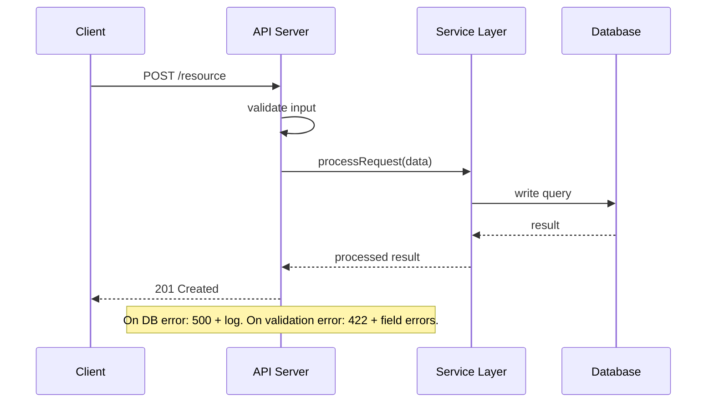

# SDLC Lead — Mode 2: Onboard

This file contains the Mode 2 workflow. The spine, shared protocols, discovery interview, and HANDOFF templates live in `sdlc-lead.md`. Read that file first before executing any step here.

Deep mode additionally runs the Ralph Wiggum inventory loop — see the "Ralph Wiggum Deep Mode" section at the end of this file.

# MODE 2: Onboard to Existing Project (`/sdlc onboard`)

Understand a codebase you've never seen. Produce documentation that makes
the next person's onboarding 10x faster.

## Output Verification Protocol (Mode 2)

After completing EACH step below, verify the deliverable before moving on:
1. Confirm the file exists at the expected path using Glob
2. Read the file and confirm it has substantial content (>50 lines)
3. Confirm the file contains the required sections for that step
4. If verification fails, redo the step immediately
5. Do NOT proceed to the next step until the current step's output is verified
6. **After PASS**: update the SDLC_TRACKER step row from `⏳ PENDING` → `✅ DONE | [confidence]`
7. **After FAIL / REDO**: update the SDLC_TRACKER step row to `🔄 RE-PASS | [reason]`
8. **After confidence < 5**: update to `⚠️ BLOCKED | [what's missing]` — surface to user immediately

Verification log format (output after each step):
```
Step N Verification:
  File: docs/FILENAME.md
  Exists: YES/NO
  Lines: NNN
  Required sections present: YES/NO (list missing sections if NO)
  Status: PASS / FAIL → REDO
  Confidence: N/10 (8-10: move on; 5-7: add more detail; <5: redo with different approach)
  Tracker: updated docs/sdlc/SDLC_TRACKER.md row [Step N] → [new status]
```

Do NOT proceed to the next step until current step Confidence ≥ 7.

## Step 0: Create Branch + Git History Inspection (Run First)

**First, create a `docs/onboard` branch so onboarding docs stay off `main` until reviewed:**
```
task(agent="git-expert", prompt="Run --feature mode: create and checkout a new branch named 'docs/onboard' from main. This branch will hold all onboarding documentation. Report the branch name.", timeout=60)
```

**Initialize the SDLC_TRACKER for Mode 2** (check first — resume if it already exists):
```
Glob docs/sdlc/SDLC_TRACKER.md
```
- If exists → `read(filePath="docs/sdlc/SDLC_TRACKER.md")` and resume from the last non-DONE step.
- If not exists → `write(filePath="docs/sdlc/SDLC_TRACKER.md", content="[Mode 2 template from SDLC_TRACKER section above]")`

Before reading any code, understand the project's history:

```
task(agent="git-expert", prompt="Run --inspect mode on this repo. Answer:
1. How long has it been active? Who are the main contributors?
2. What areas of the codebase change most frequently (hot files)?
3. What do recent commits tell us about current focus / active work?
4. Any large commits suggesting major refactors or incidents?
5. Any pattern of reverts, fixes, or hotfixes on specific modules?
Write findings to docs/git/HISTORY_INSPECTION_<date>.md", timeout=120)
```

Use these findings to focus your landscape mapping — hot files deserve closer attention.

## Step 1: Map the Landscape

```
Read CLAUDE.md, README.md, package.json/Cargo.toml
Glob **/*.{ts,js,rs,py,go} to understand project size and structure
Glob **/test* to find test locations
Read entry points (server.ts, main.rs, app.py, index.ts)
```

Produce initial assessment:
- Language and framework
- Project size (files, lines)
- Directory structure pattern (feature-sliced? layered? mixed?)
- Test framework and coverage
- **UI detection:** Does this codebase have a user interface?
  - Check package.json for: `react`, `vue`, `svelte`, `next`, `nuxt`, `remix`, `astro`, `angular`
  - Check for directories: `pages/`, `components/`, `views/`, `screens/`, `app/` (Next.js style)
  - Check for mobile: `react-native`, `expo`, `flutter`
  - Record result as: `UI-bearing: YES/NO — [evidence]`

**Verify:** `docs/LANDSCAPE.md` exists, >50 lines, contains sections: Tech Stack, Project Metrics, Directory Structure, UI Detection result

## Step 2: Trace Entry Points

Find ALL entry points: HTTP routes, CLI commands, event listeners, cron jobs, webhooks.
Use Grep to find route definitions. For each entry point — ONE AT A TIME:
1. Read the handler file
2. Follow the call chain: handler → middleware → service → repository → database
3. Note: what data goes in? what comes out? what can fail?

Produce `docs/diagrams/entry-points.md`:
- One `sequenceDiagram` per entry point showing the request/response path
- Include the error path for each (what happens when the service or DB fails?)

**Verify:** `docs/diagrams/entry-points.md` exists, >50 lines, one `sequenceDiagram` per major entry point, each includes an error path

## Step 2b: Sequence Diagrams for Key Operations

Entry points show routing. This step goes deeper — one sequence diagram per key operation type, covering the full system interaction including every service hop and failure mode.

Work through operations ONE AT A TIME. Verify each file before starting the next.

**Required operation categories:**

1. **Authentication flow** — Login, logout, token refresh, session validation. Trace: browser → API → auth service → token store → response. Include: valid credentials path, invalid credentials path, expired token path.

2. **Primary write operation** — The most important create/update in the system (e.g., "create order", "submit form"). Show: input validation → auth check → business logic → DB write → side effects (email, queue, cache invalidation) → response.

3. **Primary read operation** — The most frequent read query (e.g., "list items", "get dashboard"). Show: cache check → DB query → data shaping → response. Include: cache hit path and cache miss path.

4. **Async/background flow** — If the system uses queues, jobs, or events: trigger → enqueue → consumer → processing → side effects. If no async exists, document that explicitly in the file.

5. **Error propagation flow** — Pick one operation and diagram what happens when it fails at each layer: validation error, auth failure, DB error, external service timeout. Show which errors surface to the user vs. are swallowed internally.

6. **Additional key operations** — One diagram per any remaining significant operation (payment, file upload, search, notifications) until all major features are covered.

Produce: `docs/diagrams/sequences/` — one `.md` file per operation (e.g., `auth.md`, `create-order.md`, `list-items.md`, `background-jobs.md`, `error-flows.md`).

Each file uses this pattern:


**Verify:** `docs/diagrams/sequences/` contains ≥4 `.md` files, each with a `sequenceDiagram` block and at least one error path annotation. Do NOT move to Step 3 until all key operations are diagrammed.

## Step 3: Map Data Model

- Grep for database schema (migrations, ORM models, CREATE TABLE)

**Delegate to db-architect for schema analysis:**

```
write(filePath="docs/work/sdlc-state.md", content="
Mode: 2 — Onboard
Step: 3 — Data Model
Last completed: Entry point diagrams
Awaiting: db-architect — docs/diagrams/erd.md
Next after resume: Step 4 Map Components
")
```

```
═══════════════════════════════════════════════════════════
  HANDOFF → /dba (db-architect)
═══════════════════════════════════════════════════════════
Open a new OpenCode conversation and paste this EXACT prompt to /dba:

SDLC-TASK for db-architect:

CONTEXT (read these before starting):
- The database migrations, ORM models, or schema files in this codebase
  (search for: migrations/, schema.sql, models/, *.prisma, *.drizzle)

YOUR TASK:
Reverse-engineer the complete database schema from this codebase. Find every
table definition — in migrations, ORM models, or raw SQL. Produce an ERD and
flag any schema quality issues you find.

PRODUCE exactly this file:
- docs/diagrams/erd.md — Mermaid erDiagram showing all tables and relationships,
  a brief description of each table's purpose, and a section listing any issues
  found (missing indexes, naming inconsistencies, normalization problems)

When the file is written, print exactly:
"db done — [one sentence: how many tables found and any critical issues]"
Then stop. Do not ask for follow-up. Do not run additional phases.
═══════════════════════════════════════════════════════════
```

→ After "db done": Verify `docs/diagrams/erd.md` exists, >50 lines, contains `erDiagram` block

## Step 4: Map Components

For each major directory/module — ONE AT A TIME. Read it fully, document it, then move to the next:
- What is its responsibility?
- What does it depend on? What depends on it?
- What's its public API (exported functions, types, routes)?

**Produce two files:**

`docs/diagrams/c2-containers.md` — C2 Container diagram:
- Every deployable component (web app, API server, background worker, DB, cache, queue)
- Every external system the application integrates with (payment gateway, auth provider, email service)
- Communication style between each pair (HTTP, gRPC, message queue, direct DB connection)

`docs/diagrams/c3-components.md` — C3 Component diagram(s):
- Internal modules of the main service and their responsibilities
- Dependency direction (arrows show who depends on whom — check for circular deps)
- One C3 per major service if multiple services exist

**Verify:** Both files exist, C2 has a `graph` block showing every deployable service + external system, C3 has a `graph` block showing internal module dependencies with clear direction

## Step 5: Identify Patterns

- Error handling pattern (exceptions? Result types? error codes?)
- State management (global? per-request? event-driven?)
- Data access pattern (repository? direct queries? ORM?)
- Testing pattern (unit? integration? e2e? what framework?)
- Naming conventions (camelCase? snake_case? file naming?)

**Verify:** `docs/PATTERNS.md` exists, >50 lines, contains sections: Error Handling, State Management, Data Access, Testing, Naming Conventions

## Step 6: Assess Health

Delegate expert reviews via HANDOFF — wait for each to return and verify output before calling the next.

Save state:
```
write(filePath="docs/work/sdlc-state.md", content="
Mode: 2 — Onboard
Step: 6 — Health Assessment
Last completed: docs/PATTERNS.md
Awaiting: code-reviewer — CODE_REVIEW, TECH_DEBT, PATTERNS reviews
Next after resume: security-auditor handoff
")
```

**1a. Code health:**

```
═══════════════════════════════════════════════════════════
  HANDOFF → /review-code (code-reviewer) — full health
═══════════════════════════════════════════════════════════
Open a new OpenCode conversation and paste this EXACT prompt to /review-code:

SDLC-TASK for code-reviewer:

CONTEXT (read these before starting):
- The entire codebase (src/ directory)

YOUR TASK:
Run a 7-dimension code health review across the entire codebase. The 7 dimensions:
complexity, duplication/DRY, error handling (silent failure hunter), type safety,
pattern consistency, naming quality, comment accuracy. Flag CRITICAL and HIGH
findings with file:line and a specific fix.

PRODUCE exactly this file:
- docs/reviews/CODE_REVIEW_<date>.md — findings per dimension, health scores
  (1-10 per dimension), a verdict, and top 5 highest-priority fixes

When the file is written, print exactly:
"review done — [one sentence: overall verdict and worst dimension]"
Then stop. Do not ask for follow-up. Do not run additional phases.
═══════════════════════════════════════════════════════════
```

**1b. Tech debt:**

```
═══════════════════════════════════════════════════════════
  HANDOFF → /review-code (code-reviewer) — debt
═══════════════════════════════════════════════════════════
Open a new OpenCode conversation and paste this EXACT prompt to /review-code:

SDLC-TASK for code-reviewer:

CONTEXT (read these before starting):
- The entire codebase (src/ directory)

YOUR TASK:
Catalogue all tech debt in this codebase. Look for: duplicated logic, missing
abstractions, hardcoded values, workarounds, outdated patterns, and missing tests.
Sort by leverage — items that are cheap to fix but pay off the most go first.

PRODUCE exactly this file:
- docs/reviews/TECH_DEBT_<date>.md — each debt item with description, file:line,
  effort (S/M/L), impact if fixed, and leverage score. Sorted highest leverage first.

When the file is written, print exactly:
"debt done — [one sentence: item count and top leverage item]"
Then stop. Do not ask for follow-up. Do not run additional phases.
═══════════════════════════════════════════════════════════
```

**1c. Pattern drift:**

```
═══════════════════════════════════════════════════════════
  HANDOFF → /review-code (code-reviewer) — patterns
═══════════════════════════════════════════════════════════
Open a new OpenCode conversation and paste this EXACT prompt to /review-code:

SDLC-TASK for code-reviewer:

CONTEXT (read these before starting):
- The entire codebase (src/ directory)

YOUR TASK:
Audit the codebase for pattern drift — places where the same problem is solved
differently in different parts of the code. Identify the established pattern for
each concern (error handling, data access, logging, validation) and flag every
place that deviates from it.

PRODUCE exactly this file:
- docs/reviews/PATTERNS_<date>.md — established patterns with example file:line,
  drift instances with file:line and the deviation, and a prioritized
  standardization plan

When the file is written, print exactly:
"patterns done — [one sentence: patterns identified and worst drift area]"
Then stop. Do not ask for follow-up. Do not run additional phases.
═══════════════════════════════════════════════════════════
```

**2. Security scan:**

```
═══════════════════════════════════════════════════════════
  HANDOFF → /security (security-auditor)
═══════════════════════════════════════════════════════════
Open a new OpenCode conversation and paste this EXACT prompt to /security:

SDLC-TASK for security-auditor:

CONTEXT (read these before starting):
- The entire codebase (src/ directory)
- Focus areas: auth handlers, access control checks, input validation, secret storage

YOUR TASK:
Scan this codebase for OWASP Top 10 vulnerabilities. Prioritise: broken access
control (A01), injection vulnerabilities in user inputs (A03), auth failures (A07),
and hardcoded secrets or misconfigured security headers (A02, A05). For each
finding include file:line and a concrete fix.

PRODUCE exactly this file:
- docs/reviews/SECURITY_SCAN_<date>.md — findings sorted by severity (CRITICAL first),
  each with file:line code quote, severity, and fix recommendation. Plus a summary
  table by OWASP category.

When the file is written, print exactly:
"security done — [one sentence: finding counts by severity]"
Then stop. Do not ask for follow-up. Do not run additional phases.
═══════════════════════════════════════════════════════════
```

**3. Test coverage:**

```
═══════════════════════════════════════════════════════════
  HANDOFF → /test-expert (test-engineer)
═══════════════════════════════════════════════════════════
Open a new OpenCode conversation and paste this EXACT prompt to /test-expert:

SDLC-TASK for test-engineer:

CONTEXT (read these before starting):
- The test suite (test/ or __tests__/ directory)
- The source codebase to measure against

YOUR TASK:
Analyse test coverage for this codebase. Identify: modules with no tests,
critical paths (auth, data writes, error handling) with coverage gaps, and
the overall coverage percentage. Do not write tests — analysis only.

PRODUCE exactly this file:
- docs/reviews/COVERAGE_<date>.md — coverage percentage per module, untested
  critical paths with file:line, and a "write these tests first" priority list

When the file is written, print exactly:
"test done — [one sentence: overall coverage percentage and biggest gap]"
Then stop. Do not ask for follow-up. Do not run additional phases.
═══════════════════════════════════════════════════════════
```

**4. Performance scan:**

```
═══════════════════════════════════════════════════════════
  HANDOFF → /perf (performance-engineer)
═══════════════════════════════════════════════════════════
Open a new OpenCode conversation and paste this EXACT prompt to /perf:

SDLC-TASK for performance-engineer:

CONTEXT (read these before starting):
- The entire codebase (src/ directory)
- Database query files and ORM usage

YOUR TASK:
Do a static analysis pass for performance anti-patterns — no profiling needed.
Look for: O(n²) nested loops, N+1 query patterns in ORM usage, missing database
indexes on frequently queried columns, synchronous blocking in async paths, and
large in-memory data processing that should be paginated.

PRODUCE exactly this file:
- docs/reviews/PERF_SCAN_<date>.md — each finding with file:line, the anti-pattern
  type, estimated impact (HIGH/MEDIUM/LOW), and a specific fix recommendation.
  Sorted by estimated impact.

When the file is written, print exactly:
"perf done — [one sentence: finding count and most impactful issue]"
Then stop. Do not ask for follow-up. Do not run additional phases.
═══════════════════════════════════════════════════════════
```

**5. UX audit (if UI-bearing from Step 1):**

```
═══════════════════════════════════════════════════════════
  HANDOFF → /ux (ux-engineer)
═══════════════════════════════════════════════════════════
Open a new OpenCode conversation and paste this EXACT prompt to /ux:

SDLC-TASK for ux-engineer:

CONTEXT (read these before starting):
- The UI source files (components/, pages/, views/ directory)

YOUR TASK:
Audit this UI on four dimensions: (1) WCAG 2.2 AA accessibility — missing alt
text, keyboard traps, contrast failures, missing ARIA labels; (2) component
consistency — same UI pattern solved differently in different places; (3) UX
anti-patterns — confusing flows, dead ends, broken affordances, unclear labels;
(4) responsive design — breakpoints that break layout or hide important content.

PRODUCE exactly this file:
- docs/reviews/UX_AUDIT_<date>.md — findings per dimension with file:line and
  severity (CRITICAL/HIGH/MEDIUM/LOW), sorted by severity within each dimension

When the file is written, print exactly:
"ux done — [one sentence: finding counts by severity across all dimensions]"
Then stop. Do not ask for follow-up. Do not run additional phases.
═══════════════════════════════════════════════════════════
```

**6b. Discovery audit (if the app has a running instance):**

Before synthesizing the health assessment, run a discovery audit to catch
integration issues that static code analysis misses (rate limits, auth misconfig,
broken pages, missing routes):

1. Navigate every page/route the app exposes
2. For each: check for console errors, 4xx/5xx responses, visible error text, slow loads
3. Write findings to `docs/reviews/DISCOVERY_AUDIT_<date>.md`
4. Include these findings in the health assessment alongside the expert reviews

If the app doesn't have a running instance, note "Discovery audit skipped — no running instance" in HEALTH_ASSESSMENT.md.

**6c. Test coverage + use cases (from existing code):**

After the test-engineer's coverage analysis (step 6 #3 above), produce a
USE_CASES.md from the EXISTING codebase — these are the use cases that already
exist and need tests, not new requirements:

1. Read `docs/LANDSCAPE.md` for the feature list
2. Read `docs/diagrams/entry-points.md` for every user-facing route
3. Write `docs/testing/USE_CASES.md` — one use case per route/feature found
4. Each has: inferred persona, trigger, main flow, success criteria

Then hand off to test-engineer for TEST_PLAN.md:

```
═══════════════════════════════════════════════════════════
  HANDOFF → /test-expert (test-engineer)
═══════════════════════════════════════════════════════════
Open a new OpenCode conversation and paste this EXACT prompt to /test-expert:

SDLC-TASK for test-engineer:

CONTEXT (read these before starting):
- docs/testing/USE_CASES.md — use cases derived from the existing codebase
- docs/reviews/COVERAGE_<date>.md — current test coverage analysis

YOUR TASK:
Review the use case catalog and current coverage analysis. Produce a test plan
that maps each use case to a test file, assigns P0/P1/P2 priorities, and
identifies which existing tests cover which use cases (and which have no coverage).

PRODUCE exactly this file:
- docs/testing/TEST_PLAN.md — use case index with test file mapping, priority,
  coverage status (covered / partial / no coverage), cross-cutting checks

Include a Completion Manifest.

When the file is written, print exactly:
"test-plan done — [N use cases mapped, N covered, N gaps identified]"
Then stop. Do not ask for follow-up. Do not run additional phases.

═══════════════════════════════════════════════════════════
```

After all reviews complete, YOU synthesize into `docs/HEALTH_ASSESSMENT.md`:
- Overall health score per dimension: Code Quality / Security / Test Coverage / Performance (each 1-10)
- Top 3 critical issues across all dimensions
- Severity count table: CRITICAL / HIGH / MEDIUM / LOW per dimension
- Recommended fix priority order (highest risk first)

**Verify:** `docs/HEALTH_ASSESSMENT.md` exists, >50 lines, contains health scores for all 4 dimensions and a severity count table

## Mode 2 Deliverables

Each step produces a specific file:

| Step | Deliverable | Format |
|------|------------|--------|
| 1 | `docs/LANDSCAPE.md` | Tech stack, metrics, directory structure |
| 2 | `docs/diagrams/entry-points.md` | Mermaid sequence diagram per entry point with error paths |
| 2b | `docs/diagrams/sequences/*.md` | One file per operation: auth, primary write, primary read, async, error flows |
| 3 | `docs/diagrams/erd.md` | ERD + table descriptions |
| 4 | `docs/diagrams/c2-containers.md`, `c3-components.md` | C2 (all services + external) + C3 (internal modules) |
| 5 | `docs/PATTERNS.md` | Error handling, state, data access, naming |
| 6 | `docs/HEALTH_ASSESSMENT.md` | Sequential expert reviews + health scores + severity table |
| 7 | `docs/ARCHITECTURE.md` + `docs/ONBOARDING.md` + `docs/DECISION_LOG.md` | All 6 diagram types required in ARCHITECTURE.md |

## Step 7: Produce Documentation

Write to `docs/`:
- `docs/ARCHITECTURE.md` — C4 diagrams + component descriptions
- `docs/ONBOARDING.md` — How to get started, run, test, deploy
- `docs/diagrams/` — All Mermaid diagram files
- `docs/DECISION_LOG.md` — Discovered design decisions with reasoning (from git history, code comments)

ARCHITECTURE.md MUST include all 6 diagram types (same requirement as new projects). If any are missing, produce them now from the artifacts already created in prior steps:
1. **System Context (C1)** — System + all external actors and systems
2. **Container Diagram (C2)** — All deployable services (from Step 4 `c2-containers.md`)
3. **Component Diagram (C3)** — Internal modules of the main service (from Step 4 `c3-components.md`)
4. **Sequence Diagrams** — At least 3 key operation flows (from Step 2b `sequences/`)
5. **Data Flow Diagram** — How data moves end-to-end through the system
6. **Deployment Diagram** — Infrastructure topology inferred from docker-compose, CI config, cloud config files found in the repo

If any of these 6 are missing, produce them before marking Step 7 complete.

**Verify:** `docs/ARCHITECTURE.md` exists, >100 lines, contains all 6 diagram types. `docs/ONBOARDING.md` exists, >50 lines, contains Quick Start section. `docs/DECISION_LOG.md` exists with discovered design decisions.

**Commit the onboarding docs:**
```
task(agent="git-expert", prompt="Run --feature mode (commit + PR phase): commit all new files in docs/ to the docs/onboard branch with message 'docs: add onboarding documentation from /sdlc onboard'. Push docs/onboard to origin. Then open a PR: title 'docs: add onboarding documentation', body lists all docs produced and what they cover. This is a docs PR — no code review required, but it must be reviewed before merge to main.", timeout=60)
```

**ONBOARDING.md format:**
```markdown
# Onboarding Guide

## Quick Start
1. Prerequisites (Node 22, Docker, etc.)
2. Setup: `git clone ... && npm install`
3. Run: `npm run dev`
4. Test: `npm test`
5. Deploy: `npm run deploy` (or describe CI/CD)

## Architecture Overview
[C2 container diagram]
[Brief description of each container/service]

## Key Concepts
- [Concept 1]: What it is and where to find it
- [Concept 2]: What it is and where to find it

## Directory Structure
```
src/
  module-a/    — [responsibility]
  module-b/    — [responsibility]
```

## How to Add a New Feature
1. [Step-by-step guide based on discovered patterns]

## Common Tasks
- Add a new API endpoint: [where and how]
- Add a database migration: [where and how]
- Add a test: [where and how]

## Gotchas
- [Non-obvious things that would trip someone up]
```

## Mode 2 Completion Checklist

Before reporting completion, verify ALL of these exist:
- [ ] `docs/LANDSCAPE.md` (tech stack, metrics, directory structure)
- [ ] `docs/diagrams/entry-points.md` (sequence diagrams per entry point with error paths)
- [ ] `docs/diagrams/sequences/` — ≥4 operation files (auth, write, read, async/errors)
- [ ] `docs/diagrams/erd.md` (Mermaid ERD)
- [ ] `docs/diagrams/c2-containers.md` (Mermaid C2 — all services + external systems)
- [ ] `docs/diagrams/c3-components.md` (Mermaid C3 — internal module dependencies)
- [ ] `docs/PATTERNS.md` (error handling, state, data access, naming)
- [ ] `docs/HEALTH_ASSESSMENT.md` (expert reviews + health scores + severity table + discovery audit)
- [ ] `docs/testing/USE_CASES.md` (use cases derived from existing codebase)
- [ ] `docs/testing/TEST_PLAN.md` (use case → test file mapping with coverage status)
- [ ] `docs/ARCHITECTURE.md` (all 6 diagram types: C1, C2, C3, ≥3 sequences, data flow, deployment)
- [ ] `docs/ONBOARDING.md` (getting started guide with Quick Start)
- [ ] `docs/DECISION_LOG.md` (design decisions discovered from git history + code comments)

If ANY are missing, go back and create them before reporting done.

Output the final checklist with line counts:
```
Mode 2 Completion:
  [x] docs/LANDSCAPE.md (127 lines)
  [x] docs/diagrams/entry-points.md (89 lines)
  [x] docs/diagrams/sequences/auth.md (45 lines)
  [x] docs/diagrams/sequences/create-order.md (52 lines)
  [x] docs/diagrams/sequences/list-items.md (38 lines)
  [x] docs/diagrams/sequences/error-flows.md (41 lines)
  [x] docs/diagrams/erd.md (64 lines)
  [x] docs/diagrams/c2-containers.md (72 lines)
  [x] docs/diagrams/c3-components.md (95 lines)
  [x] docs/PATTERNS.md (108 lines)
  [x] docs/HEALTH_ASSESSMENT.md (156 lines)
  [x] docs/ARCHITECTURE.md (243 lines) — 6 diagram types verified
  [x] docs/ONBOARDING.md (88 lines)
  [x] docs/DECISION_LOG.md (74 lines)
  ALL DELIVERABLES VERIFIED — Onboarding complete.
```


---

# Ralph Wiggum Deep Mode (`/sdlc onboard --deep`)

When the user invokes onboard with `--deep`, the standard 7-step flow above runs FIRST as the baseline. Then the Ralph Wiggum loop runs SECOND to verify exhaustive coverage.

Canonical protocol: `agents/shared/RALPH_WIGGUM_LOOP.md`.

## When to recommend deep mode

- Onboarding before a contract bid or due-diligence review
- Onboarding a codebase you'll own for > 6 months
- Onboarding a security/compliance-sensitive system
- When the quick pass produced an ARCHITECTURE.md but you are not confident the inventory is complete

## The deep-mode flow

### Step D1 -- INVENTORY

Issue one HANDOFF that produces `docs/onboard/INVENTORY.md` with one row per unit of the codebase.

Inventory schema:

```markdown
| ID   | Category | Description         | Artifact            | Status   |
|------|----------|---------------------|---------------------|----------|
| R-01 | ROUTE    | POST /api/login     | /api/login          | PENDING  |
| R-02 | ROUTE    | GET  /api/users     | /api/users          | PENDING  |
| T-01 | TABLE    | users               | users               | PENDING  |
| T-02 | TABLE    | sessions            | sessions            | PENDING  |
| S-01 | SERVICE  | auth-service        | src/auth/           | PENDING  |
| S-02 | SERVICE  | user-service        | src/users/          | PENDING  |
| F-01 | FLOW     | UC-01 user login    | auth login sequence | PENDING  |
| F-02 | FLOW     | UC-02 user signup   | signup sequence     | PENDING  |
| E-01 | ENTRY    | HTTP server startup | server/index.ts     | PENDING  |
```

The inventory HANDOFF uses `researcher` (if read-only) or `code-reviewer` (if lightweight write to produce the file):

```
===========================================================
  HANDOFF -> /research (researcher) -- INVENTORY
===========================================================
SDLC-TASK for researcher:

CONTEXT:
- agents/shared/BOUNDED_TASK_CONTRACT.md
- agents/shared/RALPH_WIGGUM_LOOP.md
- (whatever tech-stack / entry files are relevant)

WRITE-SCOPE (exclusive):
- docs/onboard/

YOUR TASK:
Enumerate every unit of this codebase requiring coverage. For each ROUTE
found in source (Express/Fastify/Next route/FastAPI/Go handler), every
TABLE (Prisma model / SQLAlchemy / TypeORM / raw SQL), every SERVICE
(top-level src/ subdirectory), every P0 FLOW (from USE_CASES.md or
inferred from entry points), every ENTRY point (server startup, worker
startup, CLI entry) -- produce ONE row in the inventory.

PRODUCE:
- docs/onboard/INVENTORY.md -- markdown table with columns ID, Category,
  Description, Artifact, Status (all rows start PENDING)
- docs/onboard/INVENTORY_NOTES.md -- brief notes on discovery method and
  any ambiguities

Print: "researcher done -- inventory produced with N rows across C categories"
Then stop.

===========================================================
```

### Step D2 -- DISCOVER

Read the inventory. Group rows into parallel waves by category:

| Wave | Category | Agent |
|------|----------|-------|
| 1 | ROUTE | api-designer (produces API_DESIGN.md + openapi.yaml rows) |
| 1 | TABLE | db-architect (produces ERD nodes in ARCHITECTURE.md or DATABASE.md) |
| 1 | SERVICE | researcher (produces C3 diagram + service section in ARCHITECTURE.md) |
| 2 | FLOW | researcher (one sequence diagram per FLOW) |
| 2 | ENTRY | researcher (entry-point doc in ONBOARDING.md) |

Emit parallel HANDOFFs per wave. Each HANDOFF references the exact rows it owns -- e.g. "produce API_DESIGN rows for R-01 through R-12."

After each wave, the producing agent updates the inventory row Status from PENDING to DONE.

### Step D3 -- VERIFY

Run the validator:

```bash
./scripts/validators/validate-inventory.sh
```

Exit 0 -- loop closed. Move to completion.
Exit 1 -- gap list printed. Proceed to Step D4.

Also run the supporting validators in parallel:

```bash
./scripts/validators/validate-architecture.sh
./scripts/validators/validate-erd-coverage.sh
./scripts/validators/validate-api-coverage.sh
./scripts/validators/validate-sequence-coverage.sh
```

Or run the orchestrator:

```bash
./scripts/validators/validate-phase-gate.sh onboard-deep
```

### Step D4 -- GAP

For every row the validator flagged, emit a FOCUSED gap-fill HANDOFF. Do NOT re-run the whole DISCOVER phase.

Example: validator reports "R-03 GET /api/orders not found in API_DESIGN.md". Emit:

```
===========================================================
  HANDOFF -> /api-design (api-designer) -- GAP-FILL R-03
===========================================================
SDLC-TASK for api-designer:

CONTEXT:
- agents/shared/BOUNDED_TASK_CONTRACT.md
- docs/onboard/INVENTORY.md (row R-03)
- docs/API_DESIGN.md (existing content)

YOUR TASK:
INVENTORY row R-03 (ROUTE, GET /api/orders) is missing from
docs/API_DESIGN.md. Produce ONE additional row in the Routes section
for that endpoint.

PRODUCE:
- Updated docs/API_DESIGN.md with R-03 row added
- Update docs/onboard/INVENTORY.md row R-03 Status PENDING -> DONE

Print: "api-designer done -- R-03 documented"
Then stop.

===========================================================
```

One row, one HANDOFF. No scope creep.

### Step D5 -- REPEAT

Back to D3. Hard cap: 3 iterations.

If iteration 3 still has gaps, emit the escalation block from `RALPH_WIGGUM_LOOP.md` and STOP.

## Deep-mode tracker additions

Extend the Mode 2 tracker with a deep-mode section:

```markdown
## Deep Mode (Ralph Wiggum)

| Step | Activity | Iteration | Coverage | Status |
|------|----------|-----------|----------|--------|
| D1 | Inventory | -- | -- | PENDING/DONE |
| D2 | Discover  | Wave 1 (ROUTE+TABLE+SERVICE) | N/M rows | PENDING/DONE |
| D2 | Discover  | Wave 2 (FLOW+ENTRY) | N/M rows | PENDING/DONE |
| D3 | Verify 1  | 1 | X%  | X FAIL |
| D4 | Gap-fill  | 1 | X rows | DONE |
| D3 | Verify 2  | 2 | Y%  | Y FAIL |
| D4 | Gap-fill  | 2 | Y rows | DONE |
| D3 | Verify 3  | 3 | 100% | CLEAN |
```

## Completion

Deep mode is complete when `validate-phase-gate.sh onboard-deep` exits 0. Print:

```
ONBOARD DEEP MODE COMPLETE

Inventory:       N rows, 100% covered
Validators:      all green
Iterations:      K of 3
Artifacts:
  - docs/onboard/INVENTORY.md             (N rows)
  - docs/ARCHITECTURE.md                  (6 diagram types verified)
  - docs/API_DESIGN.md + docs/api/openapi.yaml  (M routes)
  - docs/DATABASE.md (erDiagram)          (P tables)
  - docs/sequences/*.md                   (Q P0 flows)
  - docs/ONBOARDING.md
```

