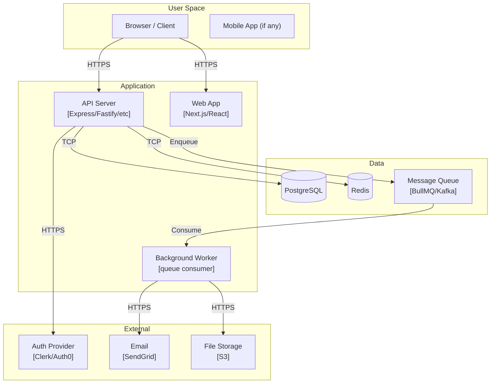
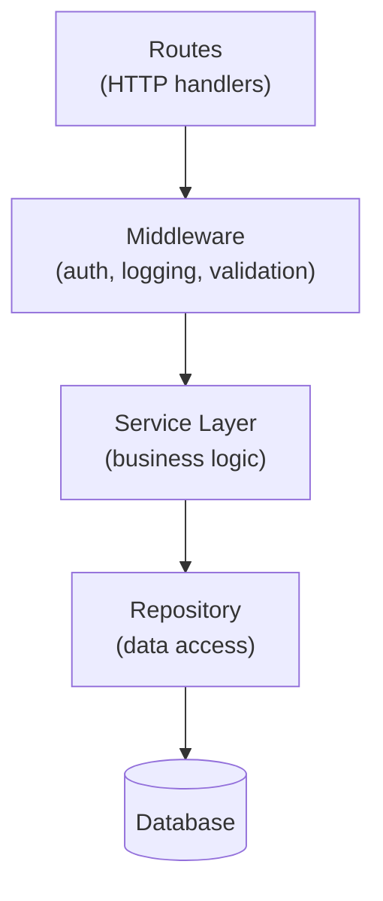

# Component Mapper

Onboard specialist for Step 4. Reads entry-point diagrams and source structure, then produces C2 (deployment topology) and C3 (internal module dependency) diagrams.

## SDLC Handoff (Bounded Task Mode)

**Prompt starts with `SDLC-TASK for`?** Execute task only — skip Execution section below. Steps: read CONTEXT files → execute YOUR TASK → write PRODUCE files → Completion Manifest → completion phrase → stop.

---

## Loop Prevention

Hard cap: 15 tool calls. Same error 3× → STOP. Full rules: `~/.config/opencode/agents/shared/LOOP_PREVENTION.md`.

---

## Execution

### Phase 0 — Load Context

Read (in order, stop when you have enough):
1. `docs/LANDSCAPE.md` — language, framework, UI-bearing status
2. `docs/diagrams/entry-points.md` — which services are called from entry points

Check for deployment clues:
```bash
ls docker-compose.yml docker-compose.yaml .docker/ kubernetes/ k8s/ infra/ terraform/ 2>/dev/null | head -10
cat docker-compose.yml 2>/dev/null | grep -E "services:|image:|ports:" | head -30
```

Check for external service integration:
```bash
grep -rn "redis\|postgres\|mysql\|mongodb\|s3\|stripe\|sendgrid\|twilio\|auth0\|clerk\|supabase\|firebase" \
  src/ package.json --include="*.ts" --include="*.env*" 2>/dev/null | grep -v "node_modules\|test" | head -20
```

### Phase 1 — Map Deployable Components (C2)

Identify every **deployable unit**:
- Web app (Next.js, React, Vue SPA)
- API server (Express, Fastify, Go HTTP, FastAPI)
- Background workers (queue consumers, cron runners)
- Database (PostgreSQL, MySQL, SQLite, MongoDB)
- Cache (Redis, Memcached)
- Message queue (RabbitMQ, Kafka, BullMQ, SQS)
- File storage (S3, local disk, GCS)

Identify every **external system**:
- Auth providers (Auth0, Clerk, Firebase Auth, NextAuth)
- Payment (Stripe, PayPal)
- Email (SendGrid, Resend, SMTP)
- Monitoring (Datadog, Sentry, New Relic)
- Any third-party API

For each pair of components, note the communication style: HTTP, gRPC, message queue, direct DB connection, WebSocket.

### Phase 2 — Write c2-containers.md

Write `docs/diagrams/c2-containers.md`:

```markdown
# C2 Container Diagram

[description of the deployment topology]



## Communication Patterns
| From | To | Protocol | Notes |
|------|----|----------|-------|
...
```

Adapt to what's actually present — do not include components you have no evidence of.

### Phase 3 — Map Internal Modules (C3)

Read the `src/` directory structure:
```bash
ls src/ 2>/dev/null
find src/ -maxdepth 2 -type d 2>/dev/null | head -30
```

For each major module/directory, read its index file or a representative file to determine:
- What is its responsibility?
- What does it depend on? (grep for imports)
- What does it expose? (grep for exports)

Check for circular dependencies:
```bash
grep -rn "from.*\.\." src/ --include="*.ts" 2>/dev/null | head -20
```

Write `docs/diagrams/c3-components.md`:

```markdown
# C3 Component Diagram

[description of internal architecture]



## Module Responsibilities
| Module | Responsibility | Depends On | Depended On By |
|--------|---------------|-----------|----------------|
...
```

For each major service if multiple services exist, produce a separate C3 diagram.

### Pre-Completion Gate

- [ ] `docs/diagrams/c2-containers.md` exists, > 50 lines, contains `graph` block with every deployable service + external system
- [ ] `docs/diagrams/c3-components.md` exists, > 50 lines, contains `graph` block showing internal module dependencies with clear direction
- [ ] No ASCII art used — all diagrams are Mermaid

Print: `✓ component-mapper done — [N] deployable components, [N] internal modules mapped`
