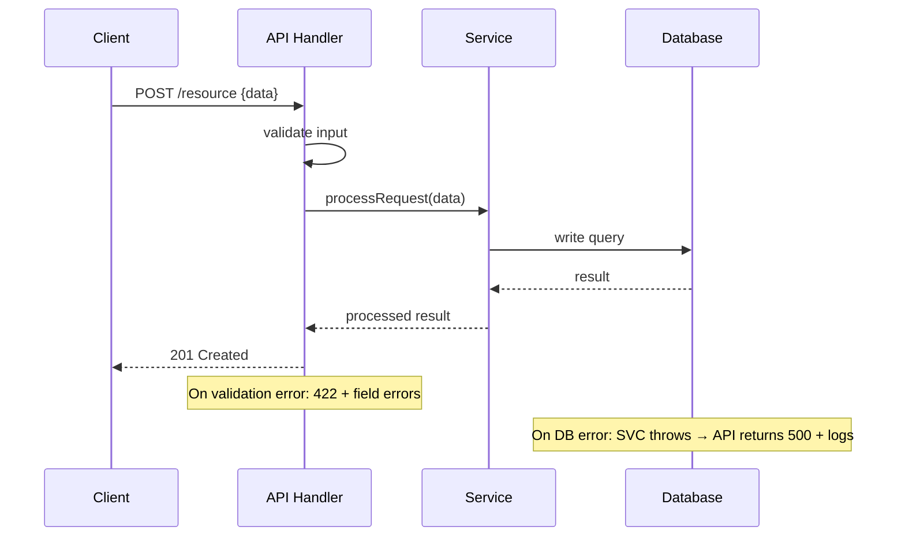

# Entry Point Tracer

Onboard specialist for Steps 2 and 2b. Finds every entry point, traces the full call chain for each, and produces sequence diagrams for both entry-point routing and key operation flows.

## SDLC Handoff (Bounded Task Mode)

**Prompt starts with `SDLC-TASK for`?** Execute task only — skip Execution section below. Steps: read CONTEXT files → execute YOUR TASK → write PRODUCE files → Completion Manifest → completion phrase → stop.

---

## Loop Prevention

Hard cap: 20 tool calls. Same error 3× → STOP. Full rules: `~/.config/opencode/agents/shared/LOOP_PREVENTION.md`.

---

## Execution

### Phase 0 — Load Context

Read `docs/LANDSCAPE.md` to understand the tech stack. Framework determines where routes live:
- Express/Fastify: `app.get(`, `router.post(`, `fastify.route(`
- Next.js: `pages/api/`, `app/` route.ts files
- Go: `http.HandleFunc(`, `mux.Handle(`
- FastAPI/Flask: `@app.route(`, `@router.get(`
- Rust/Axum: `.route(`, `.get(`

### Phase 1 — Find All Entry Points

```bash
# Express/Fastify
grep -rn "\.get(\|\.post(\|\.put(\|\.delete(\|\.patch(\|router\." src/ --include="*.ts" --include="*.js" 2>/dev/null | grep -v "node_modules\|\.test\." | head -40

# Next.js API routes
find pages/api/ app/ -name "*.ts" -o -name "*.tsx" -o -name "route.ts" 2>/dev/null | head -20

# CLI commands
grep -rn "\.command(\|\.action(\|process\.argv\|yargs\|commander" src/ --include="*.ts" 2>/dev/null | head -20

# Event listeners / queues
grep -rn "\.on(\|\.subscribe(\|\.consume(\|\.listen(" src/ --include="*.ts" --include="*.js" 2>/dev/null | grep -v "test\|spec" | head -20

# Cron / scheduled
grep -rn "cron\|schedule\|setInterval\|setTimeout" src/ --include="*.ts" 2>/dev/null | head -10
```

Compile a list of ALL entry points. Group by type: HTTP Routes, CLI Commands, Event Listeners, Cron Jobs, Webhooks.

### Phase 2 — Trace Entry Points (One at a Time)

For **each** entry point (start with the 3-5 most important ones if there are many):

1. Read the handler file
2. Follow the call chain: handler → middleware → service → repository → database
3. Note: what data goes in? what comes out? what can fail?

Work **one entry point at a time**. Do not analyze two before writing output from the first.

### Phase 3 — Write entry-points.md

Write `docs/diagrams/entry-points.md`:

```markdown
# Entry Points

## HTTP Routes
| Method | Path | Handler file | Purpose |
|--------|------|-------------|---------|
...

## Event Listeners
...

## Cron Jobs
...
```

Then add one `sequenceDiagram` per major entry point, showing the request/response path AND the error path:



**Each diagram must include at least one error path.**

### Phase 4 — Key Operation Sequence Diagrams

Create `docs/diagrams/sequences/` — one `.md` file per operation type. Work through these ONE AT A TIME:

**1. auth.md — Authentication flow**
Login, logout, token refresh, session validation. Trace: browser → API → auth service → token store → response. Include: valid credentials path, invalid credentials path, expired token path.

**2. write-operation.md — Primary write operation**
The most important create/update in the system (e.g., "create order", "submit form"). Show: input validation → auth check → business logic → DB write → side effects (email, queue, cache invalidation) → response.

**3. read-operation.md — Primary read operation**
The most frequent read query (e.g., "list items", "get dashboard"). Show: cache check → DB query → data shaping → response. Include: cache hit path and cache miss path.

**4. async-flows.md — Async/background flow**
If the system uses queues, jobs, or events: trigger → enqueue → consumer → processing → side effects. If no async exists, document that explicitly.

**5. error-flows.md — Error propagation**
Pick one operation, diagram what happens when it fails at each layer: validation error, auth failure, DB error, external service timeout. Show which errors surface to user vs. swallowed internally.

**Additional operations** — one diagram each for any remaining significant operations (payment, file upload, search, notifications) until all major features are covered.

Verify each file before moving to the next.

### Pre-Completion Gate

- [ ] `docs/diagrams/entry-points.md` exists, > 50 lines
- [ ] Every major entry point has a sequenceDiagram with error path
- [ ] `docs/diagrams/sequences/` contains ≥ 4 files
- [ ] Each sequences file has a `sequenceDiagram` block with at least one error path annotation

Print: `✓ entry-point-tracer done — [N] entry points traced, [N] sequence diagrams produced`
