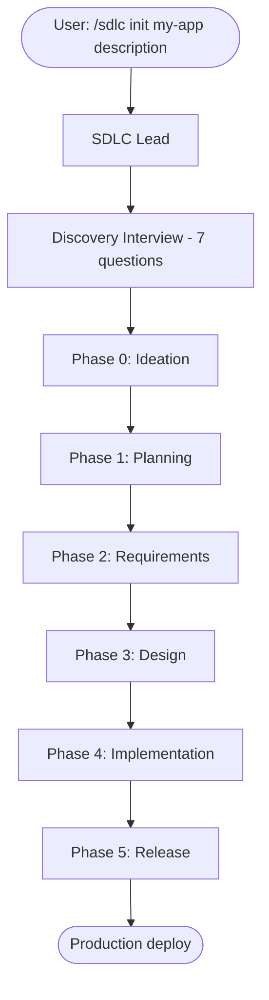
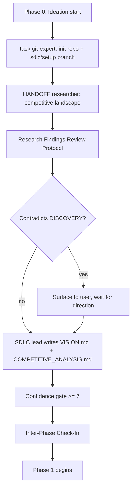
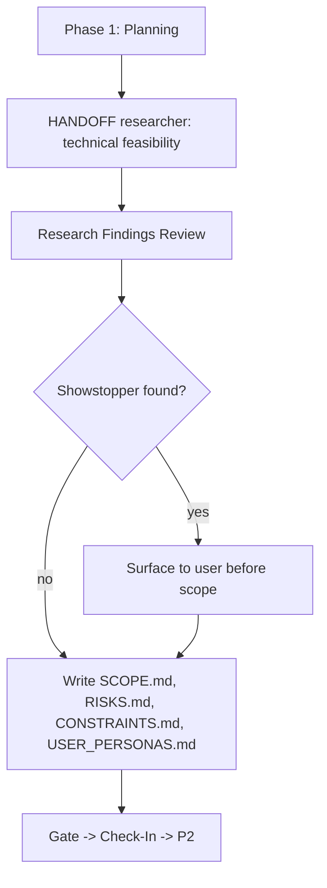
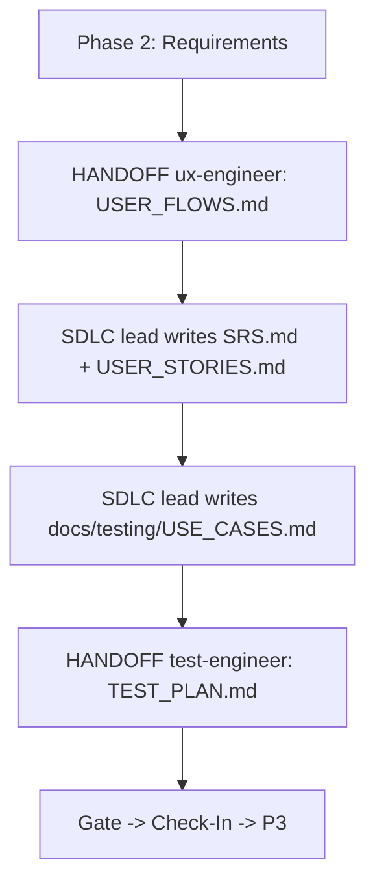
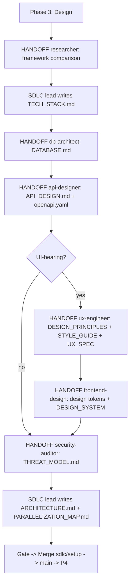
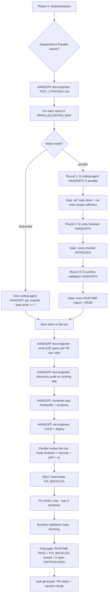
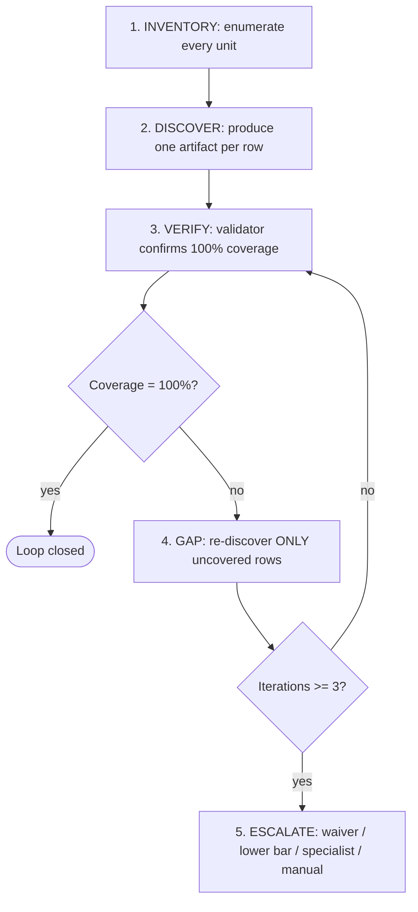
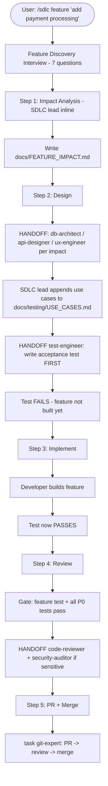
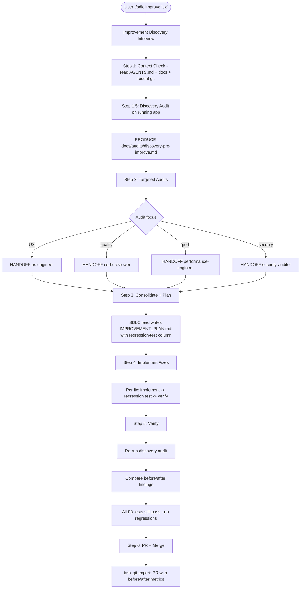

# Agent Process Flow — Step by Step

_How the SDLC lead orchestrates specialists. Every arrow is a handoff or a return._

## Two protocols every agent honors

Before walking the mode flows, two cross-cutting protocols apply to every step in every diagram:

1. **Scope boundary** (`agents/shared/SCOPE_BOUNDARY.md`) — a primary agent invoked directly (e.g., the user typing `/research` or `/code`) checks whether the request belongs to its domain. If not, it prints a SCOPE-BOUNDARY block naming the right specialist (or `/sdlc` for orchestration) and stops. Phrases like "review for gaps", "audit this", "evaluate" are forced into Mode 4 (`/sdlc improve`) — never freelanced.
2. **Bounded task contract** (`agents/shared/BOUNDED_TASK_CONTRACT.md`) — when an agent receives a HANDOFF prompt starting with `SDLC-TASK for <agent>:`, the five rules apply: write-scope isolation, no extras beyond PRODUCE, verbatim completion phrase, no scope expansion, stop-means-stop.

The flows below assume both. If either fires, the diagram pauses and the user gets either a SCOPE-BOUNDARY block (mid-flight, agent stops) or a REVISE handoff (post-HANDOFF gate failure).

## Mode 1: New Project — full lifecycle



### Phase 0 — Ideation



### Phase 1 — Planning



### Phase 2 — Requirements



### Phase 3 — Design



### Phase 4 — Implementation (wave-based)



### Phase 5 — Release

Phase 5 is the release gate, not a workflow. It runs `validate-phase-gate.sh phase-5` which chains FIX_BACKLOG-closed, all reviews APPROVED, and runtime gates. If clean, it merges to `main` and tags the release.

## What's New (highlights from recent versions)

### USE_CASES.md in Phase 2

SDLC lead writes this inline (not a handoff) because it derives directly from requirements. One use case per user story, with persona, preconditions, trigger, main flow, alt flows, success criteria. This is the source of truth for what gets tested.

### TEST_PLAN.md via test-engineer in Phase 2

After USE_CASES.md is written, test-engineer reviews it and produces TEST_PLAN.md: P0/P1/P2 priorities, test-file mapping, cross-cutting checks. Tracked through Phase 4.

### E2E test writing in Phase 4

Phase 4 does not stop at TEST_STRATEGY.md (framework choices) — that's aspirational. After implementation, SDLC lead hands off to test-engineer to actually WRITE the E2E specs (one per P0 use case), run the suite, and report counts. Catches integration issues before code review starts.

### Discovery audit after implementation

SDLC lead runs an inline discovery check: navigate every page/endpoint, collect console errors / 4xx-5xx / visible error text / slow loads. Produces `docs/audits/discovery-YYYY-MM-DD.md`. Triage blockers before sending to code-reviewer.

### P0 gate before code review

Code-reviewer and security-auditor should not waste time on code that doesn't pass its own tests. All P0 tests must be green before review starts.

## Context Packet Protocol (for all HANDOFFs)

Before every HANDOFF, SDLC lead prepares a context packet — NOT inside the handoff prompt itself, but as a separate file the agent reads:

```
write(filePath="docs/work/context-for-{agent}.md", content="
# Context Packet for {agent}

## Project (3 sentences from DISCOVERY.md)
## Your task (specific: what to do, what to produce)
## Files to read (in priority order, with what's relevant in each)
## Files to produce (with expected content description)
## Patterns to follow (from CODING_MEMORY.md or project conventions)
## What NOT to do (scope boundaries)
")
```

Then in the HANDOFF prompt:
```
CONTEXT (read these before starting):
- docs/work/context-for-{agent}.md — full context for this task
- [specific file 1]
- [specific file 2]
```

**Why:** agents that re-explore the codebase waste 30-50% of their context on orientation. A focused context packet front-loads them.

## Completion Manifest Protocol (for all returning agents)

Every specialist must end with:

```
# Completion: {agent} — {task summary}
Files produced: [list with line counts]
Files modified: [list with what changed]
Tests: [new count, existing pass/fail, test command]
Decisions: [key choices made, with reasoning]
Known issues: [deferred items, with why]
Ready for: {next agent or "SDLC lead resume"}
```

SDLC lead reads this, verifies files exist with content, runs the test command, then continues.

**Why:** "check file exists with >50 lines" is too weak. Completion manifests give structured verification.

## Post-HANDOFF automated gates (v0.15.0)

After every specialist HANDOFF returns and before accepting the work, the orchestrator runs three automated gates via `./scripts/validators/run-handoff-gates.sh`:

```bash
run-handoff-gates.sh \
  --scope <assigned-dir> [--scope <dir2> ...] \
  --manifest <manifest-path> \
  [--coverage validate-<name>.sh]
```

Three gates, any failure aborts the rest:

| Gate | Script | What it checks |
|------|--------|----------------|
| 1. Scope | `validate-scope.sh` | `git status --porcelain` confined to assigned dir(s) + `docs/work/**` + `docs/reviews/**` |
| 2. Manifest | `validate-completion-manifest.sh` | Required sections + completion phrase |
| 3. Coverage | domain validator | Coverage fact (architecture / api / erd / owasp / inventory) |

**HANDOFF type → `--coverage` mapping:**

| HANDOFF type | `--coverage` arg |
|--------------|------------------|
| api-designer | `validate-api-coverage.sh` |
| db-architect | `validate-erd-coverage.sh` |
| architecture synthesis | `validate-architecture.sh` |
| security-auditor --deep | `validate-owasp.sh` |
| onboard --deep | `validate-inventory.sh` |
| code/refactor | omit |

Any gate failure returns the HANDOFF with REVISE status + the specific gap. No orchestrator judgment required.

## Ralph Wiggum Loop (deep verification)

Used by `/sdlc onboard --deep` and `/security --deep`. Canonical protocol: `agents/shared/RALPH_WIGGUM_LOOP.md`.



Replaces confidence-score self-evaluation with coverage-percentage facts.

- `/sdlc onboard --deep` — inventory is `docs/onboard/INVENTORY.md`. Validator: `validate-phase-gate.sh onboard-deep`.
- `/security --deep` — inventory is the OWASP tracker + semgrep rule-file coverage + 9 attack-chain patterns. Validator: `validate-phase-gate.sh security-deep`.

Three sub-skills trigger the individual onboard-deep steps: `/onboard-inventory` (D1), `/onboard-verify` (D3), `/onboard-gap-fill` (D4).

## Mode 3: Feature Addition



## Mode 4: Improve


