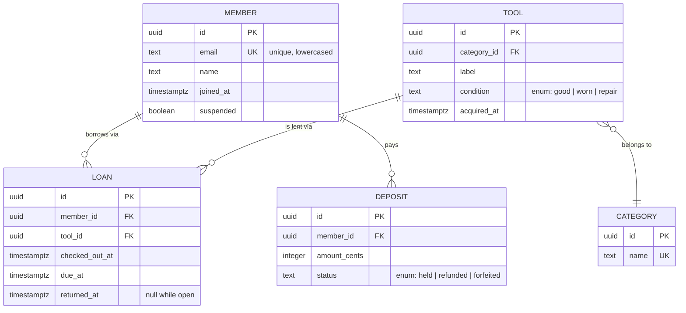

# Exemplar: ERD + Table Specs

> Copy the STRUCTURE, not the content. Domain here is a fictional community
> tool-lending library — your entities, types, and constraints come from the
> actual task. Format notes: every entity shows PK/FK + types; every
> relationship is labeled with cardinality + verb; each table gets a spec row
> block with constraints and index rationale.

## Entity-Relationship Diagram

## Table Specs

### loans
| Column | Type | Constraints | Notes |
|--------|------|-------------|-------|
| id | uuid | PK, default gen_random_uuid() | |
| member_id | uuid | FK members.id, NOT NULL, ON DELETE RESTRICT | never orphan a loan |
| tool_id | uuid | FK tools.id, NOT NULL, ON DELETE RESTRICT | |
| checked_out_at | timestamptz | NOT NULL, default now() | |
| due_at | timestamptz | NOT NULL, CHECK (due_at > checked_out_at) | |
| returned_at | timestamptz | NULL | NULL = loan open |

**Indexes:**
- `idx_loans_open` — partial index on `(tool_id) WHERE returned_at IS NULL`: enforces and accelerates the "is this tool out?" check, the hottest query.
- `idx_loans_member` — `(member_id, checked_out_at DESC)`: member history page.

**Invariants (enforced where):**
- A tool has at most one open loan — partial unique index `idx_loans_open` (DB layer, not app layer).
- Suspended members cannot open loans — service-layer check + covered by integration test.

## Migration note
Forward-only migration; backfill `due_at` for existing rows as `checked_out_at + interval '14 days'` before adding the CHECK constraint.
