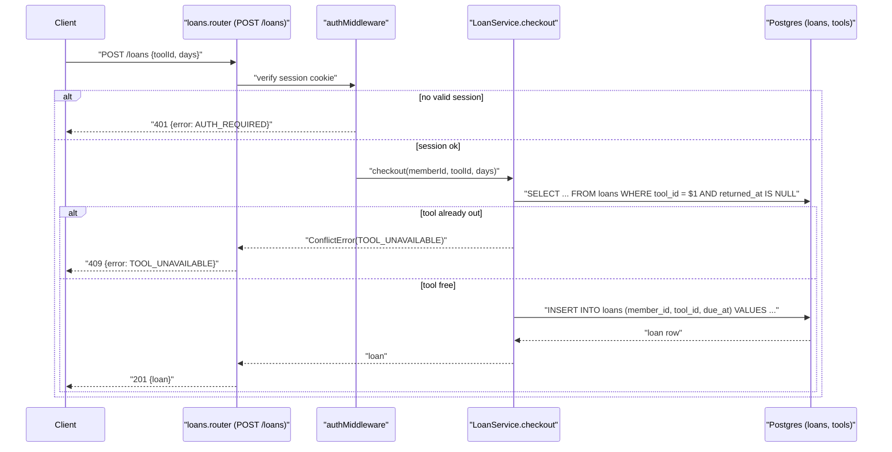

# Exemplar: Sequence Diagram (entry point with error path)

> Copy the STRUCTURE, not the content. Domain here is a fictional community
> tool-lending library. Format notes: one diagram per entry point; participants
> are real components (route, middleware, service, store), not abstractions;
> the happy path AND at least one error path appear in the same diagram via
> `alt`; every arrow names the actual function or query, not "processes data".

## POST /loans — check out a tool

**Error paths covered:** unauthenticated (401), tool already on loan (409).
**Not shown, handled upstream:** body validation (zod schema at router, 400) — noted here so the reader knows it exists without a third branch.
**Side effects:** none beyond the INSERT; no events emitted.
