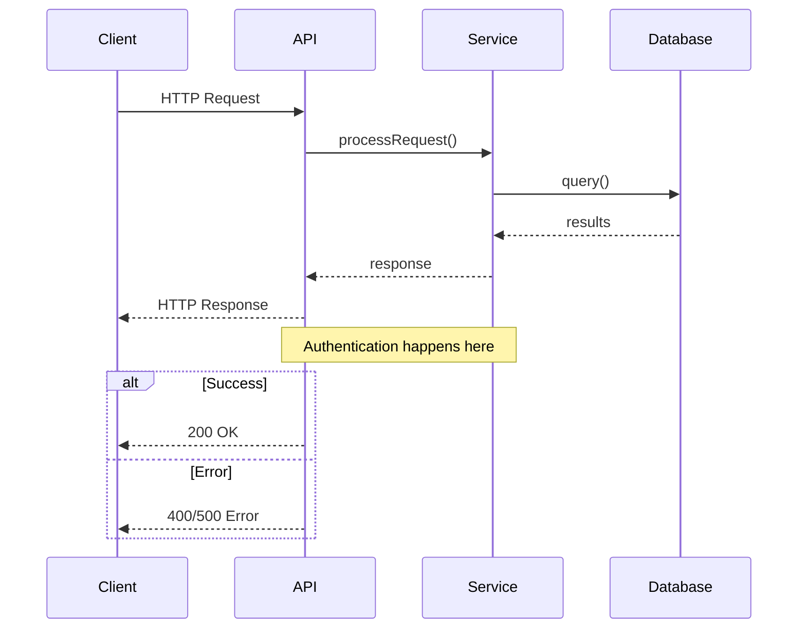
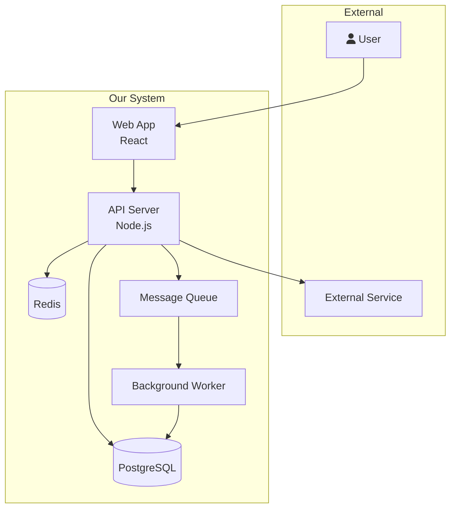
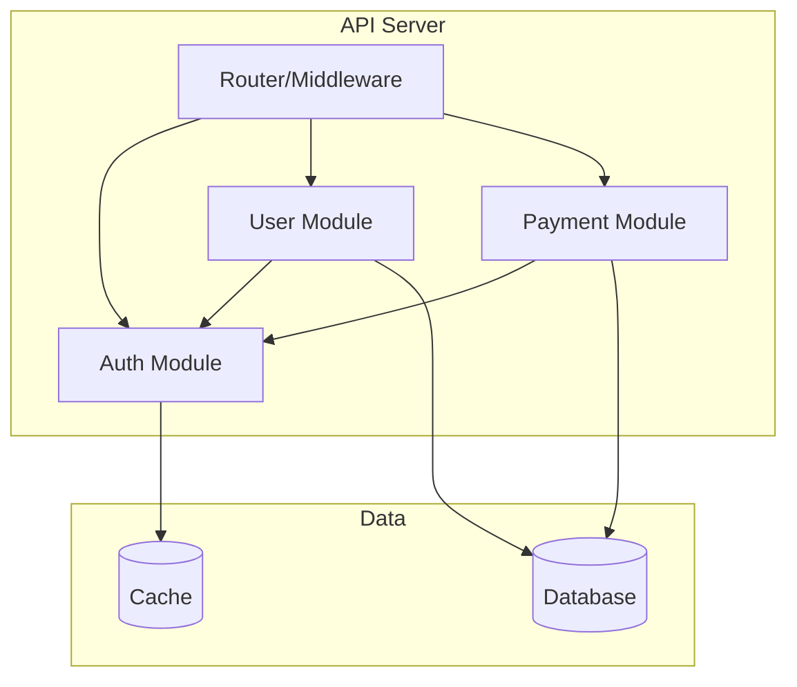
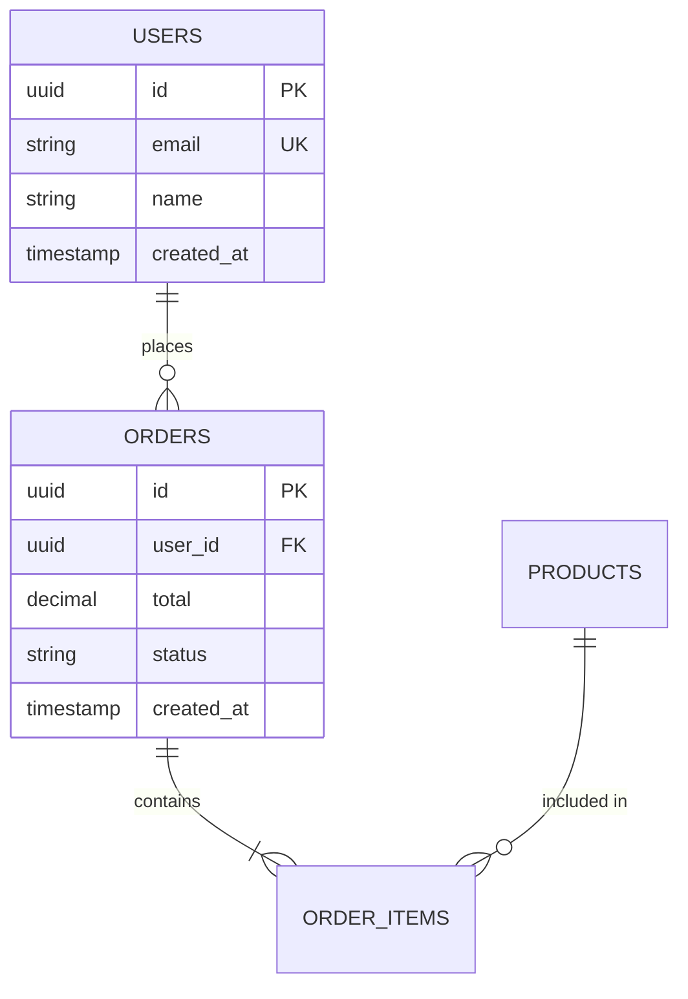
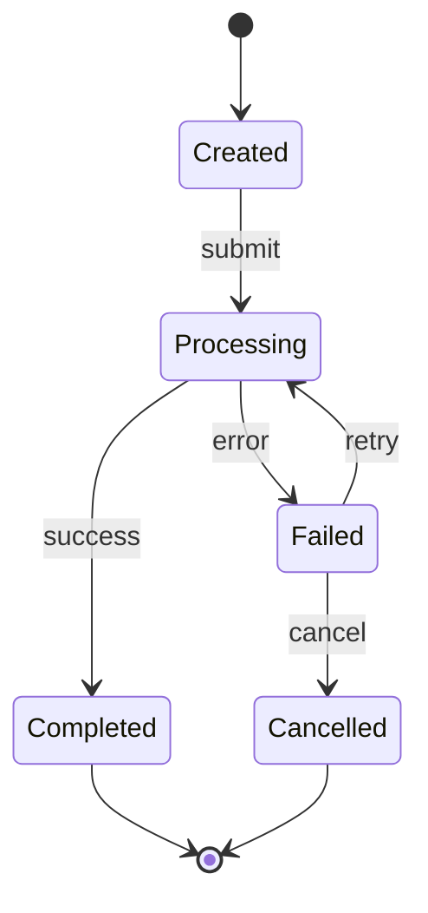
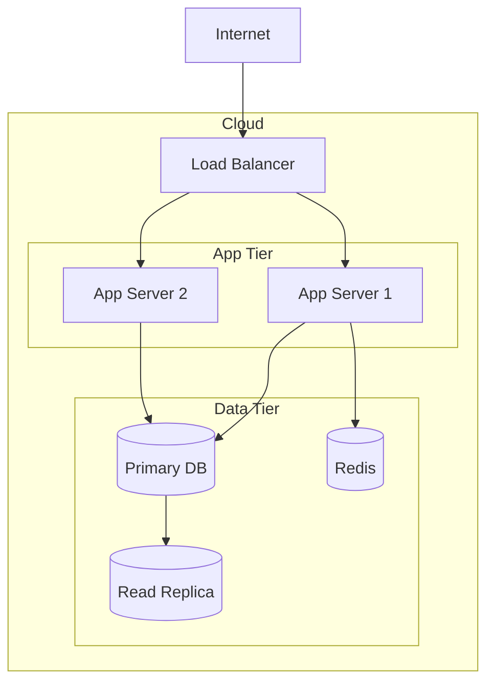

# Engineering Artifact Templates

Reference for all agents producing engineering documentation.

## Document Types and When to Produce Them

| Artifact | When Required | Who Produces |
|----------|--------------|-------------|
| SRS (Requirements) | New project Phase 2 | sdlc-lead |
| SAD (Architecture) | New project Phase 3, Onboarding | sdlc-lead + experts |
| C4 Diagrams | Every project | sdlc-lead |
| Sequence Diagrams | Critical user flows | sdlc-lead or any expert |
| ERD | Any project with database | db-architect |
| API Contract | Any project with API | api-designer |
| Threat Model | Phase 3 or security audit | security-auditor |
| Onboarding Guide | Onboard mode | sdlc-lead |
| ADRs | Every significant decision | whoever makes the decision |

## Architecture Decision Record (ADR) Format

```markdown
# ADR-NNN: [Decision Title]

**Date:** YYYY-MM-DD
**Status:** Proposed | Accepted | Deprecated | Superseded by ADR-NNN

## Context
What is the issue or situation that motivated this decision?

## Decision
What is the change we are making?

## Consequences
What are the positive and negative outcomes of this decision?

## Alternatives Considered
| Option | Pros | Cons | Why Not |
|--------|------|------|---------|
| [Alternative A] | ... | ... | ... |
| [Alternative B] | ... | ... | ... |
```

## Mermaid Diagram Cheatsheet

### Sequence Diagram


### C2 Container Diagram


### C3 Component Diagram


### Entity-Relationship Diagram


### State Machine


### Deployment Diagram


## Modular Code Structure Template

### Feature-Sliced (Recommended)
```
src/
  auth/                    # Authentication domain
    auth.service.ts        # Business logic
    auth.repository.ts     # Data access
    auth.types.ts          # Interfaces and types
    auth.routes.ts         # HTTP handlers
    auth.test.ts           # Tests
    index.ts               # Public API (exports)

  payments/                # Payment domain
    payment.service.ts
    payment.repository.ts
    payment.types.ts
    payment.routes.ts
    payment.test.ts
    index.ts

  shared/                  # Cross-cutting concerns
    database.ts            # DB connection
    logger.ts              # Logging
    errors.ts              # Error types
    middleware.ts           # Auth, validation, rate limiting
```

### Module Interface Pattern
```typescript
// auth/auth.types.ts — THE CONTRACT
export interface AuthService {
  login(email: string, password: string): Promise<Result<Token>>
  register(input: RegisterInput): Promise<Result<User>>
  verify(token: string): Promise<Result<UserClaims>>
}

// auth/auth.service.ts — THE IMPLEMENTATION
export class AuthServiceImpl implements AuthService {
  constructor(
    private userRepo: UserRepository,  // injected
    private hasher: PasswordHasher,    // injected
    private jwt: JwtSigner,           // injected
  ) {}
  // ...
}

// auth/index.ts — THE PUBLIC API
export type { AuthService } from './auth.types.js'
export { AuthServiceImpl } from './auth.service.js'
```
